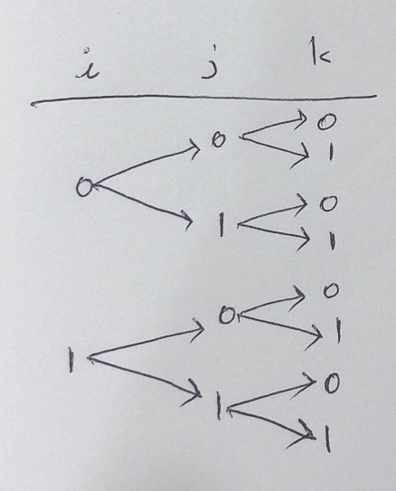

# APS 기본

* APS(Algorithm Problem Solving)

* (수) 실습 1문제, (목) 실습 5개(4개 + 1개)

  * Gitlab에 repository 생성
  * 교수님 초대
  * 소스코드명에 문제번호 포함

* 표준 스트림(standard streams)

  * 표준 입력(stdin) - keyboard
  * 표준 출력(stdout) - console
  * 표준 오류(stderr)

  ```python
  import sys
  sys.stdin = open('input.txt', 'r')
  # input.txt 파일을 표준 입력으로 간주하여 받겠다.
  ```

  

* python이 다른 컴파일 언어와 다른점?
  * c, java 변수 선언... , 컴파일러 이용.
  * python 인터프리터. 
  
* 초반 알고리즘 연습시 최대한 내장 함수, 라이브러리 쓰지 않고 구현하기!
  * len(), append(), 리스트 컴프리헨션 외에 다른 것 쓰지 않기
  * list slicing 쓰지 않기
  
* [알고리즘 참고 사이트 problems](http://problems.kr/)

## 1. 배열(List) 1 

### 알고리즘 시간복잡도
* 알고리즘 : 컴퓨터가 일을 하는 과정 기술한 것. 문제 해결 위한 절차.

* 알고리즘 표현 방법
  * 슈더코드 : 텍스트
  * 순서도 : 그림
  
* APS 과정의 목표 : 좋은 알고리즘 이해, 활용

* 좋은 알고리즘?
  * 정확성
  * **작업량** : 얼마나 적은 연산, 얼마나 CPU 적게 쓰나, 실행시간과 관련.
  * **메모리 사용량**
  * 단순성
  * 최적성 : 더 이상 개선 여지 없이 최적화되었는가.
  
* 알고리즘 성능
  * 성능 분석 기준으로 대부분 알고리즘의 **작업량**을 비교함.
  
  * 작업량은 **시간복잡도**로 표현함.
  
  * 시간 복잡도
  
  * 실제 걸리는 시간 -> 측정 힘듬
    
    * **실행되는 명령문 개수(연산 횟수) 계산**
    
      ``` python
      def func(n):
          # 명령문 - 1번
          for i in range(n):
              # 명령문 - n 번
              for j in range(i, n):
                  #명령문 - n * (n + 1)/2
      ```
    
  * 시간 복잡도 - 빅-오(O) 표기법 => 최악의 경우
  
    * 시간 복잡도 함수 중 가장 큰 영향력 주는 n에 대한 항만을 표시
    * 계수(Coefficient) 생략
    * O(1) 은 어떤 데이터든 시간 복잡도 같음.
  
  * 오메가(Ω) 표기법 => 최선의 경우
  
  * 쎄타(θ) 표기법 => 최악 == 최선
  
  * 예시
  
    ```html
    배열에 n개의 정수값이 있을 때, key를 찾는 문제
    ```
  
    * 순차검색 : idx 0부터 n-1까지 key값과 비교하는 방법. 최선 : 1번, 최악 : n번.
    * 이진탐색 : 정렬된 배열에서 검색. 1/2 중간위치부터 비교. 최선 : 1번, 최악 : log2n번.
  
  * 
  
    * 다항식 O(1) ~ O(n^2) 비교적 쉬운 문제
    * O(2^n), O(n!) NP
  
* 정렬 알고리즘 시간복잡도
  
  
  
### 버블 정렬

  * 인접한 두 개 자료 비교해 자리 교환하는 방식
  
  * 한 단계가 끝나면 가장 큰 자료 마지막 자리로 정렬됨.
  
  * 예시)
  
    ```python
      # 내부 for문부터 이해하기
      arr = [55, 7, 78, 12, 42]
      
      n = len(arr)
      for i in range(n-1): # n -1 ~ 1
          if arr[i] > arr[i+1]:
              arr[i], arr[i+1] = arr[i+1], arr[i]
      		# => [7, 55, 12, 42, 78]   
              
      for i in range(n-2):
          if arr[i] > arr[i+1]:
              arr[i], arr[i+1] = arr[i+1], arr[i]
              # => [7, 12, 42, 55, 78]
             
      for i in range(n-3):
          ...
          
      for i in range(1): # i == 0    
    ```
  
    ```python
      # 버블 정렬 완성
      arr = [55, 7, 78, 12, 42]
      
      n = len(arr)
      for j in range(n-1, 0, -1):
          for i in range(j):
              if arr[i] > arr[i+1]:
              	arr[i], arr[i+1] = arr[i+1], arr[i]
    ```

### 카운팅 정렬 

  * O(n + k), n: 리스트 길이, k: 최대값
    
  * 자료값의 빈도수 계산해서 정렬하는 방법
    
  * 제한 사항
    
    * 저장되는 자료 양의 정수여야 함. (자료값을 리스트의 인덱스로 사용할 것이기 때문.)
    * 가장 큰 값을 알아야 함. (리스트 범위 지정 위해.)
    
  * 예시)
    
    ```python
      arr = [0, 4, 1, 3, 1, 2, 4, 1]
      # 양의 정수, 최대값을 알아야 된다.
      # 최대값 = 4
      cnt = [0] * 5 # 배열의 인덱스 n-1 = 4
      
      # 빈도수 계산
    for val in arr:
          cnt[val] += 1
      # cnt => [1, 3, 1, 1, 2]
      
      # 누적 빈도수 계산 => 옮겨질 위치
      for i in range(1, len(cnt)):
          cnt[i] = cnt [i-1] + cnt[i]
      
      # cnt => [1, 4, 5, 6, 8]
      # 옮겨질 위치 뒤에서부터 채움
      # arr 끝부터 읽으면서 cnt 1씩 깎고 위치에 넣음
      # 1은 4번째, 4는 8번째...
      
      #...(생략, 채워보기)
      
    ```
    
    ```python
      arr = [0, 4, 1, 3, 1, 2, 4, 1]
      cnt = [0] * 5
      
      for val in arr:
          cnt[val] += 1
      
      sorted_list = []
      for i in range(len(cnt)):
          for j in range(cnt[i]):
              # i가 cnt[i] 만큼 반복되는 것
              sorted_list.append(i)
      print(sorted_list)
    ```

### 배열 활용 예제 : Gravity

* 각 열의 인덱스 0, 1, ,,, , 8 
* 상자 개수 저장. [7, 4, 2, 0, 0, 6, 0, 7, 0]
* A상자 낙차 : (A상자 인덱스 ~ 바닥 인덱스까지 거리) - (중간에 있는 박스 개수)
* 중간에 있는 박스 개수 : A상자의 높이와 같거나 큰 높이 찾기
  
### 완전검색(Exaustive Search)

* 개요
  * 해법으로 생각할 수 있는 모든 경우의 수 나열하고 확인하는 기법
  * **Brute-force** 혹은 **generated-and test 기법**이라고도 불림.
  * 경우의 수 상대적으로 작을 때 유용함.
  * 수행 속도는 느리지만, 해답 찾아내지 못할 확률 작음.
  * 자격검정평가에서 문제 풀이시, 우선 완전 검색으로 접근해 해답 도출 후, 성능 개선 위해 다른 알고리즘 사용해 해답 확인하는 것이 바람직함.
* Baby-gin Game 예제
  * 설명
    * 0~9 숫자 카드에서 임의의 카드 6장을 뽑았을 때, 3장의 카드가 연속적인 번호를 갖는 경우 run, 동일한 번호를 갖는 경우 triplet이라고 한다.
    * 그리고, 6장의 카드가 run, triplet로만 구성된 경우를 baby-gin이라 한다. (run, run도 가능)
    * 6자의 숫자를 입력 받아 baby-gin 여부를 판단하는 프로그램을 작성하다.
    
  * 입력 예
    * 667767 => True
    * 054060 => True
    * 101123 => False
    
  * 완전검색으로 풀이 (조합)
    * 나올 수 있는 모든 경우의 수
    * 3장, 3장씩 그룹으로 나오는 경우의 수. (C(6, 3) * C(3, 3))/2!
    
  * 완전검색으로 풀이 (순열)
  
    * 720가지
  
    * 앞 3장 1그룹, 뒤 3장 2그룹
  
    * 그룹별 3개의 값 같은지, 1씩 커지는지 판단
  
    * 중복순열 생성 예시
  
      ```python
      arr = 'ABC'
      n = len(arr)
      for i in range(n):
          for j in range(n):
              for k in range(n):
                  print(arr[i], arr[j], arr[k])
              	# A A A
                  # A A B
                  # ... (생략)
      ```
  
    * 순열 생성 예시
  
      ```python
      arr = 'ABC'
      n = len(arr)
      for i in range(n):
          for j in range(n):
              if j == i: continue
              for k in range(n):
                  if k == i or k == j continue
                  print(arr[i], arr[j], arr[k])
      ```
  
    * 중첩 for문을 재귀 호출로 구현
  
      * 중첩 for문에서는 i, j, k를 알 수 있음
      * 재귀 호출에서는 알 수 없음 => 전역 변수 or 매개 변수 사용
  
      ```python
      # 나중에..
      ```
  
*  결정 문제
  
  * 답이 2개로 나타낼 수 있는 문제(True or False 등)
* 최적화 문제 (완전 탐색으로 푼다)
  * 최적해를 구하는 문제
  * 최소 혹은 최대가 되는 경우를 찾는다. (외판원 문제)
  * 모든 후보해(가능한 경우)를 조사한다.
  * 순열(n!), 조합, 부분집합(2^n), ...
  * 좀 더 효율적으로 하는 방법이 없을까? (덜 무식하게 완전탐색하는 방법들)
    * 탐색기반 - 백트래킹(그래프, 트리를 탐색하듯이) + (가지치기)
    * 문제간의 관계(재귀적 관계) 동적 계획법 
  * 최적화 문제 중 탐욕 기법으로 풀 수 있는 방법들
    * 쉬운 문제는 풀 수 있지만, 어려운 문제는 대부분 못푼다.
    * Prim, Kruskal
    * 다익스트라
    * 최소비용 신장 트리
  
  

### 탐욕(Greedy) 알고리즘

* 보통 최적해 구하는 데 사용되는 방법

* 지역적으론 최적이지만, 최종적으로 최적일 보장은 없음.

* 거스름돈 줄이기 예시

  * 설명
    * "거스름돈으로 주는 동전의 개수 최소화"
    * 동전 종류 = {500, 100, 50, 10}
    * 거스름 돈 = 800원 
  * 큰 금액의 동전부터 찾고 싶은 해집합에 포함하면서 선택해 나아감.
    * 거스름 돈 = {500}, 300원을 채우는 더 작은 문제로 범위 좁아짐.
    * 거스름 돈 = {500, 500} => -200원. 실행가능 x. 선택 x
    * 거스름 돈 = {500, 100}, 200원
    * 거스름 돈 = {500, 100, 100}, 100원
    * 거스름 돈 = {500, 100, 100, 100}, 0원
  * 완전 탐색 방법은 가능한 거스름 돈 조합 모두.
  * 동전 종류 400원 추가된다면? 동전 종류 = {500, 400, 100, 50, 10}
    * 똑같이 탐욕으로 접근.
    * {500} -> {500, 500} x -> {500, 400} x -> ... -> {500, 100, 100, 100}
    * 이 경우 최적해가 아니다! => 완전 탐색으로 풀어야 함.

* 완전검색이 아닌 탐욕으로 풀어보자!

  * Baby-gin 예시

    * 빈도수 계산해(cnt 배열 사용) 체크
    * 3 이상인 값 => triplet
    * 연속 1이상 => run

    ```python
    num = '456789' # Baby-gin 확인할 6자리 수
    c = [0] * 12 # 6자리 개수 저장할 리스트
    # 0~9 인데 10개가 아닌 12개인 이유 c[i], c[i+1], c[i+2] 비교하려고.
    # 심플하게 하려는 방법, 이렇게 안해도 되긴 함.
    
    # triplete 조사 후 삭제
    # run 조사
    
    # triplet + run == 2이면 Baby-gin!
    ```

    

## 2. 배열 2

### 배열: 2차 배열

* 숫자 퍼즐 예제

* 2차원 배열의 선언

  * list안에 list
  * arr = [[0,1,2,3], [4,5,6,7]]
* **주의**
  
```python
  # 방법 1 - 나의 실수
list1 = [[0] * 3] * 3
  list1[0][0] = 1
  print(list1)
  # [[1, 0, 0], [1, 0, 0], [1, 0, 0]]
  
  # 방법 2 - 맞는 방법
  list2 = [[0] * 3 for _ in range(3)]
  list2[0][0] = 1
  print(list2)
  # [[1, 0, 0], [0, 0, 0], [0, 0, 0]]
```

  * 배열 순회
  
    * n*m개 원소 빠짐없이 조사하는 방법
    * 행 우선순회(첫 번째 행, 두번째 행...)
    
    ```python
    arr = [[1, 2], [3, 4]]
    # python스러운 코드
    for a in arr:
        for val in a:
            print(val)
    ```
  
    * 열 우선순회
    
    * 지그재그 순회
    
    ```python
    # idx 짝수, 홀수일 때로 나눔
    arr = [[1, 2], [3, 4]]
    N = len(arr)
    for i in range(N):
        if not i % 2: # 짝수
            for j in range(N):
                pass
        else:
            for j in range(N-1, -1, -1): # 홀수, N-1부터 0까지
                pass
      
    ```
  
  * 배열의 활용
  
    * 전치 행렬 : 행과 열이 바뀜
    * 대각 순회 i, j = [ 00 => 01 -> 10 => 0, 2 -> 1, 1 -> 2, 0 => ... => 4, 4 ]
    
    ```python
    n, m = len(arr), len(arr[0])
    for diag in range(0, n + m -1) # diag: 사선의 수
    
    # x, y: 시작좌표
    x = 0 if diag < M else (diag - M _1)
    y = diag if diag < M else M -1
    
    while x < n and y >= 0:
        arr[x][y]
        x += 1
        y -= 1
    ```
  
    * 델타를 이용한 2차 배열 탐색
      * 배열의 한 좌표에서 4방향 인접 배열 요소 탐색하는 방법
      * 미로 탐색, 체스 등 많이 쓰임
    
    ```python
    # 상하좌우
    dx = [0, 0, -1, 1] # x 좌표 리스트
    dy = [-1, 1, 0, 0] # y 좌표 리스트
    ```
  
  * 연습문제
  
    * 5*5 2차 배열에 무작위로 25개 숫자로 초기화한 후
    * 각 요소에 대해 그 요소와 이웃한 요소와의 차의 절대값의 합을 구하시오
    * 주의! 벽에 있는 요소는 이웃한 요소가 없을 수 있음
    * [소스보기](day3_ex1.py)
    * 

### 부분집합 생성(비트)

* 부분집합 합(Subset Sum) 문제

  * n개의 정수로 이루어진 집합이 있을 때, 부분집합 중 집합 원소의 합이 0이 되는 경우가 있는지를 알아내는 문제
  * 결정 문제 (True or False)
  * 최적화 문제로 바꾼다면 '총 합이 0이 되는 경우 중 합이 가장 큰(혹은 작은) 값은?'
  * [-7, -3, -2, 5, 8]이 있을 때, [-3, -2, 5]는 총 합이 0이므로 답이 참이 된다.
  * 완전검색으로 모든 부분집합 생성 후 부분집합 합 구하기

* 부분집합 수 : 2^n개(공집합, 자기자신까지 포함)

  * 각 원소에 대해 포함되거나 되지 않거나 2가지
  * n = 3, {1, 2, 3}, 2^n가지(0~2^n-1)

  |     부분집합      | 2진수 | 10진수 |
  | :---------------: | :---: | :----: |
  |  c(3, 0), 공집합  |  000  |   0    |
  |    c(3, 1) {1}    |  100  |   4    |
  |        {2}        |  010  |   2    |
  |        {3}        |  001  |   1    |
  |  C(3, 2) {1, 2}   |  110  |   6    |
  |      {1, 3}       |  101  |   5    |
  |      {2, 3}       |  011  |   3    |
  | C(3, 3) {1, 2, 3} |  111  |   7    |

  ```python
  arr = 'ABC'
  bits = [0] * 3
  
  for i in range(2):
      bits[0] = i
      for i in range(2):
          bits[1] = i
          for i in range(2):
              bits[2] = i
              print(bits, end = '> ')
              for i in range(len(bits)):
                  if bits[i]: print(arr[i], end=' ')
  # [0, 0, 0]
  # [0, 0, 1]> C
  # ...
  # [1. 1. 1]> A B C
  ```

  ```python
  # 부분집합 생성 코드 예제) 교재에서!
  arr = [3, 6, 7, 1, 5, 4]
  
  n = len(arr) # n: 원소의 개수
  for i in range(1<<n) : # 1<<n: 부분집합의 개수
      for j in range(n): # 원소의 수만큼 비트 비교
          if i & (1<<j): # i의 j번째 비트가 1이면 j번째 원소 출력
              print(arr[j], end=", ")
          print()
      print()
  ```

  

* 위의 코드 재귀호출로 바꿔보기

```python
arr = 'ABC'
bits = [0] * 3

def subset(k, n):
    if k == n:
        print(bits, end = '> ')
        for i in range(len(bits)):
            if bits[i]: print(arr[i], end=' ')
        
        return
    
    
# 재귀 호출
bits[0] = 0
subset(k + 1, n)
bits[1] = 1
subset(k + 1, n)
            
```

* 비트 연산자 (Bit Operator)

  * &, |, <<, >>, ...

  ```python
  a = 10
  print(bin(10)) # bin() 이진수 표기로 문자형으로 리턴
  
  a = 0b1010
  print(a) # 10진수 표기
  
  # AND 연산
  a = 0b1010
  b = 0b1100
  c = a & b
  print(bin(c)) # => 0b1000
  
  # Shift 연산 << 곱하기, >> 나누기
  print(bin(a << 1)) # => 0b10100
  ```

  * 비트 연산자를 쓰는 이유?

    * 다른 연산에 비해 빠르다. (c에서는 다른 operator보다 적은 명령어)

    ```python
    n = 10
    if n % 2:
        print('홀수')
    else:
        print('짝수')
    
    # 비트 연산자 이용
    n = 10
    if n & 1:
        print('홀수')
    else:
        print('짝수')    
    ```

  * `1 << n`: 2^n

  * `i & (1 << j)`: i의 j번째 비트가 1인지 아닌지를 리턴

* 비트 연산자 사용해 부분집합 생성

```python
arr = [3, 6, 7, 1, 5, 4]

n = len(arr) # n : 원소의 개수

for i in range(1 << n): # 1 << n: 부분 집합의 개수
    for j in range(n): # 원소의 수만큼 비트를 비교함
        if i & (1 << j): # i의 j번째 비트가 1이면 j번째 원소 출력
            print(arr[j], end=",")
   	print()
print()

```


### 이진 검색 (Binary Search)

* 검색의 종류 : 순차 검색, 이진 검색, 해쉬

* 순차 검색: 브루트 포스 방법

  * 가장 단순하고 직관적인 검색 방법
  * 리스트 등 순차구조로 구현된 자료구조에서 순차적으로 검색
  * 정렬되어 있다면 이진검색을 보통 씀.

* 이진 검색

  * **반드시 정렬된 상태여야 한다.**
  * 중앙에 있는 원소와 비교

  ```python
  def binarySearch(arr, key):
      lo, hi = 0, len(arr)-1
      # lo = 범위의 시작인덱스, hi = 범위의 끝 인덱스
      
      while lo <= hi: # 같아질 때 까지! lo가 커지면 탐색실패!
  		mid = (lo + hi) >> 1 # // 2 (나누기 2)
          if arr[mid] == key:
              return True
          elif arr[mid] > key: # 왼쪽에서 탐색해야함 (lo ~ mid-1)
              hi = mid - 1
          else:
              lo = mid + 1
      return False
  ```

  ```python
  # 재귀호출
  def binarySearch(arr, lo, hi, key):
      if lo > hi: return False
      mid = (lo + hi) >> 1
      if arr[mid] == key:
          return True
      elif arr[mid] > key: # 왼쪽에서 탐색해야함 (lo ~ mid-1)
          return binarySearch(arr, lo, mid - 1, key)
      else:
          return binarySearch(arr, mid + 1, hi, key)
  ```


* 인덱스
  * 대량 데이터 성능 저하 문제 해결 위해 배열 인덱스 사용
  * 문자열의 suffix array(접미사 배열)

### 셀렉션 알고리즘 (Selection Algorithm)

정렬되어 있는(혹은 정렬되지 않은) 자료로부터 k번째로 큰(혹은 작은) 원소를 찾는 방법

### 선택 정렬 (Selection Sort)

k번째 큰값(혹은 작은값) 찾는 것

```python
# 규칙 찾기

arr = [64, 25, 10, 22, 11]
n = len(arr)

# 첫번째 단계 [0, n - 1]
min_idx = 0
for j in range(1, n):
    if arr[min_idx] > arr[j]:
        min_idx = j
arr[0], arr[min_idx] = arr[min_dix], arr[0]

print(arr)

# 두번째 단계 [1, n - 1]
min_idx = 1
for j in range(2, n):
    if arr[min_idx] > arr[j]:
        min_idx = j
arr[1], arr[min_idx] = arr[min_dix], arr[1]

print(arr)
```


```python
# 선택 정렬 코드 

arr = [64, 25, 10, 22, 11]
n = len(arr)

for i in range(n-1): # 범위의 시작 위치 : 0 ~ n-2
    min_idx = i
    for j in range(i+1, n):
        if arr[min_idx] > arr[j]:
        min_idx = j
arr[i], arr[min_idx] = arr[min_dix], arr[i]

print(arr)
```

### 실습 1, 2

p. 100


## 3. 문자열

### 문자열

c와 관련된 내용들

```python
# ASCII값
print(ord('A'))

# 문자로 변환
print(chr(65))
```

* 문자의 표현
  * 데이터 저장하는 방식, Byte order
    * big-endian : 앞부터 차례대로 01, 02, 03, 04 (Linux, window, IBM ...)
    * little-endian : 뒤부터 차례대로 04, 03, 02, 01 (솔라리스, 리눅스, Hp)
* 인코딩 확인

```python
import sys
print(sys.getdefualtencoding())
```

* 문자열은 기본  자료형이 아니다.

* python 에서 class를 정의하면 멤버 함수 코드는 가지고 있지 않음.

  멤버 변수를 저장하는 메모리 공간이 할당됨.

* 문자 뒤집기 (펠린드롬, 회문)

  * 예제 : [초심자의 회문검사 1989.py](./code/1989.py)	

```python
arr = 'algorithm'
# print(arr[::-1]) python에서는 이렇게하면 바로 뒤집어짐

arr = list(arr)
print(arr)

n = len(arr)
for i in range(n//2):
	# arr[i] <-- arr[n - 1 - i]
    arr[i], arr[n - 1 - i] = arr[n - 1 - i], arr[i]
print(arr)		
```

* 문자열 비교
  * 사전 순으로 비교

```python
print('aaa' == 'aab') # => False
print('aaa' > 'aab') # => FAlse
print('aaa' < 'aab') # => True
```

* int쓰지 않고 숫자로 바꾸기

```python
arr = '1234567'
val = 0
for c in arr:
    val = val * 10 + (ord(c) - ord('0'))
    
print(val)
```

* str 쓰지 않고 숫자로바꾸기

```python
val = 1234567
val_str = ''
while val:
    print(val % 10)
    val = val//10
```


### 패턴 매칭

IM에는 안나옴

AD에서도 패턴 매칭 문제 잘 안나옴

고지식한 알고리즘(브루트-포스)는 알아두기

```
t: text
p: pattern
n: text길이
m: pattern의 길이
```


* 브루트 포스(Brute Force)

  * 고지식한 방법
  * 모든 가능한 시작위치에서 검사하는 것
  * 0 ~ n-m 시작위치부터 비교

  ```python
  p = 'ACAAAGTCCAGTACTAAA'
  t = 'CA'
  
  n, m = len(t), len(p)
  
  # 가능한 모든 위치에 대해
  for i in range(n - m + 1):
      for j in range(m):
          if t[i + j] != p[j]:
              break
      else:
          # 패턴을 찾음
          
          
  # c 스타일
  for i in range(n - m + 1):
      j = 0
      while j < m and t[i + j] == p[j]:
          j += 1
      if j == m:
          # 패턴을 찾음
  ```

  * t[i] == p[j], 같은 경우
    * i++, j++
  * t[i] != p[j], 다른 경우
    * j = 0
    * i는 원래 시작했던 위치의 다음 칸(원래 시작 위치: i-j, 다음칸:i-j+1)
    * i = i - j + 1

  ```python
  p = 'ACAAAGTCCAGTACTAAA'
  t = 'CA'
  
  n, m = len(t), len(p)
  
  i = j = 0
  while i < n:
      if t[i] == [j]:
          i, j = i + 1, j + 1
      else:
          i = i - j + 1
          j = 0
      
      if j == m:
          # 찾음
          break
  ```

  ```python
  # 교재에 있는 방법, 꼭 이렇게 안해도 됨
  
  p = 'ACAAAGTCCAGTACTAAA'
  t = 'CA'
  
  n, m = len(t), len(p)
  
  i = j = 0
  while i < n and j < m:
      if t[i] != [j]:
          i = i - j
          j = -1
      i, j = i + 1, j + 1
      if j == m:
          # i - j를 저장
          j = 0
  ```

* KMP(Knuth-Morris-Pratt Algorithm)

  * 브루스 포트처럼 비교하다가 매치하지 않으면,

    패턴 위치 0으로 돌아가지 않음.

  * 패턴 전처리

    * 패턴의 각 자리에서 불일치가 발생했을 때, 미리 이동할 곳을 찾아놓음.

  * 접두어, 접미어

    ```
    'abcd'의 접두어
    a
    ab
    abc
    
    'abcd'의 접미어
    d
    cd
    bcd
    
    같은 길이의 접두어, 접미어
    
    불일치가 일어났을 때, 길이가 같고 공통되는 접두어, 접미어가 없으면,
    i는 가만히(브루트 포스에서는 i=0)
    j는 0, 만약 공통되는 접두어, 접미어 있으면 그에 맞게
    ```

    

* Rabin–Karp: 해싱의 개념 사용

* Boyer-moore

  * 상용으로 가장 널리 사용됨
  * 문자집합이 큰 경우
  * 오른쪽에서 왼쪽으로 비교
  * bad character : 비교를 안해도 되는 구간 skip
  * Suffix : 공통된 접미사, 안벽 대칭되는 접미/접두사

### 문자열 암호화


### 문자열 압축


## 4. Stack 1

### 스택

* 스택은 선형구조이다.

  * 선형구조:  자료간 관계 1대1의 관계, 지금 자료 다음 읽을 자료 1개
  * 비선형구조: 트리, 그래프의 경우 인접한 자식 여러개 중 선택

* 스택 구현 위해 필요한 자료구조, 연산

  * 자료구조: 자료를 선형으로 저장할 저장소(c의 경우 배열)
  * 연산: push, pop, isEmpty, peek
  * top: 맨 위 자료를 가리키는 idx

* 스택 구현

  ```python
  # C - style
  stack = [0] * 3
  top = -1 # 맨 마지막
  
  def push(item):
      global top
      # full - 상태를 주의
      # c에서는 마지막 인덱스인지 아닌지 if top == 마지막인덱스:
      top += 1
      stack[top] = item
   
  def pop():
      # empty - 상태를 체크
      if top == -1: return
      ret = stack[top]
      top -= 1
  	return ret
  
  # python에서는
  stack.append(1) # push
  stack.append(2) # push
  stack.append(3) # push
  stack.pop() # pop
  
  # => 3\n2\n1\n
  
  ```

  

### 재귀호출

재귀호출로 DFS(깊이 우선 탐색) 많이함

1. 재귀적으로 문제를 해결
   * 재귀적 정의를 코드 구현할 때
   * 좀 더 작은 문제의 해를 이용해서 좀 더 큰 문제의 해를 구하는 문제
   * => 분할 정복, DP
2. 그래프 탐색(DFS)
3. 백트래킹(상태 공간 트리 탐색)

```python
def printHello():
    print('Hello')
    printHello()
    
# for i in range(3):
#     print('Hello')

printHello()
```

위 코드 error! 재귀호출 횟수 1000으로 제한

```python
import sys
print(sys.getrecursionlimit())
# => 1000
```

검정 시험에서는 풀 수 있도록 늘려놨을 것이다.

```python
def printHello(i, n):
    if i == n:
        # 하고 싶은 일
        return
    else:
        print(i, 'Hello') # 함수 호출 전
    	printHello(i + 1, n)
        print(i, 'Hello') # 함수 호출 후

printHello(0, 3)
```

```pyhon
# 결과
0 Hello
1 Hello
2 Hello
2 Hello
1 Hello
0 Hello
```

```python
cnt = 0
def printHello(i, n):
    global cnt
    if i == n:
        cnt += 1
        return
    else:
    	printHello(i + 1, n)

printHello(0, 3)
print('cnt=', cnt) # = cnt = 1
```

```python
cnt = 0
def printHello(i, n):
    global cnt
    if i == n:
        cnt += 1
        return
    else:
    	printHello(i + 1, n)
        printHello(i + 1, n)

printHello(0, 3)
print('cnt=', cnt) # = cnt = 8 2^3
```

```python
cnt = 0
def printHello(i, n):
    global cnt
    if i == n:
        cnt += 1
        return
    else:
    	printHello(i + 1, n)
        printHello(i + 1, n)
        printHello(i + 1, n)

printHello(0, 3)
print('cnt=', cnt) # = cnt = 27 depth만큼 제곱 3^3
```

* 이해 x 이해해보기

```python
cnt = 0
bits = [0] * 3
def printHello(i, n):
    global cnt
    if i == n:
        cnt += 1
        print(bits)
        return
    else:
    	bits[i] = 1; printHello(i + 1, n)
        bits[i] = 0; printHello(i + 1, n)
        
printHello(0, 3)
print('cnt=', cnt)
```

* factorial 재귀로 구현 
  * O( 2^n)

```python
def fact(n): # n = 문제를 식별하는 값, 문제의 크기
    if n == 0 or n == 1:
        return 1
    else:
        return n * fact(n - 1)
```

```python
def fibo(n):
    if n == 0 or n == 1:
        return n
    return fibo(n - 1) + fibo(n - 2)

print(fibo(40))
```

### Memoization

* O(n)

  `recursive` 방식으로 구현

```python
memo = [-1] * (101)
def fibo(n):
    if n == 0 or n == 1:
        return n
    if memo[n] != -1: # 답을 구함
        return memo[0]
    
    memo[n] = fibo(n - 1) + fibo(n - 2)
    return memo[n]

print(fibo(40))
```

이게 DP다.

### DP(Dynamic Programming, 동적 계획)

* 그리디처럼 **최적화 문제** 해결하는 알고리즘
* 최적화 문제는 완전 탐색을 기본으로 한다.

* 완전 탐색인데, 덜 무식하게 하는 방법
* DP는 재귀로 푼다.(작은 문제 -> 큰 문제 최적해 구함)
* DP의 구현 방식
  * recursive
  * iterative
* `iterative` 방식으로 구현 (`recursive`보다 `iterative` 방식이 좋다.)

```python
memo = [-1] * (101)
def fibo(n):
    # 내가 알고 있는 기저상태 채우기
    memo[0], memo[1] = 0, 1
    for i in range(2, n + 1): # i => 문제를 식별하는 값
    	memo[n] = memo(n - 1) + memo(n - 2)
     
    return memo[n]

print(fibo(40))
```

16주차 그래프 먼저 함

## 12. 그래프

### 그래프 기본

그래프는 아이템(사물 또는 추상적 개념)들 - **정점**과 이들 사이의 연결관계 - **간선**을 표현함.

* 그래프 속성

  * 정점(Vertex)와 이를 연결하는 간선(Edge)
  * V개의 정점을 가지는 그래프는 최대 V*(V-1)/2개 간선이 가능
  * 최소간선 개수 : 정점개수 - 1

* 인접 정점

  * 인접 : 두 개 정점 사이 간선이 존재하면 서로 인접해있다고 함.

* 그래프 표현

  * 인접 행렬 : v*v 크기 2차원 배열에 간선 정보 저장
  * 인접 리스트 : 각 정점마다 해당 정점으로 나가는 간선 정보 저장

  

### DFS(Depth First Search, 깊이 우선 탐색)

* **그래프**에서 사용하는 알고리즘
* 단점 : 최단 경로를 보장할 수 없음!

### 실습1, 2, 3

* [연습문제 3](./code/stack_ex3-1.py)

  * 스택을 사용해 그래프 탐색
  * [input](./code/DFS_input.txt)

  ```python
  # stack_ex3-1.py
  
  import sys; sys.stdin = open('DFS_input.txt', 'r')
  
  
  def DFS(v):
      # 시작점을 방문하고 스택에 push
      stack = [] # 스택
      visit[v] = True; print(v, end='')
      stack.append(v)
      while stack: # 빈 스택이 아닐동안 반복
          for w in g[v]:
              if not visit[w]: # v에 방문하지 않은 인접정점 w를 찾아서
                  visit[w] = True; print(w, end='') # 방문
                  stack.append(w) # w를 방문하고, v를 스택에 push
                  v = w # v를 w로 설정
                  break
          else: # 인접정점이 없다면, 스택에서 pop()해서
              v = stack.pop() # v로 설정
  
  
  v, e = map(int, input().split()) # 정점수, 간선수
  g = [[] for _ in range(v + 1)]   # 1 ~ v 까지
  visit = [False] * (v + 1)        # 방문 정보
  
  for _ in range(e):
      u, v = map(int, input().split()) # 정점1, 정점2
      g[u].append(v)
      g[v].append(u) # 무향 그래프
  
  print(g)
  DFS(1)
  ```

  

  
  * 하지만, 재귀호출로 짜는 것이 낫다.
  * 한번 짜보기!
  
  * [재귀로](./code/stack_ex3.py)
  
  ```python
  # stack_ex3.py
  
  import sys; sys.stdin = open('DFS_input.txt', 'r')
  
  
  def DFS(v): # v = 현재 방문하는 정점
  
      visit[v] = True; print(v, end='')
  
      for w in g[v]:
          if not visit[w]: # v에 방문하지 않은 인접정점 w를 찾아서
              DFS(w)
  
  
  v, e = map(int, input().split()) # 정점수, 간선수
  g = [[] for _ in range(v + 1)]   # 1 ~ v 까지
  visit = [False] * (v + 1)        # 방문 정보
  
  for _ in range(e):
      u, v = map(int, input().split()) # 정점1, 정점2
      g[u].append(v)
      g[v].append(u) # 무향 그래프
  
  print(g)
  
  DFS(1)
  ```

  

## 5. Stack 2

### 계산기


### 백트래킹(Backtracking)

* **해를 찾는 도중 '막히면'(해가 아니면) 되돌아가서** 해를 다시 찾음
* 최적화 문제, 결정 문제
* 결정 문제: Yes or No
  * 미로 찾기
  
    * 그래프 문제로 생각할 수 있지만 백트래킹!
    * 왜? 그래프 탐색은 모든 정점을 방문하는 것이 목적임
    * 미로찾기는 답을 빨리 찾는 것이 목적이다.
      * 답을 찾으면 바로 종료!
    * DFS, BFS로 풀 때, 그래프가 아니지만 그래프 인 것 처럼 푼다.
    * 갈림길에서 어느 길로 가야하는지 모름
      * 그럼 어떻게?
      * 일단 가본다.
    * 백트래킹 vs 깊이우선탐색
      * 백트래킹: 경로가 해결책으로 이어질 것 같지 않으면 더 이상 경로를 따라가지 않음
        * Pruning 가지치기
      * 깊이우선탐색: 모든 경로 추적
      * **그래서!** 4871그래프 경로(./code/README/Day8 참고) 풀이시 return 쓰면 어려움이 있었다.
      * 깊이우선탐색 가하기엔 경우의 수 너무나 많음
      * 백트래킹을 적용해도 경우의 수 줄어들지만, 이도 역시 최악의 경우 불가능할 수 있음
  
  * n-Queen 문제
  
    * 보통 8-Queen으로 알려져있음(서양의 8*8장기판)
      * C(64, 8) 경우의 수
    * 4*4 예제
      * C(16, 4)  경우의 수
  
  * Map coloring
  
  * 부분 집합의 합 문제 등
  
  * 8-puzzle
  
    * 3*3 에 1~8 숫자, 한칸 비어있음
    * 비어있는 곳으로 숫자 옮길 수 있다.
    * 퍼즐판 상태 9! 가지
    * 상태 공간 트리로 표현할 수 있음
      * 현재 상태에서 퍼즐 하나 밀어서 갈 수 있는 상태
      * 이것을 인접 상태로 표현한다.
    * 초기 상태에서 목표 상태로 가는 경로 찾기
    * 최단 경로 찾으면 됨
    * 한번 갔던 경로 가지 않아도 됨
  
  * 부분집합 구하기
  
    ```
    원소수 = N, 부분집합 1 << n
    n=3, 1 << 3 = 8
    ```
  
    
  
    ```python
    arr = 'ABC'; N = len(arr)
    bits = [0] * N
    
    for i in range(2):
        bits[0] = i
        for j in range(2):
        	bits[0] = j
        	for k in range(2):
        		bits[0] = k
                print(bits)
    ```
  
    
  
    ```python
    arr = 'ABC'; n = len(arr)
    bits = [0] * n
    
    def subset(k, n): #k: 현재 노드의 높이, n: 단말 노드의 높이
        if k == n: # 모든 선택이 완료, 단말노드 도착
            for i in range(n):
                if bist[i]: print(arr[i], end=" ") # 1(포함)이면 출력
            print(bits)
            return
        # 선택이 남았다.
        bits[k] = 1; subset(k + 1, n) # 왼쪽
        bits[k] = 0; subset(k + 1, n) # 오른쪽
        
        
    subset(0, n) # 0: 어떤 선택도 하지 않았다. n: 해야할 선택 수
    ```
  
    * [부분집합의 합 4837-2](./code/4837-2.py) 참고

* 최적화 문제 가장 기본적인 방법은 완전 탐색!

  * 모든 경우의 수 트리로 그리기 => 상태 공간 트리

* 백트래킹 기법

  * 어떤 노드의 유망성을 점검 후, 유망하지 않으면 부모로 되돌아감(backtracking)
    * 지금 한 선택 취소하고 돌아감
  * 가지치기(pruning): 답이 될 가능성 없는 노드 탐색 하지 않음
  * 다음과 같은 절차!
    * 상태 공간 트리의 깊이 우선 탐색 실시
    * 각 노드의 유망성 점검
    * 그 유망하지 않다면, 그 선택 취소하고 부모 노드로 돌아감

  ```pseudocode
  def checknode(v) : # 현재노드
      if promising(v): # 유망성
          if there is a solution at v:
              write the solution
          else:
              for u in each child of v:
                  checknode(u)
  ```

* 동전 실습

  ```python
  coin = [6, 4, 1] # 가장 적은 동전 문제라면, 큰 금액부터 하는 것이 좋음
  choose = [0] * 100
  def coinChange(k, n): # k: 선택한 동전의 수, n: 거스름돈 금액
      if n == 0:
          for i in range(k):
              print(choose[i], end=' ')
          print()
          return
      for c in coin:
          if c > n: continue
          choose[k] = c
          coinChange(k + 1, n - c)
          
  coinChange(0, 8)
  ```

  가지치기를 해보자!

  ```python
  coin = [6, 4, 1]
  choose = [0] * 100
  MIN = 0xffffff
  def coinChange(k, n): # k: 선택한 동전의 수, n: 거스름돈 금액
      if k >= MIN: return
      if n == 0:
          global MIN
          MIN = min(k, MIN)
          for i in range(k):
              print(choose[i], end=' ')
          print()
          return
      for c in coin:
          if c > n: continue
          choose[k] = c
          coinChange(k + 1, n - c)
          
  coinChange(0, 8)
  ```

  ```python
  arr = 'ABC'; n = len(arr)
  order = [0] * N # 원소의 인덱스의 순서를 저장
  
  def coinChange(k, n, used):
      if k == n: # 하나의 순열을 생성
          return
          
      for i in range(n):
          if used & (1 << i): continue
          order[k] = i
  coinChange(0, N, 0) # 선택한 수, 전체원소수, 선택한 요소들의 집합
  ```

  

### 순열 (공부해보기!)

```
{A, B, C}, n = 3
n! = 3! = 6

터미널 노드 개수 6개
```

* 부분집합과 다른점
  * 자식 노드의 수 가변적
  * 선택했던 것을 기록해야함 (이전에 선택한 것에 따라 다음단계 선택후보 달라짐)

```python
# 중복순열

arr = 'ABC'; N = len(arr)

for i in range(N):
    for j in range(N):
        for k in range(N):
            print(arr[i], arr[j], arr[k])
```

```python
# 중복 제외한 순열

arr = 'ABC'; N = len(arr)

for i in range(N):
    for j in range(N):
        if i == j:
            continue
        for k in range(N):
            if i == k or j == k: 
                continue
            print(arr[i], arr[j], arr[k])
```

```python
# 교재에 있는 내용 - 잘 이해가 가지 않는다...
arr = 'ABC'; N = len(arr)
order = [0] * N # 실제 요소들의 순서(index를 기록)

def perm(k, n):
    if k == n:
        for i in range(N):
            print(arr[order[i]], end=" ")
        print()
        return
  	used = [False] * N # 선택했는지
    for i in range(k): # 지금까지 선택한 k개의 원소를 확인
        used[order[i]] = True
        
    for i in range(N): # 선택하지 않은 요소들에 대해
        if used[i]: continue
        order[k] = i
        perm(k + 1, n)
        
perm(0, N)
```

```python
# 선생님 방법
arr = 'ABC'; N = len(arr)
order = [0] * N # 실제 요소들의 순서(index를 기록)
used = [0] * N # global 변수로 선언하여 썼다지웠다하는 방법

def perm(k, n):
    if k == n:
        for i in range(N):
            print(arr[order[i]], end=" ")
        print()
        return
    
    for i in range(N): # 선택하지 않은 요소들에 대해
        if used[i]: continue
        used[i] = 1
        order[k] = i
        perm(k + 1, n)
        used[i] = 0
        
perm(0, N)
```

```python
# 선생님's best practices
arr = 'ABC'; N = len(arr)
order = [0] * N # 실제 요소들의 순서(index를 기록)

def perm(k, n, used):
    if k == n:
        for i in range(N):
            print(arr[order[i]], end=" ")
        print()
        return
    
    for i in range(N): # 선택하지 않은 요소들에 대해
        if used[i] & (1 << i): continue
        order[k] = i
        perm(k + 1, n, used | (1 << i))
       
perm(0, N, 0)
```


### 분할정복

* 분할 : 해결할 문제 여러 개의 작은 부분으로 나눔
* 정복 : 작은 문제 각각 해결
* 통합 : 해결된 해답 모음

```python
arr = [6, 4, 2, 5, 1, 9, 2, 11, 8, 7]

def getMin(lo, hi): # lo: 범위의 시작, hi: 범위 끝
    if lo == hi:
        return arr[lo]
    
    return min(arr[hi], getMin(lo, hi - 1))

print(getMin(0, len(arr) - 1))
```

### 퀵 정렬

* 주어진 배열 두 개로 분할하고, 각각을 정렬한다.
* 합병정렬과 같은가?
  * 다른점1 : 합병정렬 그냥 나누는 반면, 퀵정렬은 pivot item 중심으로 작은 것 왼편, 큰 것 오른편으로 위치시킴
  * 다른점2 : 각 부분 정렬 끝나면 합병정렬은 `합병`작업이 필요하나 퀵정렬은 아님
* 교재에 있는 코드 깔끔치 않음!
* 다음에 다시 코드 보기!
* 퀵 정렬의 시간 복잡도 O(n^2)
  * 분할이 안되는 경우
  * pivio값이 가장 큰 값, 가장 작은 값이면 크기가 1씩 줄어듬
  * 버블정렬, 선택정렬처럼 

### 실습1, 2


## 6. Queue

### 큐

* 사용법

  ```python
  from queue import Queue, PriortyQueue # 큐, 우선순위큐
  from collections import deque # 덱, 가장 성능상 좋음
  
  dq = deque()
  ```

  * 주의사항

    * 검정시험에서 `from` 쓰면 안됨
    * 아래와 같이 사용

    ```python
    import collections
    
    que = collections.deque()
    ```

    

### 우선순위 큐

* 우선순위

* 코드

  ```python
  from queue import PriorityQueue
  
  arr = [(3, 5), (7, 8), (1, 4), (2, 6)]
  
  PQ = PriorityQueue()
  for val in arr:
      PQ.put(val)
      
  while not PQ.empty():
      print(PQ.get())
  ```

  

### BFS

* DFS vs BFS

  * BFS는 항상 최단경로
  * DFS는 어디를 선택하느냐에 따라 달라짐(최단 경로 보장 못함)

  ```python
  import sys, collections
  sys.stdin = open('input.txt', 'r')
  
  def bfs(s): # 시작점
      queue = collections.deque() # 큐생성
      visit[s] = True # 방문 표시
      queue.append(s) # 큐에 삽입
      
      while queue: # 빈큐 아닐동안
          v = queue.popleft() # 큐에서 하나 꺼내옴
          for w in G[v]:# v의 방문하지 않은 인접정점을 모두 찾아서
          	if not visit[w]:# 차례로 방문하고, 큐에 삽입
      			visit[w] = True
                  queue.append(w)
                 
                  # 스택과 다른점 : 찾는 족족 다 방문
                  # 스택은 방문하고 v를 w로 바꾸어줌
                  
  V, E = map(int, input().aplit())
  visit = [False] * (V + 1)
  G = [[] for _ in range(V + 1)]
  # g에 input 삽입하기
  bfs(s)
  
  ```

  

### 큐 활용 : 버퍼


### 최단경로

* 구현

  * 최단거리와 최단경로트리를 저장

    ```
    D[] : 최단 거리를 저장
    P[] : 최단 경로 트리
    
    v -> w일 때,
    D[w] = D[W] + 1
    P[w] = v
    
    거쳐오는 정점이 없으면, p[w] = w
    ```

    

  ```python
  def bfs(s): # 시작점
      queue = collections.deque() # 큐생성
      visit[s] = True # 방문 표시
      queue.append(s) # 큐에 삽입
      D[s], P[s] = 0, s
      
      while queue: # 빈큐 아닐동안
          v = queue.popleft() # 큐에서 하나 꺼내옴
          for w in G[v]:# v의 방문하지 않은 인접정점을 모두 찾아서
          	if not visit[w]:# 차례로 방문하고, 큐에 삽입
      			visit[w] = True
                  D[w] = D[v] + 1
                  P[w] = v
                  queue.append(w)
                 
                  # 스택과 다른점 : 찾는 족족 다 방문
                  # 스택은 방문하고 v를 w로 바꾸어줌
                  
  V, E = map(int, input().aplit())
  visit = [False] * (V + 1)
  G = [[] for _ in range(V + 1)]
  # g에 input 삽입하기
  D = [0] * (V + 1) # 최단 거리를 저장
  P = [0] * (V + 1) # 최단 경로 트리
  bfs(s)
  
  ```

  


## 7. 연결리스트

### 리스트

* 구현 방법에 따라 크게 두 가지로 나뉨

  * 순차 리스트 : 배열을 기반으로 구현
    * 인덱스로 접근
    * c에서 배열이름은 시작주소
    * `arr[5] `는 시작주소로부터 4byte(보통)  * 5 위치에 있다.
  * 연결 리스트 : 메모리 동적할당을 기반으로 구현

* 연결 리스트 클래스 코드 구현

  * [실습코드](./list/linkedList.py) : 아래 코드 완성시키기

  ```python
  class Node:
      def __init__(self, data): # 노드 생성
          self.data = data
          self.next = None
  
      def __del__(self): # 노드 삭제
          print(self.data, '삭제')
  
  class List:
      def __init__(self):
          self.head = None
          self.tail = None
          self.size = 0
  
      def printlist(self):
          pass
  
      def insertlast(self, node):
          pass
  
      def insertfirst(self, node):
          pass
  
      def deletelast(self):
          pass
  
      def deletefirst(self):
          pass
  
      def insertAt(self, idx, node):
          pass
  
      def deleteAt(self, idx):
          pass
  ```

  

### 삽입 정렬

* 도서관 사서의 책 정리

* 이미 정렬된 부분과 비교해 자신의 위치를 찾아 삽입하는 방법

* O(n^2)

* 연결리스트일 때, 배열보다 효율적이다.

  * 연결만 끊었다 연결하면 되기 때문

* 구현

  ```python
  arr = [69, 10, 30, 2, 16, 8, 31, 22]
  N = len(arr)
  # 삽입하는 작업을 n-1번 반복(1번 ~ n - 1번)
  
  for i in range(1, N):
      tmp = arr[i]
      j = i - 1
      while j >= 0 and arr[j] > tmp:
          arr[j + 1] = arr[j]
          j -= 1
      arr[j + 1] = tmp
  ```

  

### 병합 정렬

* O(n log n)

* 분할 정복 알고리즘 활용

* 분할 단계 : 문제를 리스트 크기 1개가 될 때까지 분할

  * depth가 logn만큼 나오게 된다.

* 병합 과정

* 구현

  ```python
  arr = [69, 10, 30, 2, 16, 8, 31, 22]
  tmp = [0] * len(arr)
  
  def mergeSort(lo, hi):
      # print(lo, hi)
      # 분할 단계
      if lo > = hi: return
      mid = (lo + hi) >> 1
      mergeSort(lo, mid) # 왼쪽
      mergeSort(mid + 1, hi) # 오른쪽
  
      # 병합 과정
      i, j, k = lo, mid + 1, lo # i:왼쪽시작위치, j:오른쪽시작위치, k:tmp시작위치
      while i <= mid  and j <= hi:
          if arr[i] < arr[j]:
              tmp[k] = arr[i]
              k, i = k + 1, i + 1
          else:
              tmp[k] = arr[j]
              k, j = k + 1, j + 1
          
      while i <= mid: # 왼쪽 남아있으면
          tmp[k] = arr[i]
          k, i = k + 1, i + 1
      while j <= hi:
          tmp[k] = arr[j]
          k, j = k + 1, j + 1
          
      for i in rnage(lo, hi + 1):
          arr[i] = tmp[i]
          
  mergeSort(0, len(arr) - 1) # 시작, 끝 인덱스
  print(arr)
  ```

  


### 리스트를 이용한 스택

### 우선순위 큐


## 8. 트리(Tree)

### 트리 - 정의

* 한 개 이상의 노드로 이루어진 유한 집합
  * 루트(Root) : 최상위 노드
  * 나머지 노드들은 분리 집합(서브 트리) T1, ..., TN으로 분리될 수 있다.
* 이들 T1, ..., TN은 각각 하나의 트리가 되며(재귀적 정의) 루트의 부 트리(subtree)라 한다.

### 트리의 특징

* 트리는 **싸이클이 없다.**
  * 유향 그래프에서도 싸이클이 없다고 본다.
* 트리의 노드 수가 N개, 간선 수 = N - 1개
* 그래프의 관점 connected component(연결 컴포넌트) : 모두 다 연결되어 있다.
  * 어떤 정점에서 다른 모든 정점과 연결되어 있다.
* Spanning Tree
  * ex) 섬이 6개라면, 섬을 연결하는 최소 간선수 = 5개
  * 최소 연결
* MST(Minimum Spanning Tree, 최소 신장 트리)
  * Spanning Tree 중 사용된 간선들의 가중치 합이 최소인 트리
  * 구현 방법
    * Kruskal MST 
      * **간선 선택을 기반** 
      * 탐욕적인 방법(greedy method) 사용
      * 가장 최소 가중치 간선부터 선택
      * 싸이클을 형성하지 않게 선택한다.
    * Prim MST
      * **정점 선택을 기반**
      * 이전 단계에서 선택한 정점을 기반으로 선택 가능한 간선 중 가중치가 적은 간선을 선택한다.

### 트리 - 용어 정리

* 노드 - 트리의 원소
* 간선(edge) - 노드 연결하는 선. 부모 노드와 자식 노드 연결
* 루트 노드(root node) - 트리의 시작 노드
  * 일반적으로 트리는 순회할 때 부모 -> 자식 노드로 순회함(DFS)
* 형제 노드 - 같은 부모 노드의 자식 노드들
* 조상 노드 - 간선을 따라 루트 까지 이르는 경로에 있는 모든 노드들(직계 존속)
* **최소 공통 조상(LCA)**
  * Least Common Ancestor
  * Lowest Common Ancestor
  * 두 노드에 대해서 최소 공통 조상?
    * E의 조상 : B, A
    * K의 조상 : F, B, A
    * 최소 공통 조상은 B가 된다.
    * 공통 조상 중 루트에서 제일 멀리 떨어진 노드
      * 루트에서 경로가 갈라지는 위치
    * 혹은 가장 가까이 있는 공통 조상
      * 루트로 올라가다가 만나는 위치
* 차수(degree)
  * 노드의 차수 : 노드에 연결된 자식 노드의 수
  * 트리의 차수 : 트리에 있는 노드의 차수 중 가장 큰 값
  * 단말 노드 : 차수가 0인 노드. 자식 노드가 없는 노드
* 높이(Level)
  * 노드의 높이 : 루트에서 노드에 이르는 간선의 수. 노드의 레벨
  * 트리의 높이 : 트리에 있는 노드 높이 중 가장 큰 값. 최대 레벨

### 이진트리

* 모든 노드들이 2개의 서브트리를 갖는 특별한 형태의 트리
* 각 노드가 자식 노드를 최대 2개까지만 가질 수 있는 트리

### 이진트리 - 특성

* 높이i에서 노드의 최대 개수 2^i개

* 높이가 h인 이진트리가 가질 수 있는 노드의 최소 개수(h + 1)개가 되며, 

  최대 개수는 2^(h+1) - 1개가 된다.

### 이진 트리 - 종류

* 포화 이진 트리
  * 모든 레벨에 노드가 포화상태로 차 있는 트리
  * 루트를 1번으로 하여 2^(h+1)-1까지 노드 번호를 가짐(순서대로)
* 완전 이진 트리
  * 노드 개수가 n개일 때, 1번부터 n번까지 빈 자리 없는 이진 트리
  * 포화 이진 트리는 완전 이진 트리이다. (o)
  * 완전 이진 트리는 포화 이진 트리이다. (x)
* 편향 이진 트리
  * 높이 h에 대한 최소 개수의 노드를 가지면서 한쪽 방향의 자식 노드만을 가진 이진 트리
  * 왼쪽 편향 이진 트리
  * 오른쪽 편향 이진 트리

### 이진트리 - 순회

* 기본적으로 **DFS(재귀)**로 순회한다.
  
* 간결하게 코드 작성할 수 있다.
  
* 순회 : 트리의 각 노드를 중복되지 않게 전부 방문(visit)하는 것

  * 트리에서는 방문정보를 표시하지 않아도 된다.

  * 한번 방문했던 곳 다시 방문하지 않기 때문에

  * 재귀 호출을 통해 트리를 순회하는데 싸이클이 없기 때문에 중복 방문하진 않지만,

    더 이상 갈 노드가 없을 때(단말 노드) 돌아옴

  * 단말노드인지 아닌지를 판단 후 재귀호출 멈춰야함

* 트리는 비 선형 구조이기 때문에 선후 연결 관계를 알 수 없다.

* 특별한 방법이 필요하다.

* 모든 노드 3번 지나감 => 방문 시점 3개

* (단말 노드의 경우 자식노드가 NULL노드라고 생각하면 3번)

* 방문 시점 3곳

  - 처음 진입할 때 - 전위
  - 왼쪽 자식에서 돌아올 때 - 중위
  - 오른쪽 자식에서 돌아올 때 - 후위

* 3가지 기본적 순회방법

  * 전위순회 : VLR
  * 중위순회 : LVR
  * 후위순회 : LRV

* 순회 연습 문제

  * 전위 순회 VLR : A, (B, <D, H, I>, <E, J>), (C, <F, K>, <G, L, M>)
  * 중위 순회 LVR : H, D, I, B, J, E, A, F, K, C, L, G, M
  * 후위 순회 LRV : H, I, D, J, E, B, K, F, L, M, G, C, A

### 수식트리 - 계산기

* **특징**

  * 연산자는 루트 노드이거나 가지 노드
    * 가지 노드 : 루트, 단말을 제외한 노드
  * 피연산자는 모두 잎 노드
    * 단말 노드

* 연습문제

  * 첫 줄에는 트리 정점의 총수 V, V-1개의 간선

  * 간선은 그것을 이루는 두 정점으로 표기됨

  * 부모, 자식 순

  * 이진 트리 표현에 대해 전위 순회하여 정점의 번호를 출력하시오.

  * 파이썬 구현

    ```python
    # import sys; sys.stdin = open('input.txt', 'r')
    
    # V, E = map(int, input().split())
    V, E = 13, 12
    L = [0] * (V + 1) # tree = [[0, 0, 0] for _ in range(V + 1)]
    R = [0] * (V + 1) # tree = [[] for _ in range(V + 1)]
    P = [0] * (V + 1)
    
    # arr = list(map(int, input().split()))
    arr = [1, 2, 1, 3, 2, 4, 3, 5, 3, 6, 4, 7, 5, 8, 5, 9, 6, 10, 6, 11, 7, 12, 11, 13]
    for i in range(0, E * 2, 2):
        p, c = arr[i], arr[i + 1]
        if L[p] == 0: L[p] = c
        else: R[p] = c
        P[c] = p                # 부모 정보는 필요한 경우에 저장해서 사용
    
    #-----------------------------------------------------------------
    def inorder(v): # V = 현재 노드
        if v == 0: return
        # print(v, end=' ') 전위
        inorder(L[v])
        print(v, end=' ') # 중위
        inorder(R[v])
        # print(v, end=' ') 후위
    # ----------------------------------------------------------------
    inorder(1)
    ```

### 트리 실습

* 파이썬 구현

  ```python
  V, E = 13, 12
  L = [0] * (V + 1) # tree = [[0, 0, 0] for _ in range(V + 1)]
  R = [0] * (V + 1) # tree = [[] for _ in range(V + 1)]
  P = [0] * (V + 1)
  
  arr = [1, 2, 1, 3, 2, 4, 3, 5, 3, 6, 4, 7, 5, 8, 5, 9, 6, 10, 6, 11, 7, 12, 11, 13]
  for i in range(0, E * 2, 2):
      p, c = arr[i], arr[i + 1]
      if L[p] == 0: L[p] = c
      else: R[p] = c
      P[c] = p                # 부모 정보는 필요한 경우에 저장해서 사용
  
  # 1. 트리 순회(전위, 중위, 후위) -----------------------------------------
  pre, ino, post = [], [], []
  def order(v): # V = 현재 노드
      if v == 0: return
      pre.append(v) # 전위
      order(L[v])
      ino.append(v) # 중위
      order(R[v])
      post.append(v)# 후위
  order(1)
  print('# 1 - (1). 전위 : {}'.format(*pre))
  print('# 1 - (2). 중위 : {}'.format(*ino))
  print('# 1 - (3). 후위 : {}'.format(*post))
  
  # 2. 트리의 높이, treeHeight(w) -----------------------------------------
  height = 0
  def treeHeight(v, curH):
      if v == 0:
          global height
          height = max(height, curH - 1)
          return
      treeHeight(L[v], curH + 1)
      treeHeight(R[v], curH + 1)
  treeHeight(1, height)
  print('-----------------------------------------')
  print('# 2. 트리의 높이 : {}'.format(height))
  
  # 3. 높이가 3인 노드 출력 -----------------------------------------
  nodeList = []
  def height(v, curH):
      if curH == 3 and v != 0:
          nodeList.append(v)
          return
      if v == 0:
          return
      height(L[v], curH + 1)
      height(R[v], curH + 1)
  height(1, 0)
  print('-----------------------------------------')
  print('# 3. 높이가 3인 노드 : ', end='')
  print(*nodeList)
  
  # 4. 트리의 노드 수. treeSize(v): v를 루트로 하는 트리의 노드 수 계산 ---
  def treeSize(v):
      if v == 0: return
      global nodeCnt
      nodeCnt += 1
      treeSize(L[v])
      treeSize(R[v])
  
  print('-----------------------------------------')
  print('# 4. 트리의 노드 수')
  for v in range(1, V + 1):
      nodeCnt = 0
      treeSize(v)
      print('루트가 {}인 트리의 노드 수 : {}'.format(v, nodeCnt))
  
  # 5. 9번, 13번 각각 노드의 조상을 찾아 출력하고, 두 노드의 공통조상 찾아 출력하기
  def anc(v): # V = 현재 노드
      tmp = []
      while v != 1:
          tmp.append(P[v])
          v = P[v]
      return tmp
  ancList1 = anc(9)
  ancList2 = anc(13)
  ancList1, ancList2 = sorted(ancList1), sorted(ancList2)
  print('-----------------------------------------')
  print('# 5 - (1). 노드 9의 조상 : {}'.format(ancList1))
  print('# 5 - (2). 노드 13의 조상 : {}'.format(ancList2))
  print('# 5 - (3). 9, 13의 공통조상 : ', end='')
  x = 0
  while ancList1[x] == ancList2[x]:
      print(ancList1[x], end=' ')
      x += 1
  ```

  

### 힙

* 파이썬 힙 구현

  ```python
  # 힙 구현
  H = [0] * 100           # 저장소
  top = 0                 # 자료의 수, 마지막 노드의 인덱스
  
  def push(item):
      global top
      top += 1
      H[top] = item
      c, p = top, top // 2 # c, p : 자식, 부모
      while p:
          if H[p] > H[c]:
              H[p], H[c] = H[c], H[p]
              c = p
              p = c // 2
          else: break
  
  def pop():
      global top
      # empty 체크
      ret = H[1]
      H[1] = H[top]
      top -= 1
      p, c = 1, 2
      while c <= top:
          if c + 1 <= top and H[c] > H[c + 1]:
              c += 1
          if H[p] > H[c]:
              H[p], H[c] = H[c], H[p]
              p = c
              c = p * 2 # 왼쪽 자식
          else: break
      return ret
  
  
  data = [69, 10, 30, 2, 16, 8, 31, 22]
  
  for val in data:
      push(val)
  
  while top:
      print(pop(), end = ' ')
  ```

  


# APS 응용

그래프, 완전탐색, 분할정복, 백트래킹-BFS, DFS

## 1. Start

## 2. 완전탐색/탐욕

* A문제를 풀 때 우선 **완전탐색**으로 해답을 도출한 후,

  알고리즘 기법을 적용하여 수정해나가면 된다.

## 3. 백트래킹/분할정복/트리

### 순열/조합 생성

* 순열(Permutation)

  * **순서화된 요소들의 집합에서 최선의 방법을 찾는 것**과 관련이 있다.

  * ex> TSP

  * N이 10개가 넘어가는 경우 순열 시간 초과 날 가능성 있음

    * **그렇게 푸는 것이 아니다**라는 것을 인지 후 다른 방법으로 풀기!!!

  * 예시

    ```
    [1, 2, 3, 4]
    # -------------------
    (0, 0) [1, 2, 3, 4]
    (0, 1) [2, 1, 3, 4]
    (0, 2) [3, 2, 1, 4]
    (0, 3) [4, 2, 3, 1]
    ```

    ```python
    arr = [1, 2, 3, 4]
    N = len(arr)
    for i in range(N):
        arr[0], arr[i] = arr[i], arr[0]
        print(*arr)
    # 결과
    1 2 3 4
    2 1 3 4
    3 1 2 4
    4 1 2 3
    ```

    ```
    arr는 계속 [1, 2, 3, 4]여야 한다.
    원하는 결과 얻으려면 아래와 같이 수정
    한번 더 교환
    ```

    ```python
    arr = [1, 2, 3, 4]
    N = len(arr)
    for i in range(N):
        arr[0], arr[i] = arr[i], arr[0]
        print(*arr)
        arr[0], arr[i] = arr[i], arr[0] # 추가
    ```

    ```
    [1, 2, 3, 4]
    # -------------------
    (0, 0) [1, 2, 3, 4]
    (0, 1) [2, 1, 3, 4]
    (0, 2) [3, 2, 1, 4]
    (0, 3) [4, 2, 3, 1]
    # -------------------
    (0, 0) [1, 2, 3, 4]에 대해서
    (1, 1) [1, 2, 3, 4]
    (1, 2) [1, 3, 2, 4]
    (1, 3) [1, 4, 3, 2]
    # -------------------
    (1, 1) [1, 2, 3, 4]에 대해서
    (2, 2) [1, 2, 3, 4]
    (2, 3) [1, 2, 4, 3]
    ```

  * 부분집합 생성 방법

    * 바이너리 카운팅
      * 단점은 모든 부분집합을 다 생성해놓고 해야해서 중간에 끊을 수 없다.
      * 가지치기가 힘들다.
    * 재귀
      * 선택 or 노선택

* 배낭 짐싸기(Knapsack)

  * 문제 유형
    * 0-1 Knapsack
      * Fractional Knapsack보다 더 좋은 해를 가질 수 없다.
      * 배낭에 물건을 통째로 담아야하는 문제
      * 물건을 쪼갤 수 없는 경우
    * Fractional Knapsack
      * 분기 한정 Branch & bound: 가지(Branch)
      * 물건을 부분적으로 담는 것이 허용
      * 물건을 쪼갤 수 있는 경우

### 병합정렬

* 연결리스트에 적합

* python List append(), pop(), slicing을 사용하면 시간이 너무 오래 소요됨

* C - style, 배열을 사용하듯이

  ```python
  arr = [69, 10, 30, 2, 16, 8, 31, 22]
  tmp = [0] * len(arr)
  
  def mergeSort(lo, hi): # 문제의 크기 - 정렬할 자료의 범위
      # 기저 사례
      if lo == hi: return
      # 유도 사례
      mid = (lo + hi) >> 1
      mergeSort(lo, mid) # 왼쪽
      mergeSort(mid + 1, hi) # 오른쪽
      # 왼쪽 오른쪽 자료들이 정렬된 상태
      i, j, k = lo, mid + 1, lo # 왼쪽/오른쪽/tmp 시작인덱스
      while i <= mid and j <= hi:
          if arr[i] < arr[j]:
              tmp[k] = arr[i]; k, i = k + 1, i + 1
          else:
              tmp[k] = arr[j]; k, j = k + 1, j + 1
      while i <= mid: # 남아있는 왼쪽
          tmp[k] = arr[i]; k, i = k + 1, i + 1
      while j <= hi: # 남아있는 오른쪽
          tmp[k] = arr[j]; k, j = k + 1, j + 1
  
      for x in range(lo, hi + 1):
          arr[x] = tmp[x]
  
  mergeSort(0, len(arr) - 1)
  print(*arr)
  ```

* Counting Inversions

  * 병합정렬 이용해 풀 수 있는 유명한 문제
  * [백준 - 카운팅 인버전](https://www.acmicpc.net/problem/10090)
  * 

### 퀵정렬

* 병합 정렬은 두 부분으로 나누는 반면, 퀵은 pivot을 기준으로 이보다 작은 것은 왼편, 큰 것은 오른편에 위치시킨다.

* 최악의 경우 분할이 안될 수 있다. 

  * pivot 어떻게 선택하는지, 어떠한 데이터가 주어지는지에 따라 시간 달라짐
  * O(n^2)
  * pivot을 선택하는 것이 중요하다.
  * pivot을 랜덤하게 선택하는 것이 성능이 가장 좋다고 알려짐
  * 병합정렬의 경우 무조건 이분할(n, n/2, n/4, ... )이기 때문에 O(NlogN)

* A형 문제에는 거의 나오지 않는다.

* Pro시험에서는 직접 구현해서 써야한다.

* 과정

  * 임의의 pivot을 정한다.
    * i = 0, j = N-1
    * pivot보다 작을동안 i 증가
    * pivot보다 클동안 j감소
    * i, j값 교환
  * 위의 과정 반복하다가 i, j가 지나치면 경계가 생긴다.
  * j값과 pivot교환하고 pivot 왼쪽, 오른쪽에 대해 같은 과정 반복
  * **주의**
    * pivot보다 다 작은값만 있는 경우 i값이 hi값 + 1까지 간다.
    * 경계를 벗어남
    * 조건 추가 i<=hi
    * j값은 항상 범위안에 있게 된다.
  * `arr[lo] >= arr[i]`
    * `=`를 넣어야하는 이유 : pivot값을 지나치기 위해

  ```python
  arr = [69, 10, 30, 2, 16, 8, 31, 22]
  
  def quickSort(lo, hi):
      if lo >= hi: return
  
      i, j = lo, hi # arr[lo]: 피봇
      while i < j:
          while i <= hi and arr[lo] >= arr[i]: i += 1
          while arr[lo] < arr[j]: j -= 1
          if i < j:
              arr[i], arr[j] = arr[j], arr[i]
      arr[lo], arr[j] = arr[j], arr[lo] # 피봇을 있어야 할 위치로
  
      quickSort(lo, j - 1)
      quickSort(j + 1, hi)
  
  print(*arr)
  quickSort(0, len(arr) - 1)
  print(*arr)
  ```

* Lomuto partition 알고리즘

  * 퀵 정렬에 선택 알고리즘 적용
  * 성능이 좋다.
  * 잘 이해가 가지 않는다... 나중에 다시 이해해보기

  ```python
  arr = [69, 10, 30, 2, 16, 8, 31, 22]
  
  def quickSort(lo, hi):
      if lo >= hi: return
      i = lo - 1
      for j in range(lo, hi): # lo ~ hi - 1
          if arr[j] < arr[hi]:
              i += 1
              arr[i], arr[j] = arr[j], arr[i]
      i += 1
      arr[i], arr[hi] = arr[hi], arr[i]
      quickSort(lo, i - 1)
      quickSort(i + 1, hi)
  
  print(arr)
  quickSort(0, len(arr) - 1)
  print(arr)
  ```


### 백트래킹

* 동전 거스름돈

  ```python
  coins = [6, 4, 1]
  choose = []
  MIN = 0xffffff
  def coinChange(k, n): # k:선택한 동전수, n:거스름돈 금액
      if n == 0:
          global MIN
          if MIN > k:
              MIN = k
              print(choose)
      else:
          for coin in coins:
              if coin > n: continue
              choose.append(coin)
              coinChange(k + 1, n - coin)
              choose.pop()
  
  coinChange(0, 8)
  ```

  * DP로 풀기

    * 동전 거스름돈이 8일 때

      거스름돈 6, 4, 1을 선택할 수 있음

    * 그때 각 거스름돈은 2, 4, 7이 된다.

    * 거스름돈 n일 때 n-6, n-4, n-1

      ```
      f(n) = min(f(n-6)+1, f(n-4)+1, f(n-1)+1)
      ,0(n=0)
      ```

    ```python
    coins = [6, 4, 1]
    choose = []
    
    def coinChange(n): # n:매개변수
        if n == 0: return 0
        MIN = 0xffffff
        for coin in coins:
            if coin > n : continue
            ret = coinChange(n - coin) + 1
            if ret < MIN: MIN = ret
    
        return MIN
    
    print(coinChange(8))
    ```

    * 하지만 값이 커지면, 재귀이기 때문에 오래걸리는 단점이 있다. 이때 `Memoization` 사용한다.

  * Memoization

    ```python
    coins = [6, 4, 1]
    choose = []
    memo = [-1] * 100
    def coinChange(n): # n:매개변수, 문제의 크기(식별), 반환값: 문제의 해
        if n == 0: return 0
        if memo[n] != -1: return memo[n]
        MIN = 0xffffff
        for coin in coins:
            if coin > n : continue
            ret = coinChange(n - coin) + 1
            if ret < MIN: MIN = ret
        memo[n] = MIN
        return MIN
    
    print(coinChange(80))
    ```

    * bottom-up

      ```python
      coins = [6, 4, 1]
      choose = []
      memo = [-1] * 100
      def coinChange(n): # n:매개변수, 문제의 크기(식별), 반환값: 문제의 해
          memo[0] = 0
          for i in range(1, n + 1): # i=>문제를 나타내는 값
              MIN = 0xffffff
              for coin in coins:
                  if coin > i : continue
                  ret = memo[i - coin] + 1
                  if ret < MIN: MIN = ret
              memo[i] = MIN
          return MIN
      
      print(coinChange(8))
      print(memo[:9])
      ```

      

* 백트래킹은 top-down(기저사례까지 갔다가 다시 올라옴), DP는 bottom-up

* DP가 어렵게 느껴질 수 있지만, 점화식은 완전탐색으로부터 나온다.

## 4. 그래프

### 최단경로, 최소신장트리(Minimum Spanning Tree)

> 최소신장트리 : Prim, Kruskal
>
> 최단경로: [Dijkstra](https://cloge.tistory.com/26)(가중치가 양), [벨만포트](https://cloge.tistory.com/27)(가중치가 음인 것 포함)
>
> 최소신장트리, 최단경로는 탐욕 기법이다. (완탐으로도 풀린다는 뜻)
>
> 탐욕 기법은 증명이 있음(**나중에 최소신장트리, 최단경로 증명 찾아보기**)

### 서로소 집합들(Disjoint-Sets)

* 교집합이 없는 집합들의 정보를 관리하기 위한 **자료구조**

## 5. 문자열

### 접미어 트리, 접미어 배열, 허프만 트리

## 6. DP1

* 개요

  * 최적화 문제를 풀기 위해 완전 검색 말고는 최적해를 구할 수 없음
  * 완전 검색 시간 오래 걸리는 단점
  * 완전 검색을 좀 효율적으로 하는 방법 => **DP**
  * Recursive(재귀) + Memoization
  * 점화식을 찾으면 된다.

* 문제 : 토끼 수 구하기

  * n번째 달의 토끼 수는?

    * 첫 달에 새로 태어난 토끼 한쌍
    * 두 달 이상이 되면 번식 가능
    * 번식 가능한 토끼 한쌍은 매달 새끼 한쌍을 낳는다.
    * 토끼는 영원히 죽지 않는다.

    ```
    5째 달 토끼의 수
    4째 달 토끼 + 3째 달 토끼가 낳은 토끼
    
    f(n+2) = f(n+1) + f(n)
    피보나치 수열
    ```

  * 피보나치 수열

    * 자연세계에서 많이 발견됨

* 수학적 귀납법

  * 귀납 기본 : n=1(혹은 n=0)에 대해 등식이 성립함을 증명한다.
  * 귀납 가정 : 임의의 n에 대해 등식이 성립한다고 가정한다.
  * 귀납 단계 : 등식이 n+1에 대해서도 성립함을 증명한다.

* 비둘기집 원리

  * 귀류법으로 증명 가능
    * n개의 비둘기 집, n+1마리의 비둘기
    * 각 비둘기 집에 한 마리 이하의 비둘기만 들어있다면 많아야 n마리의 비둘기만 존재한다.
    * 그런데, 비둘기는 모두 n+1마리 이므로, 어느 비둘기 집에는 두 마리 이상의 비둘기가 있다.
  * 풀어야할 문제 n개가 있지만 함수를 중복해서 호출하고 있음을 알 수 있다.

* 연습문제 1

  * 아파트 각 층별로 파란색, 노란색으로 칠하되 다음 규칙이 있다.
    * 노란색 인접한 두 층에 사용할 수 있다.
    * 파란색은 인접한 두 층에 사용할 수 없다.
  * 피보나치 수열과 같다.
    * n층
      * 노란색 : n-1층과 같다.
      * 파란색 : n-2 층에 노란색을 칠한 후 파란색을 칠하면 되므로, n-2층과 같다.

* 메모이제이션

  * DP는 **최적화 문제**를 해결하는 알고리즘이다.
  * 물론, 다른 경우에도 쓸 수 있음
  * 최적화 문제 : 최적(최대값이나 최소값 같은)값을 구하는 문제
    * 여러 해가 있을 수 있다. 특정 최적해가 아닌 어떤 최적해를 구하는 것

* 동적 계획법 적용 조건

  * **최적 부분문제 구조** : 점화식으로 표현 가능해야 함
    * 최적화의 원칙 : 내가 풀려는 문제의 최적해는 그 문제의 작은 문제(부분 문제)들의 최적해로 구성된다.
  * 중복 부분문제 구조 

* 최장경로 (NP-Hard)

  * 최적 원칙 적용되지 않는 예 
  * 최단경로는 최적 원칙 적용된다.
    * 최단경로가 s -> a -> b -> c -> d -> t일 때 s->c, c->t는 최단 경로이다.
    * 최장경로는 성립하지 않는다.
    * 최장경로문제는 DP로 해결할 수 없다.
      * **DAG그래프 일 땐 DP를 적용할 수 있다.**
      * DAG 그래프 위상 정렬 가능
    * [SWEA 1247 최적 경로](./code/1001/1247.py) DP로 풀어보기!

* 탐욕과 DP

  * 탐욕의 조건
    * 탐색적 선택
    * **최적 부분 구조** => 탐욕 문제는 DP로 풀 수 있다.
  * DP문제는 탐욕으로 풀 수 없다.

* 분할 정복 vs DP

* 연습문제 2

  * 문제

    * 1cm 파란막대, 1cm 노란막대, 2cm 빨간막대
    * 이 막대들을 이용해 길이가 n인 막대 만드는 방법수 f(n)?

  * 풀이

    * n일때 1cm 파란막대 => n-1, 노란막대 => n-1, 2cm 빨간막대 => n-2
    * f(n) = f(n-1) + f(n-1) + f(n-2)

  * 재귀 풀이

    ```python
    stick = ['B', 'Y', 'RR']
    
    def makeStick(n, s):
        if n == 0:
            print(s)
        else:
            for i in stick:
                if n >= len(i):
                    makeStick(n - len(i), s + i)
    
    makeStick(2, '')
    ```

    ```python
    stick = ['B', 'Y', 'RR']
    
    def makeStick(n):
        if n == 1: return 2
        if n == 2: return 5
        return makeStick(n - 1) * 2 + makeStick(n - 2)
    
    print(makeStick(5))
    ```

    => 오래 걸린다.

  * memoization

    ```python
    stick = ['B', 'Y', 'RR']
    memo = [-1] * 100
    
    def makeStick(n):
        if n == 1: return 2
        if n == 2: return 5
        if memo[n] != -1: return memo[n]
    
        memo[n] =  makeStick(n - 1) * 2 + makeStick(n - 2)
        return memo[n]
    print(makeStick(50))
    ```

    

## 7. DP2, NP-Complete

## 8. 근사해, 경우의 수, 확률, 정수론


