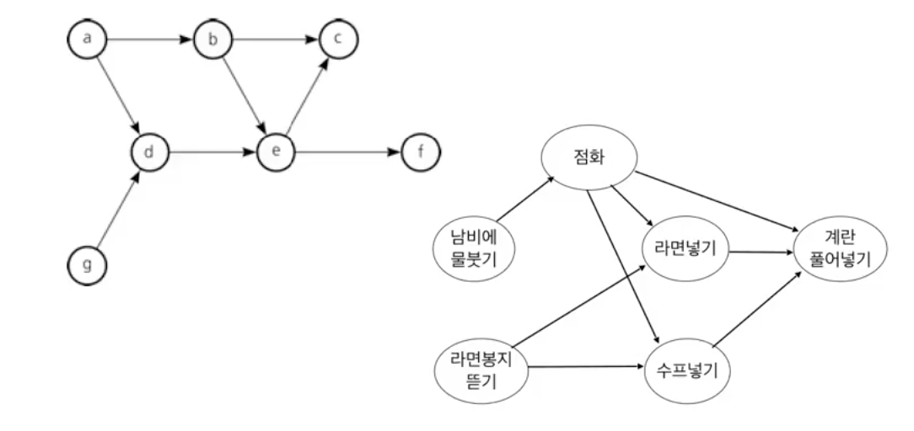
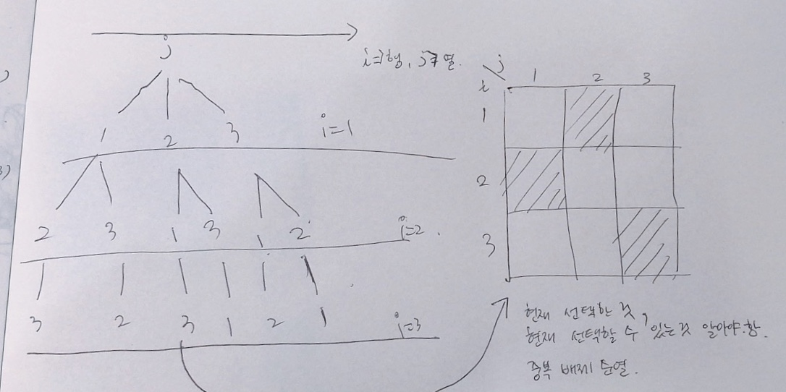

# Error

### Rumtime error

- 원인

  - 인덱스 에러
  - 파일 오픈 구문 넣었을 때
  - import 하지 않은 것 사용
  - 배열에 할당된 크기를 넘어서 접근했을 때
  - 전역 배열의 크기가 메모리 제한을 초과할 때
  - 지역 배열의 크기가 스택 크기 제한을 넘어갈 때
  - 0으로 나눌 때
  - 라이브러리에서 예외를 발생시켰을 때
  - 재귀 호출이 너무 깊어질 때
  - 이미 해제된 메모리를 또 참조할 때

### 제한횟수초과

* 원인
  * 연산 횟수 초과

### Memory Limit Exceeded 

문제에 제시된 메모리보다 많은 양의 메모리를 할당할 때 뜬다.


### Pycharm memory 부족

실제로 사용할 수 있는 용량보다 적게 설정되어 있다.

Heap 메모리 부족한 상태

* 증상

  * pycharm이 버벅거리기 시작함
  * 메모리 부족 에러 메시지가 떴을 땐, 파이참 실행도 안됨
  * 인터넷 역시 사용 불가

* 메모리 확인 방법

  * Settings > memory  검색 > Apperance > Show memory indicator 체크

  * 설치 경로 bin에서 설정파일 수정하여줌

  * bash로 실행하였다.

    ```bash
    # 설치 경로
    # C:\Program Files\JetBrains\PyCharm Community Edition 2018.2.3/bin
    
    $ pwd
    /c/Program Files/JetBrains/PyCharm Community Edition 2018.2.3/bin
    
    $ vi pycharm64.exe.vmoptions
    ```

    ```
    -Xms128m
    -Xmx750m
    
    위를 아래와 같이 바꿔줌
    
    -Xms256m
    -Xmx2048m
    ```

## python error

* TypeError: 'int' object is not subscriptable
  * 빈 리스트를 인덱스로 참조하려하였을 때 혹은 잘못된 이름의 리스트 참조

# 알고리즘 풀이 참고사이트

* [PROJECT REBAS](https://rebas.kr/category/Programming/BOJ)

# Day 1 - Array

Solving Club > list(7월 31일)

* 조망권 View
  * 소스보기 [소스보기](./array/1206.py)
  * best [소스보기](./array/1206풀이.py)


# Day 2 - List1

### SWEA

Lean > Course > IM > List1

* 1일차 - min max [소스보기](./list1/4828.py)

* 1일차 - 전기버스 [소스보기](./list1/4831.py)
  
  * 현재 위치가 N-K보다 작을 동안 반복 
  
  * 현재 위치 pos에서 갈 수 있는 만큼 최대한(pos+k) 간 후, 그 전에 위치한  가장 최근 정류장에서 충전
  
  * 운행할 수 없는 경우1:  현재 위치 pos에서 다음 충전기 정류장 pos+1까지 거리가 k보다 큰 경우
  
  * 운행할 수 없는 경우2: k*m이 n보다 작은경우
  
  * 정류장개수만큼 list. 충전기 있으면 1, 없으면 0. 정류장개수는 100이하. idx는 정류장위치.
  
  * error
  
    ```python
    for j in range(k, -1, -1): # => x
    for j in range(k, 0, -1): # k ~ 1까지
        
    # (n, m) => n ~ m-1
    # (m, n, -1) => m ~ n+1
    ```
  
* 1일차 - 숫자 카드 [소스보기](./list1/4834.py)

  * 염겨레 방법

  ```python
  # 내코드
  ...      
  for i in range(1, 10):
      if cnt[i] >= max_cnt: # 더 개수가 크면
          max_cnt = cnt[i]
          max_num = i
  # 겨레코드 (좀 더 파이썬스러움)
  # list comprehension으로 0~9빈도수 리스트 채움
  ...
  # 최대값, 인덱스 구하는 코드
  max_cnt, max_num = (cnt[i], i) for i in range(1, 10) if cnt[i] >= max_cnt
  ```

* 1일차 - 구간합 [소스보기](./list1/4835.py) 

  * 선생님 방법

  ```
  # 슬라이딩 윈도우
  A, B, C, D
  1회 합 : A+B+C
  2회 합 : B+C+D
  회차마다 더해주지 말고, 2회 때 1회합 - A + D
  시간복잡도 O(n)
  ```

Solving Club > list(8월 1일)

* Flatten, 평탄화 [소스보기](list1/1208.py)

  * 인덱스 접근, 변수에 따로 저장해 접근 [소스보기](list1/1208-2.py)

  ```python
  if box[i] > box[max_idx] # 비교할 때마다 인덱스로 접근하는 대신
  if box[i] > max_val # 변수에 저장하여 비교
  ```

  실행 결과 1.7~1.8 로 별 차이 없었음.

  * 내방법
  
  ```
  건물의 높이를 값으로 가지는 리스트.
  idx는 position
  최소값, 최대값 찾아 덤프 횟수만큼 평탄화
  ```
  
  * 염동환 방법
  
  ```
  높이 큰 것부터 빈도 세기 list 'up', idx = 개수(1 ~ 100)
  높이 작은 것부터 빈도 세기 
  덤프 수만큼 평탄화
  ```
  
  * 선생님 방법
  
  ```
  1. 빈도수 계산
  건물의 높이를 idx로 가지는 리스트. (0 ~ 100 값을 가짐)
  
  2. 최대 최소 찾기
  최소값은 idx = 0부터 처음으로 0이 아닌값을 갖는 idx
  최대값은 idx = 100부터 처음으로 0이 아닌 값을 찾는 idx
  
  3. 평탄화 작업
  최소값 빈도수 올리기, 최대값 빈도수 내리기
  ```
  
  

# Day 3 - List1

Solving Club > list(8월 7일)

* [2일차 - Sum 1209 소스보기](./list1/1209.py)

  * input 값 100개씩 들어옴
  * 100 * 100 행렬
  * 1차원 리스트로 짜보기

  ```python
  # 1차원 리스트
  arr = []
  for _ in range(100):
      arr += list(map(int, input().split()))
      
  # 2차원 리스트
  arr = [list(map(int, input().split())) for _ in range(100)]
  ```

  * 1차원 리스트의 idx

  ```
  만약 2차원 배열 인덱스가 [67][8]이라면,
  1차원 배열 인덱스는 [67 * 100 + 8] 이다.
  ```
  
  * [1209풀이 - for문 한개 쓰기](./list1/1209풀이.py)

[추가 문제 - 백준](https://www.acmicpc.net/problem/2578)

* [2578 빙고](./list1/2578.py) 

  ```python
  # list copy 주의!
  row_cnt = col_cnt = [0]*5
  row_cnt[3] = 4
  print(row_cnt) # => [0, 0, 0, 4, 0]
  print(col_cnt) # => [0, 0, 0, 4, 0]
  ```

  ```python
  # error
  if i == j:
      check[10] += 1
  elif i + j == 4:
      check[11] += 1
  ```

  이렇게 하면, arr(i=2, j=2)=5 일 때, cross_cnt 한개만 카운트된다.

  따라서, elif가 아닌 if로 바꿔줘야 함.

  ```python
  if i == j:
      check[10] += 1
  if i + j == 4:
      check[11] += 1
  ```

  ```
  error
  주의!!
  반례 생각해주기
  계속 틀렸는데, 그 이유가 빙고 갯수를 3인 경우만 생각했기 때문!!
  2줄이 그어진 상태에서, 한 줄이 더 그어졌을 때
  빙고의 개수가 4가 될 수도 있다.
  ```

  

  ```python
  # 수정 전
  if bingo == 3:
      print(cnt)
      break
  ```

  ```python
  # 수정 후
  if bingo >= 3:
      print(cnt)
      break
  ```

  * 김준영 방법 (이렇게 풀어보기!)

  ```
  나의 방법) check = [0] * 12 # row_cnt:0~4, col_cnt:5~9, cross_cnt:10~11
  지워진 개수를 세어주는 리스트를 따로 만들었다.
  
  하지만, 이를 따로 만들지 않고 숫자를 지우는 방법도 있다.
  arr에서 숫자 0으로 변경 후 행순회, 열순회, 대각순회
  ```

추가문제 - SWEA

* [요리사 4012](./list1/4012.py) 

  * 부분집합 문제
  * 부분집합 잘 모르니 일단 그냥 풀어보기

  ```
  식재료를 2그룹으로 나누어야 된다.
  N개의 식재료 --> N/2, N/2
  => 조합 문제(부분집합과 관련)
  원소의 개수가 N/2인 부분집합 찾으면 1그룹 나머지는 2그룹으로.
  N = 최대 16 --> 2^16 = 65,000
  
  가지치기하면 좀 더 빠르게 풀 수 있다!
  ```
  
  * 선생님 풀이
  
  ```python
  # 중복 상관없이 그냥 하기
  
  arr = 'ABCD'
  N = 4
  
  for set_num in range(1 << N):
      a, b = [], []
      for i in range(N):
          if set_num & (1 << i):
              a.append(arr[i])
          else:
              b.append(arr[i])
     if len(a) == len(b):
      	print(a, b)
          
  # ['A', 'B'] ['C', 'D']
  # ...
  # ['C', 'D'] ['A', 'B']
  ```
  
  * error - 제한시간 초과 [코드](./list2/4012_fail.py)
  
    * 조합리스트를 먼저 만들고, 시너지를 한꺼번에 구하는 과정
  * 조합리스트를 만들때 deepcopy를 쓰게 되는데 이 과정이 오래 걸리는 듯 하다.
  * 정상 작동된 코드
    * 조합리스트를 만들지 않고, 
    * 조합을 만드는 과정에서 시너지를 함께 계산하면서 인자로 넘긴다.
    * 조합이 완성되면, 다른 그룹의 시너지를 구하고 min값을 갱신
  * 의문점
    * 부분집합을 구하는 과정이 중복된다.
      * 예를 들어, [(0, 2), (1, 3)]일 때 [(1, 3), (0, 2)]를 또 계산하게 된다.
    * 이 중복을 어떻게 없앨 수 있을까..?
    * 비트연산으로 풀면 없앨 수 있다고 한다.
    * 다시 풀어보기!
  * [비트연산자를 사용한 풀이](./list1/4012_2.py)
    * 초기코드보다 훨씬 빠르고 간결함
    * 초기 : 1,111ms, 1,007
    * 수정 : 658ms, 759

# Day 4 - List2

Lean > Course > IM > List2

* [색칠하기 4836](./list2/4836.py)

```python
# 칠해지지 않은 상태에서 처음 칠할 때만 쓸 수 있음
# 두번째 칠할 때 부터는 어떤색인지 확인해야 함!
# 밑에 코드 쓰지 않기!
for i in range(r1, r2+1): # 위 -> 아래로 r1~r2
    gird[i][c1:c2+1] = [color] * (c2-c1) # c1~c2 개수만큼 color 변경
    
# for문 2개로 row, col 순회하며 color 확인
```

* [부분집합의 합 4837](./list2/4837.py)
* [이진탐색 4839](./list2/4839.py)

* [특별한 정렬 4843](./list2/4843.py)

Solving Club > list(8월 8일)

* [7일차 - 금속막대 1259](./list2/1259.py)

  * 수나사, 암나사 길이가 같은 나사는 존재하지 않음!
  * 연결되지 않는 나사 존재하지 않음!
  * 그냥 끼워넣기로 풀어보기

  ```
  1. 시작 나사를 찾기
     수나사와 대응되는 암나사가 없으면 시작 나사!
  2. 나사를 list에 삽입하면서 마지막나사인 암나사와 대응되는 수나사를 찾는다!
  3. 2를 n-2번(시작나사 제외) 반복한다 
  ```
  
  * 장은비 방법(재귀로 구현)
  
  ```
  def sort(screws, result, tmp):
  
  screws : 나사
  result : 답으로 출력할 리스트
  tmp
  
  screws에 있는 나사를 한 개씩 읽음.
  연결이 되면 result
  연결이 안되면 tmp
  tmp + result
  
  return sort(tmp, result, [])
  ```
  
  * 선생님 방법
  
  ```
  순열 만드는 방법, 모든 방법 단순한 방법
  하나씩 연결하면서 안되면 가지치기
  순열 생성 아직 재귀로 하는 것 안 배움! 나중에 배우면 해보기!
  ```
  
  * SWEA 화학물질2 비슷한 문제 풀어보기! 순열, DP

추가 문제 - 백준

 * [색종이 10163](./list2/10163.py)
   
    * [사이트](https://www.acmicpc.net/problem/10163)
    
 * [숫자카드 10815](./list2/10815.py) 
   
   * [사이트](https://www.acmicpc.net/problem/10815)
   * 첫번째시도) 초기 완전탐색 코드 시간초과!
   * 두번째시도) 이진 탐색
     * 상근이 카드 정렬 시킨 후 할 것
     * 이 때, sorted() 써도 되는지.. 모르겠지만 일단 써보자.
   
   ```python
   # error
   if your > my[mid]:
     left = mid
   elif your < my[mid]:
     right = mid
   ```
   
   ```
   위와 같이 하게 되면,
   반복문 빠져나올 수 없다.
   이미 검사한 mid 위치를 제외하고 검사해야한다.
   아래와 같이 바꿈.
   ```
   
   ```python
   if your > my[mid]:
     left = mid + 1
   elif your < my[mid]:
     right = mid - 1
   ```
   
   ```
   또한, while 조건문도 다음과 같이 바꾸어줌
   ```
   
   ```python
   while left != right: # 수정 전
   while left <= right: # 수정 후
   ```
   
   
   
   * 김태우 방법(set 이용)
   
   ```
   상근 카드 set
   검사할 카드 list
   
   set은 이진탐색트리, 해싱으로 구현되어 있음
   map, set, hashmap, hashset 등..
   
   주의) set은 순서를 보장하지 않음! indexing x
   ```
   

# Day 5 - String

SWEA

* [String 1221.py](./string/1221.py)
  * 내 방법은 dictionary에 개수 세어 저장하고 출력하는 방식.
  * 굳이 이렇게 할 이유가 없음
  * 세면서 바로 출력하게 하기!
* [간단한 압축 풀기 1946.py](./string/1946.py)

# Day 6 - String

SWEA > Learn > Course > IM > 파이썬 - String

* [문자열 비교 4864.py](./string/4864.py)
  
  * 브루트 포스로 풀어보자.
  * 다른 방법으로도 풀어보기!
  
* [회문 4861.py](./string/4861.py) 

  * 추윤형 코드 [4861chu.py](./string/4861chu.py)

  ```
  이중 for문 나오기 위해 flag 라는 변수를 이용!
  ```

  * 정지수 코드

  ```
  한 함수로 가로, 세로 검사 모두 가능하도록 함!
  지금 나의 방법은 가로, 세로 검사 따로 함수를 만들었음
  행,열 바꾸기를 이용함
  
  데이터가 크지 않을 경우,
  이 방법이 더 좋다고 함!
  ```

  

* [글자수 4865.py](./string/4865.py)

추가문제 - SWEA

* [세상의 모든 팰린드롬 2 4579.py](./string/4579.py)
* [세상의 모든 팰린드롬 4522.py](./string/4522.py)
* [자기 방으로 돌아가기 4408.py](./string/4408.py)

[추가문제 - 백준](https://www.acmicpc.net/problem/1244)

* [스위치 켜고 끄기 b1244.py](./string/b1244.py) 

  ```python
  # error 출력형식이 잘못되었습니다.
  # 아래 두 코드 시도해봐도 안됨
  # 1)
  print(' '.join(map(str, switch)))
  
  # 2)
  for i in range(sw_len - 1):
      print(switch[i], end=" ")
  
  print(switch[i + 1])
  ```

  문제 출력 조건 제대로 읽기! (**한 줄에 20개씩 출력**)

  아래와 같이 바꾸었다.

  그런데, ...

  ```python
  # runtime error!
  switch = list(map(str, switch))
  while len(switch) >= 20:
      print(' '.join(switch[20]))
      tmp -= 20
      switch = switch[20:]
  print(' '.join(switch))
  ```

  왜 그런지는 모르겠으나 아래와 같이 수정 후 pass

  ```python
  s = 0
  tmp = sw_len
  switch = list(map(str, switch))
  while tmp >= 20:
      print(' '.join(switch[s:s+20]))
      tmp -= 20
      s += 20
  print(' '.join(switch[s:]))
  ```

  아마 `switch = switch[20:]` 이 부분이 원인인듯 하다.

  앞으로 이러한 코드는 쓰지 않는 걸로..

Solving club > 03.String(8월 16일)

* [회문1 1215.py](./string/1215.py) 

  ```
  index 주의하기!
  가장 많이 뜬 에러 out of range index
  
  윤형씨 팁)
  인덱스 에러가 뜰 때 마지막 범위 + 1 해보고 돌려보기
  
  검사 범위 (text길이8, 회문길이4 일 때)
  행 검사: row는 0 ~ 7 / col은 0 ~ 4
  열 검사: col은 0 ~ 7 / row는 0 ~ 4
  ```

  ```
  start = (0 ~ N -M)
  end = start + m - 1
  비교 횟수 m // 2
  ```
  
  * 선생님 풀이
  
    * 슬라이싱 쓰면 속도가 느려지고, 메모리 많이 쓴다!
  
    * 나의 코드 경우에 p라는 현재 위치 변수 만들었지만, 
  
      선생님 경우 start, end위치 저장하는 변수 따로 만들었음
  
  ```python
  for tc in range(1, 11):
      m = int(input()) # 회문 길이
      word = [input() for _ in range(8)]
      
      ans = 0
      
      idx = 0
      # 한 행/열(idx:0)에 대해서,
      for s in range(8 - m + 1):
      	e = s + m - 1 # end, start
          for i in range(m // 2): # 행우선순회
              if arr[idx][s + i] != arr[idx][e - i]: break
          else:
              ans += 1
          for i in range(m // 2): # 열우선순회
              if arr[s + i][idx] != arr[e - i][idx]: break
          else:
              ans += 1
  ```
  
* [회문2 1216.py](./string/1216.py) 

  * 선생님 코드 

  ```python
  for tc in range(1, 11):
      m = int(input()) # 회문 길이
      word = [input() for _ in range(8)]
      
      ans = 1 # 지금까지 찾은 최대 길이
      # 한 행/열에 대해서,
      for idx in range(100):
          for s in range(100): # 시작 위치
              for e in range(99, s, -1): # 끝 위치, 99 ~ 0
                  L = e - s + 1 # L 현재 길이
                  if L <= ans: break
          		for i in range(L // 2): # 행우선순회
              		if arr[idx][s + i] != arr[idx][e - i]: break
         			else:
              		ans = L
                  if L <= ans: break
          		for i in range(L // 2): # 열우선순회
              		if arr[s + i][idx] != arr[e - i][idx]: break
          		else:
              		ans = L
  ```

  * 다른 방법 (한번 구현해보기)
    * 인접한 부분 비교, 같을 때까지
    * 회문 길이가 짝수, 홀수인 경우로 나눠 비교해야함
    * 기준 위치를 잡아야함 (홀수의 경우 가운데/짝수 경우 왼쪽 or 오른쪽)

  ```python
  for tc in range(1, 11):
      m = int(input()) # 회문 길이
      word = [input() for _ in range(8)]
      
      ans = 1 # 지금까지 찾은 최대 길이
      # 한 행/열에 대해서,
      for idx in range(100):
          for x in range(100): # x => 기준 위치
              # 회문 길이가 짝수
              # 행에 대해서
              l, r, cnt = x, x + 1, 0 # cnt는 회문 길이
              while l >= 0 and r < 100:
                  if arr[idx][l] != arr[idx][r]: break
                  l, r, cnt = l - 1, r + 1, cnt + 2
              ans = max(ans, cnt)
              # 열에 대해서 
              l, r, cnt = x, x + 1, 0
              while l >= 0 and r < 100:
                  if arr[l][idx] != arr[r][idx]: break
                  l, r, cnt = l - 1, r + 1, cnt + 2
              ans = max(ans, cnt)
              
              # 회문 길이가 홀수
              # 행에 대해서
              l, r, cnt = x - 1, x + 1, 1
              while l >= 0 and r < 100:
                  if arr[idx][l] != arr[idx][r]: break
                  l, r, cnt = l - 1, r + 1, cnt + 2
              ans = max(ans, cnt)
              # 열에 대해서 
              l, r, cnt = x - 1, x + 1, 1
              while l >= 0 and r < 100:
                  if arr[l][idx] != arr[r][idx]: break
                  l, r, cnt = l - 1, r + 1, cnt + 2
              ans = max(ans, cnt)
  ```

# Day 7 - Stack1

SWEA > IM > stack1

* [4일차 괄호검사 4866.py](./stack1/4866.py)

* [1210 Ladder 1](./stack1/1210.py)

  * 김준영 방법 : 거꾸로 생각하기

  ```python
  맨 위부터 찾지 않고,
  마지막 행부터 찾는다.
  2를 먼저 찾아서 위로 올라가는 방식!
  헿
  ```

  * [재귀로 해보기](./stack1/1210-2.py)

  ```
  김준영 방법으로 첫번째 행부터 말고, 마지막 행부터!
  결과를 찾아 올라가기!
  ```
  
  * [선생님 풀이1 - 반복문 (내 방법과 같음)](./stack1/1210solution.py)

    * 조건에 따른 좌표 이동과 방향 설정
  
      1. 오른쪽 길 있으면 이동, 방향 설정
      2. 왼쪽 길 있으면 이동, 방향 설정
      3. 위로 이동
      4. 왼쪽에 길이 있으면 이동
      5. 위로 이동, 방향 설정
      6. 오른쪽에 길 있으면 이동
      7. 위로 이동, 방향설정
  
    * 위 경우는 3가지로 묶을 수 있음 (1,2,3), (4, 5), (6, 7)
  
    * 방향 상태 저장하는 변수 direction = 위 or 왼쪽 or 오른쪽
    
    ```python
    dir = 0 # direction 0: 위, 1: 왼쪽, 2: 오른쪽
    while x:
        if dir != 2 and y - 1 >= 0 and arr[x][y - 1]:
            y, dir = y - 1, 1
        elif dir != 1 and y + 1 < 100 and arr[x][y + 1]:
            y, dir = y + 1, 2
        else:
            x, dir = x - 1, 0
    ```
    
    ```python
        while x:
        if y - 1 >= 0 and arr[x][y - 1]:
            while y - 1 >= 0 and arr[x][y - 1]:
                y -= 1
        elif y + 1 < 100 and arr[x][y + 1]:
            while y + 1 < 0 and arr[x][y - 1]:
                y += 1
        x -= 1
    ```
    
  * [선생님 풀이 2(재귀)](./stack1/1210solution.py)
  
    * 나의 재귀와 다르게 visit라는 방문 리스트를 따로 만들지 않고,
  
      가지고 있는 경로 변수를 이용함
  
    ```python
        def DFS(x, y):
        if x == 0: return y
        
        arr[x][y] = 0 # 이 부분 주목!
        if y - 1 >= 0 and arr[x][y - 1]:
            return arr(x, y - 1)
        elif y + 1 < 100 and arr[x][y + 1]:
            return arr(x, y + 1)
        else:
            return arr(x + 1, y)
    ```
  
    
  


# Day 8 - Stack1

SWEA > IM > stack1

* 4869.4일차 - 종이붙이기

  * 점화식 문제 - 보통 n에 대한 문제 풀 때는, n-1은 다 완료되어있다 생각하기
  * 더 작은 문제로 큰 문제를 해결하자

  ```
  f(1), f(2)
  n=1일 때 1가지
  n=2일 때 3가지(가로2개, 세로2개, 큰거1개)
  
  f(0)이면, 안만드는법 1가지!
  
  길이 n일 때,
  n-1에 10짜리 붙이는 방법 1가지!
  n-2에 1)20짜리 가로직사각형2개로, 2)20짜리 큰 사각형 1개로 2가지!
  (세로2개는 n-1에 10짜리 붙이는 방법에 포함!)
  ```

  * [재귀](./stack1/4869.py)
  * [DP](./stack1/4869-2.py) 

* 4871 [파이썬 S/W 문제해결 기본] 4일차 - 그래프 경로

  * [스택 사용](./stack1/4871-2.py) 해결하지 못하였음!

    ```python
    # runtime error!
    def DFS(v, g):
        stack = []
    
        visit[v] = True
        stack.append(v)
    
        while s: # 빈 스택 아닐동안
            for w in matrix[v]:
                if not visit[w]: # 가지 않았던 노드
                    if w == g:
                        return 1
                    visit[w] = True # 방문
                    stack.append(w)
                    v = w
                    break
            else: # 갈 수 있는 노드 없으면, 
                stack.pop()
                if stack:
                    v = stack[-1] # 되돌아가기
        return 0
    ```

    * 이유를 모르겠다. 원래 재귀로 푸는 것인가..???
    * 해결하지 못하였음!

  * [재귀 사용](./stack1/4871.py)

    * ??? 의문점) 재귀로 쓰는 DFS는 중간에 stop하지 못하는가..?

    ```python
    # error1
    def DFS(v, g): # v 현재 노드, g 도착 노드
        if v == g:
            return 1
        
        visit[v] = True
    
        for w in matrix[v]:
            if not visit[w]:
                route.append(w)
                return DFS(w, g)
       	return 0
    ```

    ```python
    # 선생님 solution - 이렇게 쓰자!
    def DFS(v, g): # v 현재 노드, g 도착 노드
        if v == g:
            return 1
        
        visit[v] = True
    
        for w in matrix[v]:
            if not visit[w]:
                route.append(w)
                if DFS(w, g) == 1:
                    return 1
       	return 0
    ```

    

    ```결과
    #1 1
    #2 1
    #3 None
    ```

    ```python
    # error2
    def DFS(v, g): # v 현재 노드, g 도착 노드
        if v == g:
            return 1
        
        visit[v] = True
    
        for w in matrix[v]:
            if not visit[w]:
                route.append(w)
                DFS(w, g)
    ```

    ```
    #1 None
    #2 None
    #3 None
    ```

    ```python
    # error3
    def DFS(v, g):  # v 현재 노드, g 도착 노드
        if v == g:
            return 1
    
        visit[v] = True
    
        for w in matrix[v]:
            if not visit[w]:
                route.append(w)
                DFS(w, g)
        return 0
    ```

    ```
    #1 0
    #2 0
    #3 0
    ```

    ```python
    # 해결
    def DFS(v):
        visit[v] = True
    
        for w in matrix[v]:
            if not visit[w]:
                route.append(w)
                DFS(w)
                
    ...
    route = []
    
    DFS(s)
    for r in route:
        if r == g:
            result = 1
            break
        else:
            result = 0
    ```

    DFS 중간에 중단하지 않고, 모두 수행한 후

    route 중 도착지점 있는지 검사하였다.

  * 정지수 해결법 ==> flag 변수 사용

    ```python
    ## 그래프 경로 4871.py
    # 유향 그래프
    # 재귀 DFS
    def DFS(v):
       flag = 0
       visit[v] = True
       if v ==g:
           return 1
       for w in matrix[v]:
           if not visit[w]:
               flag = DFS(w)
               if flag == 1:
                   break
       return flag
    t = int(input())
    for tc in range(1, t + 1):
       v, e = map(int, input().split()) # 노드, 엣지
       matrix = [[] for _ in range(v + 1)]
       # 인접행렬
       for _ in range(e):
           start, end = map(int, input().split())
           matrix[start].append(end)
       s, g = map(int, input().split()) # 시작, 도착노드
       visit = [False] * (v + 1) # 방문 노드
       print('#{} {}'.format(tc, DFS(s)))
    ```

    

* [4873. [파이썬 S/W 문제해결 기본] 4일차 - 반복문자 지우기 D](./stack1/4873.py)

추가문제

SWEA > Soving Club

* 작업순서 1267

  * DFS-스택, [DFS-재귀](./stack1/1267-2.py), [DAG-queue](./stack1/1267-3.py) 세가지 방법으로 풀어보았다.
  * DFS-스택, 재귀는 답을 스택에 저장해 거꾸로 출력
    * 방문하면서 위상순서 리스트에 저장하는 것이 아닌
    * 더 이상 갈 노드가 없을 때, 위상순서에 저장하였고
    * 이를 거꾸로 출력한 것이 답이다.
  * DAG-큐는 위상순서 그대로 출력
    * visit 대신 indegree 리스트를 사용하였음
  * [dfs스택 - 소스보기](./stack1/1267.py) 

  ```python
  # 항상 스택 접근할 때 isEmpty 주의한다!
  if tmp_stack: 
      v = tmp_stack[-1] # 되돌아가기
  ```

  * DFS로 푸는데 문제점 발생!  (DAG로도 풀어보기!)

  ```
  시작노드 찾기)
  
  들어오는 indegree 0이면서, outdegree 1이상
  
  => 결과 Fail
  
  왜?
  시작 노드가 한개만 존재하는 것이 아니다.
  아래 그림을 예로, a, g 모두 시작노드가 된다.
  
  그렇다면 시작노드에서 시작한 후, 터미널 노드까지 갔을 때
  다시 돌아오면서 방문하지 않은 노드를 찾아야한다.
  예)
  a -> b -> c 까지 온 후,
  c에서 outdegree 0이므로 이 때 1) stack에 넣어줌!
  stack을 2개 써야함
  
  1) 방문 순서 저장할 stack
  2) 돌아갈 노드 저장할 stack
  
  자세한 방법은 위상정렬 - 2)DFS 보기!
  ```

  * error
    * v(노드)와 result_stack의 길이는 같아야 하지만, v값이 더 크다.
      방문하지 않은 노드가 존재한다!
      어디서 놓쳤을까?

  ```python
  # 10 tc 중 6개만 맞음
  # 왜?
      print(v)
      print(len(result_stack))
  ```

  * 문제 코드

    ```python
    for s in range(1, v + 1):
        if outgoing[s] and indegree[s] == 0: # 시작노드이면,
            dfs(s)# DFS 시작
    ```

  * 해결 코드

    ```python
    for s in range(1, v + 1):
        if indegree[s] == 0:: # 시작노드이면,
            dfs(s)# DFS 시작
    ```

    * 왜?
      * 혼자 떨어져 있는 노드가 존재함
      * [input data](./stack1/1210input.txt)의 in, out node에는 존재하지 않음
      * 예로 test case 6번의 {160, 137, 172, 140, 119}번 노드들
      * 모두 다 연결된 상태는 아님

  * 위상 정렬 - 1) DAG(Directed Acyclic Graph) (indegree, outdegree고려)

    

    *  **들어오는 엣지를 Incomming** **/나가는 엣지를 Outgoing**
    * **엣지의 개수를 Indegree** /**나가는 엣지의 개수를 Outdegree**
    * BFS와 비슷한 방법이다.
    * 작업의 우선순위를 표현할 때 DAG 구조를 가짐
    * Queue 이용해야한다.
    * 진입 차수 계산(정점번호 idx로, 모든 정점의 진입차수 계산)
      * v에서 나가는 간선의 개수
    * 들어오는 화살표 없는(진입차수가 0인) 정점 Queue에 넣기
      * FIFO
    * v의 인접정점(u) 찾아 진입차수 1감소
      * u의 진입차수 0이 되면 u를 큐에 삽입

    

    ```python
    arr = [0, 1, 2, 2, 2, 1, 0]
    	 # a, b, c, d, e, f, g 
    
    
    queue = [a, g] # indegree 0 큐에 삽입
    arr = [0, 0, 2, 1, 2, 1, 0] # queue[0]인 a의 인접정점 indegree -1
    result = [a] # 위상순서 a
    queue = [g, b] # 인접정점 indegree 0 이 되면, queue에 삽입
    
    arr = [0, 0, 2, 0, 2, 1, 0] # g의 인접정점 indegree -1
    result = [a, g]
    queue = [b, d]
    
    arr = [0, 0, 1, 0, 1, 1, 0]
    result = [a, g, b]
    queue = [d]
    
    arr = [0, 0, 1, 0, 0, 1, 0] # d의 인접정점 e의 indegree -1
    result = [a, g, b, d]
    queue = [e]
    
    arr = [0, 0, 0, 0, 0, 0, 0] # d의 인접정점 e의 indegree -1
    result = [a, g, b, d, e]
    queue = [c, f]
    
    result = [a, g, b, d, e, c, f]
    queue = []
    ```

    ```python
    # python에서 큐 구현은 아래와 같이 import하여 사용함
    from collections import deque
    
    dq = deque()
    dq.append(1)
    dq.append(2)
    dq.append(3)
    dq.append(4) # => [1, 2, 3, 4]
    dq.popleft() # => [2, 3, 4]
    ```

    

  * 위상 정렬 - 2) DFS (outdegree만 고려)

    * 위의 예제로 보자
      * **시작점이 주어질 땐, 방문할 때마다 result_list에 넣었다.**
      * **방문 끝나면 들어온 순서대로 출력**
      * 이 예제는 시작점이 주어지지 않음!
      * 따라서 **더 이상 갈 노드가 없을 때 result_stack에 넣는다.**
      * **방문 끝나면 거꾸로 출력!**

    ```
    a에서 시작! (outgoing이 존재함)
    stack = [a]
    stack = [a, b]
    stack = [a, b, c] => 갈 노드가 없음! result_stack = [c]
    stack = [a, b]
    stack = [a, b, e]
    stack = [a, b, e, f] => 갈 노드가 없음! result_stack = [c, f]
    stack = [a, b, e] => 갈 노드가 없음! result_stack = [c, f, e]
    stack = [a, b] => 갈 노드가 없음! result_stack = [c, f, e, b]
    stack = [a]
    stack = [a, d] => 갈 노드가 없음! result_stack = [c, f, e, d]
    stack = [a] => 갈 노드가 없음! result_stack = [c, f, e, d, a]
    stack = []
    
    g에서 시작! (indegree 0, outdegree 1이상)
    stack = [g] => 갈 노드가 없음! result_stack = [c, f, e, d, a, g]
    ```

    * indegree 0인 곳에서 시작!
    * 더 이상 진입할 노드 없을 때, 다시 돌아감
      * 현재 노드를 스택에 저장
    * 거꾸로 출력! (stack pop)

* [쇠막대기 자르기 5432](./stack1/5432.py) 

  * 초기 코드 Fail

    * 원인
      * 쇠막대기 길이가 끝났을 때를 고려 안해줌
      * 끝나는 경우는 `)`다음에 `(`가 오는 경우
      * 주의) laser 경우와 구별해야함
      * laser `(`,`)`다음에 `(`가 오는 경우
      * 해결) tmp 값으로 이전 괄호를 저장해준다.
        *  `))` `()`
        * `)`가 입력될 때, 막대끝 : tmp = `)`/레이저 : tmp = `(` 

    ```python
    t = int(input())
    for tc in range(1, t + 1):
        bar = input()
    
        stack = []
        result = 0 # 답
        i = 0
        for b in bar:
            if b == '(':
                stack.append(b)
            else: # ')'
                # stack 비었는지 확인 안해도 됨
                stack.pop()
                result += len(stack)
         
        print('#{} {}'.format(tc, result))
    ```

    

# Day 9 - Stack1

오늘은 백트래킹에 대해서 배웠다.

Lean > Course > IM > List2 [부분집합의 합 4837](./list2/4837.py) 문제를

백트래킹 이용해 다시 풀어보겠다.

* [부분집합의 합 4837-2](./stack1/4837-2.py)

  * 가지치기 해보기

  ```python
  # error!
  def subset(k, n, tmpsum):
      global result
      if tmpsum > setsum:
          return
      if k == n:
          if tmpsum == setsum: # => 1)이부분 잘못됨!
              result += 1
          return
      subset(k + 1, n, tmpsum + uset[k]) # 왼쪽
      subset(k + 1, n, tmpsum) # 오른쪽
      
  uset = [i for i in range(1, 13)]
  t = int(input())
  for tc in range(1, t+1):
      n, setsum = map(int, input().split())
  
      result = 0
      subset(0, n, 0) # => 2)이부분 잘못됨!
  
  
      print('#{} {}'.format(tc, result))
  ```

  1)부분집합원소의 수를 체크하지 않았다! 

  2)12 높이까지 모두 확인해야함 (여기서 높이는 루트노드에서 현재노드까지 경로를 의미함)

  `subset(0, 3, 0)` 이면 높이 3까지만 확인함

  문제에서는 부분집합원소개수, 부분집합원소합 두가지 조건 충족해야한다고 하였음

  아래와 같이 바꿈!

  ```python
  # 해결!
  def subset(k, n, cnt, tmpsum): # cnt = 현재 선택한 원소수, tmp_sum: 원소들 합
      global result, ele_cnt, setsum
      if tmpsum > setsum:
          return
      if k == n:
          if tmpsum == setsum and cnt == ele_cnt:
              result += 1
          return
      subset(k + 1, n, cnt + 1, tmpsum + uset[k]) # 왼쪽(1:포함)
      subset(k + 1, n, cnt, tmpsum) # 오른쪽(0:미포함)
  
  uset = [i for i in range(1, 13)]
  t = int(input())
  for tc in range(1, t+1):
      ele_cnt, setsum = map(int, input().split())
  
      result = 0
      subset(0, 12, 0, 0)
  
  
      print('#{} {}'.format(tc, result))
  ```
  
* **여기서 중요한 점!** 
  
  * 지역변수를 영역 밖에서 사용할 때, `global`로 선언하고 써야함
  
  * 단순히 값이 몇인지 확인할 수 있지만,
  
  * 변수의 값을 바꿀 순 없다.
  
  * 하지만 리스트는 그냥 썼는데?
  
    * 김준영 피셜) 리스트는 객체이기 때문에 인자로 넘기지 않고도 변경이 가능했던 것!
  
      ```python
      # 변경할 수 없음
      
      def test():
          print(a)
          a = a + 1
          
      a = 3
      test()
      
      # error!
      # UnboundLocalError: local variable 'a' referenced before assignment
      ```
  
      ```python
      # 값이 몇인지는 알 수 있음
      
      def test2():
          print(a)   
          
      a = 3
      test2() # => 3
      ```
  
      ```python
      # global 선언
      
      def test3():
          global a
          a += 1
          print(a)
          
      a = 3
      test3()
      4
      ```
  
      

SWEA > Soving Club

* [1220 Magnetic](./stack1/1220.py) 

  * 선생님 풀이

    ```python
    준비(0, 1 무시) --> 교착(0, 2무시)
    ```

  * 내 풀이

    ```
    상태 1(n극) or 2(s극)만 기억, 0무시
    1 => 2 개수만 세어줌!
    ```

# Day 10 - Stack2

SWEA > Soving Club

* [1224. 6일차 - 계산기3](./stack2/1224.py)

SWEA > Learn > Stack2

* [4874. Forth](./stack2/4874.py)

  ```python
  # error!
  
  if stack and stack[-1].isdigit():
  ```

  `stack[-1]`이 연산되어 `int형`으로 stack에 있을 수 있다.

  ```bash
  # error message
  
  'int' object has no attribute 'isdigit'
  ```

  ```python
  # 해결
  
  if stack and str(stack[-1]).isdigit():
  ```

  `str형`으로 변환 후 사용하였다.

  ```python
  # error!
  else: # '/' 나누기
      stack.append(num1 / num2) # => 소수점으로 return
  
  # 해결
  else: # '//' 몫
      stack.append(num1 // num2) # => 정수형으로 return
  ```

  

  * runtime error : 10개 중 5 case만 맞았다.

    왜?

    ```python
    # 왜?
    # 연산자 만났을 때, 숫자 2개 뽑는 과정
    if stack and str(stack[-1]).isdigit():
        num1 = int(stack.pop()) # num1 => num2
    else:
        result = 'error'
        break
    if stack and str(stack[-1]).isdigit():
        num2 = int(stack.pop()) # num2 => num1
    else:
        result = 'error'
        break
       
    # ...
    
    # 연산과정
    if c == '+':
       stack.append(num1 + num2)
    # ...
    ```

    뒤에 숫자부터 뽑기 때문에 num1, num2자리가 바뀌었다.

  * 불필요한 코드

    ```python
    if stack and str(stack[-1]).isdigit():
        num1 = int(stack.pop())
    ```

    어차피 스택에 넣을 때, int로 들어가기 때문에 이러한 번거로운 작업 필요 없다.

    아래와 같이 바꾸어줌

    ```python
    if stack:
        num1 = stack.pop()
    ```

* 4875 - 미로

  * DFS로 풀어보자.

    * [소스보기](./stack2/4875.py)

  * 백트래킹으로는 어떻게...?

    * 백트래킹 vs DFS

      * 백트래킹은 답을 찾는 것이 목적!

      * 답 찾으면 종료

      * DFS는 모든 경로 찾는 것이 목적!

      * 그래서 DFS 재귀로 풀었을 때, return 값 설정에 어려움을 느꼈다.

      * 정지수 tip으로 flag를 사용할 수 있지만,

        익숙치 않으니 일단 return 없는 재귀로 풀어본다.

* [4880 - 토너먼트 카드게임](./stack2/4880.py)

  * 풀이

    * 분할정복으로 푸는 문제

    * 아직 분할정복 이해못했으니 일단 풀어보고,

      분할정복 공부한 후에 다시 풀어보자.

    ```
    처음 아이디어)
    
    재귀사용하여 완전 이진 트리 형태로 함수를 호출하였다.
    만약, 학생수가 6이라면 6 학생을 포함할 수 있는 2^3=8개의 노드가 필요하다.
    만약, 학생수가 9라면, 2^4 = 16개의 노드 필요.
    따라서 트리의 높이는 n=6일 때, height=3
    
    재귀 종료 조건은 트리 높이가 3일 때, 학생 번호를 return 하였다.
    ```

    * 위와 같이 풀면 안된다.
      * 문제에서 그룹 나누는 조건 `(i ~ (i+j)//2)`, `((i+j)//2 + 1 ~ j)` 라고 명시하였다.
      * 하지만 나의 경우 앞에서부터 2개씩 그룹핑하는 방법이기 때문에 test case 4개만 맞추었다.
      * [원래 짰던 실패 코드](./stack2/4880fail.py)

* [4881 - 배열 최소합](./stack2/4881.py)

  * 중복 순열 이해하기

    

  * 제약 조건

    ```
    한 줄에서 하나씩 N개의 숫자를 골라 합이 최소가 되도록 하려고 한다. 단, 세로로 같은 줄에서 두 개 이상의 숫자를 고를 수 없다.
    ```

    행, 열 중 1개씩(like 스도쿠)

  * 백트래킹 : 배열 합 구하는 과정에서 최소합 넘어버리면 가지치기
  
  * error 제한시간 초과
  
    * 가지치기 하지 않았더니 제한시간 초과!
    * 해결) 아래 조건 추가
  
    ```python
    def min_sum(tmp, i): # tmp: 배열합, i: 현재행
        # ...
        
        # 최소합보다 크므로, 더 이상 배열합 구할 필요 없음!
        if tmp >= result:
            return
        # ...
    ```
  
  * 선생님 풀이
  
    ```python
    if tmp >= result:
        return
    
    if k == n:
        result = tmp # min(result, tmp) => 불필요, 왜?
        			 # 값이 작으니 내려왔을 것이다.
        return
    ```
  
    * 내 코드와 비교 
  
      * **순서에 따라 결과 달라질 수 있음에 주의하자**
      * 위는 가지치기 위에서 하였음
      * 그래서 min()함수 불필요
      * 나는 가지치기 아래서 했기 때문에 min()함수를 써야했다.
  
      ```python
      if i == n:
          result = min(tmp, result)
          return
      
      if tmp >= result:
          return
      ```
  
      

# IM

* 문제

  * n, m, k(행, 열, 색칠횟수)
  * 각 색칠마다 좌상단, 우하단 좌표와 명도 번호가 주어짐
  * 칠하려는 영역 내 더 밝은 명도 존재하면, 색칠 아예 하지 않음
    * 칠하려는 영역내 검사, 색칠하는 과정(같은 for문 두번 돌렸음)

* 결과 Fail

  * [소스보기](./test/im1.py)

  * runtime error

    * 런타임에러의 원인으로는,

      잘못된 코드(인덱스 에러 등)가 있음

    * 정답인 코드를 보니 인덱스 에러일듯하다.

    * 연산횟수초과는 제한시간초과 메시지가 뜬다.

  * 왜?
  
    * 좌상단(x1, y1), 우하단(x2, y2)가 주어졌다.
  * x1~x2를 행, y1~y2를 열로 봐야하나 반대로 풀었다.
    * 그래서 50 case 중 22개만 맞았다.(아마 정사각형만 맞은듯)
  
    

# Day 11 - Queue

* [stack 2; 4875 - 미로](./stack2/4875.py)를 BFS로 풀어보자
  * [소스보기 4875-1.py](./queue/4875-1.py)

SWEA > Learn > IM > Queue

* [5097 - 회전](./queue/5097.py)

* [5105 - 미로의 거리](./queue/5105.py)
  
  * BFS, 최단거리
  
* [5099 - 피자 굽기](./queue/5099.py)

  * error
    * Memory Limit Exceeded
    * 문제에서 할당된 메모리보다 더 많은 양을 사용했을 때,
  * 해결
    * 불필요한 리스트, 덱 지워줌

* [5102 - 노드의 거리](./queue/5102.py)

  * 최단거리 - BFS 이용

  *  노드 중에는 간선으로 연결되지 않은 경우도 있을 수 있다.

  * Runtime error

    ```python
    # 아래 조건 추가로 해결!
    if not visit[n]: # 방문안했으면,
    ```

  * error : 10개 중 9개만

    * 문제에서 명시해주지 않음!
    * 도착점에 갈 수 없으면 0을 출력해줌

# Day 12 - Queue

SC 추가문제

* [4047 - 영준이의 카드 카운팅](./queue/4047.py)

* [1238 - Contact](./queue/1238.py)

  * 왜 Queue 문제일까?

    * BFS는 최단거리 구할 때 썼었는데...

    * BFS는 깊이(거리)를 알 수 있다. 

      그건 DFS도 마찬가지

    * DFS, BFS 두 방법으로 풀어볼 수 있다.

  * 문제

    * 가장 나중에 연락을 받게 되는 사람 중 가장 큰 번호

  * 입력

    * 비어있는 번호가 있을 수 있다.

    * 시간이 지나도 연락을 받지 못하는 번호 존대

    * 동일한 {from, to}쌍이 여러 번 반복되는 경우 존재

      * queue에 두번 이상 들어갈 수 있다.

      * 만약, 경로를 찾는 문제라면 문제가 될 소지 있지만,

        거리만을 필요로하기 때문에 검사하지 않겠다.

## IM 대비

* [2597.줄자접기](./IM/2597.py)

  * [문제](https://www.acmicpc.net/problem/2597)

  * 소수점 출력

    ```python
    a = 3.54
    print(format(a, '.1f'))
    3.5
    
    a = 3.65
    print(format(a, '.1f'))
    3.6
    
    # error
    print('{}'.format(a, '.1f'))
    3.65
    
    # 아래와 같이 써야한다.
    print('{0:.1f}'.format(a))
    3.6
    ```

  * 8번만에 성공하였다.

  * 놓친 것은..?

    * 줄자를 접어 더 긴 곳으로 점을 옮겨야한다.
    * 왼쪽점만, 오른쪽점만, 둘다 옮기는 경우도 있고, 둘 다 옮기지 않는 경우도 있다.
    * float형으로 써야하니, 처음부터 float형으로 넣어주었다.
    * 또한, 접었을 때 다른 점 중 같은 곳에서 접히는 점이 있으면 그 점은 접지 말아야한다.
      * DFS, BFS에서 visit 처럼 접혀야하는지 아닌지를 알 수 있는 check를 썼다.

* [2615.오목](./IM/2615.py)

  * [문제](https://www.acmicpc.net/problem/2615)

    * 문제 제대로 읽기
    * 바둑알 위치 제일 왼쪽 출력, 세로일 때는 가장 위

  * error

    * 런타임 에러

      * 거의 인덱스 에러다

      * 대각선2 일 때 for문 잘못되었다.

      * 테스트 케이스 부족할 때, 다른 예제 만들어 넣어보기!

      * 인덱스 에러가 나는 지점 찾기!

        ```python
        # 기존 코드
        for i in range(15):
            for j in range(15):
                
        # 해결 코드
        for i in range(15):
            for j in range(4, 19):
        ```

        

* [2628.종이자르기]

  * [문제](https://www.acmicpc.net/problem/2628) 아직안함!

  

* 풀었던 문제

  * 5432.쇠막대기 자르기
  * 1244.스위치 켜고 끄기
  * 4408.자기 방으로 돌아가기
  * 10163.색종이
  * 10815.숫자카드
  * 4012.요리사

## DFS, BFS

* [1260.DFS와 BFS]
  * [문제](https://www.acmicpc.net/problem/1260)
* [11724.연결요소의 개수]
  * [문제](https://www.acmicpc.net/problem/11724)
* [2667.단지번호붙이기]
  * [문제](https://www.acmicpc.net/problem/2667)
* [2178.미로탐색]
  * [문제](https://www.acmicpc.net/problem/2178)
* [2206.벽부수고 이동하기]
  * [문제](https://www.acmicpc.net/problem/2206)

# Day13 - Linked List

IM - list

* [5108 - 숫자 추가](./list/5108.py)

* [5110 - 수열 합치기](./list/5110.py) 

  * [error - 제한시간 초과 코드]((./list/5110_fail.py) )

    * 끝에 있는 노드 10개만 출력하는 코드

      * 모든 노드를 새로운 리스트(`tmp`)에 넣고 마지막부터 출력하였음

      ```python
          def printListReverse(self):
              if self.head is None: # 빈리스트
                  print('빈리스트')
                  return
      
              cur, tmp = self.head, []
              while cur is not None:
                  tmp.append(cur.data)
                  cur = cur.next
      
              for i in range(1, 11):
                  if len(tmp) < i:
                      break
                  print(tmp[-i], end=' ')
              print()
      ```

    * 단방향이 아닌 양방향 리스트로 해본다면?? 

      * 이 역시도 **제한시간 초과**

    * 어떻게 해결했나?
    
      * 초기 코드는 `insertAt()`으로 원소 한개마다 위치, 노드를 인자로 넘겨 삽입하였다.
    
      * 수정된 코드는 끼워넣을 수열을 `insertLast()`를 이용해 다른 tmp 연결리스트로 선언한 후,
    
        `insertAt()`으로 지정된 위치와 연결리스트를 인자로 넘겨 삽입하였다.

* [5120 - 암호](./list/5120.py) 

* [5122 - 수열 편집](./list/5122.py) 

  * Fail : 10개중 8개만 맞음!

    * 왜?

    * test case 만들어본 결과 D 0일 때, 제대로 수행 안됨

      ```python
      # error code
      
      def deleteAt(self, idx):
      # ...
              if prev is None: # 첫번째위치
                  self.head = cur # => self.head = cur.next 수정 후 해결
      ```

SC 추가문제

* [1258 - 행렬찾기](./list/1258.py)

  * 나의 방법)

    * 나는 행, 열 길이를 구한 뒤 0으로 만들어감

  * 선생님 방법) **best!!!** 

    * 한번에 처리하기

      ```python
      n = int(input())
      arr = [list(map(int, input().split())) for _ in range(n)]
      
      ans = [] # 튜플로 행,열의 크기 저장
      
      for i in range(n):
          for j in range(n):
              if arr[i][j] == 0: continue
                  
                  r, c = i, 0 # r, c 행,열
                  while r < n and arr[r][j]:
                      c = j
                      while c < n and arr[r][c]:
                          arr[r][c] = 0
                          c += 1
                      r += 1
                      
                  ans.append(r - i, c - j)
      ans.sort(key=_lambda a: (a[0] * a[1], a[0]))
      ```

    * `_lambda` 사용법!!

      * lambda 인자 : 표현식

        ```python
        # 함수 정의
        def hap(x, y):
            return x + y
        
        # 함수 호출
        hap(10, 20)
        ```

        함수 정의 호출을 한번에!!

        위 코드를 lambda를 사용해보자.

        ```python
        (lambda x, y: x + y)(10, 20)
        ```

      * 다른 예)

        ```python
        >>> list(map(lambda x: x ** 2, range(5)))
        [0, 1, 4, 9, 16]  
        ```

        

* [6485 - 삼성시의 버스 노선](./list/6485.py)

  * error

    ```
    결과 출력시 print 주의
    아래와 같이 나오지 않도록 개행문자 빠뜨리지 말자
    
    #1 1 1 2 2 1 1#2 3 0 ... 
    ```

# A 대비

## 190903

SWEA

- [2806. N-Queen](./A/2806.py)

  - [백트래킹 참고 링크](http://ddmix.blogspot.com/2015/06/cppalgo-29-greedy-backtracking.html)

  - 한 행에 Queen이 두 개 놓일 수 없음

  - 한 행에 한개씩! => 각 행에 대해 x위치를 구한다.

  - 고려할 것)

    ```
    두 좌표 (a, b), (c, d)일 때
    1. 한 열에 있지 않을 것! : b != d
    2. 한 행에 있지 않을 것! : a != c
    3. 대각선에 있지 않을 것! : |c - a| != |d - b|
    ```

  - 유망한지 검사하는 함수 : `isPromising()`

  - 퀸 놓는 함수 : `nQueen()`

  - [4881 배열 최소합 참고](./stack2/4881.py)

    - 배열최소합에서는 `used = [False] * n # used[j]: j열 선택 유무` 이용
    - nqueen에서는 행, 열의 정보 저장해야함
    - 따라서, `col = [False] * n # col[i] : i행에 놓인 queen의 열` 사용한다.

- [1873.상호의 배틀필드](./A/1873.py)

SC - 9월 4일 집중실습

- [2001. 파리 퇴치](./A/2001.py) 

- [4615. 재미있는 오셀로 게임](./A/4615.py) **필수**

  - 문제 잘 읽기!
  - 초기답 12나왔던 이유는 문제를 제대로 안읽어서..
  - 보드의 초기값을 중앙에 `WB\nBW`로 두고 풀어야 한다.
  - 갔던 경로 인덱스 저장 후 아니면, 다시 되돌리기

- [5356. 의석이의 세로로 말해요](./A/5356.py)

- [6190. 정곤이의 단조 증가하는 수](./A/6190.py) 

  - 초기 풀이)

    - 원소를 두개로 하는 부분집합 생성
      - Binary Counting:비트연산을 통한 순열
    - 두 원소의 곱 구해 str형으로 변환
  - 단조 검사 후 단조면? max 갱신
  
- 결과 Fail 왜?
  
  - [fail코드](./A/6190_fail.py)
  
  - 50개중 0개 (제한횟수 초과)
  
  - `isMono()` 단조 검사함수에서 이전 문자 tmp에 저장하지 않고,
  
    n-1까지 검사하였다. (i, i+1 비교) ==> 50개중 1개
  
  - 부분집합 개수 2개 => 단조검사 하였는데,
  
      최대값보다 작으면 검사 생략 가능(구글링)
    
  - 다른방법으로 풀어보기(재귀)
  
    - binary counting 말고, 재귀로 두 원소 선택해보자.
  
    - 1759.암호만들기 - 풀이2 조합 참고
  
      - 굳이 `findChoosedIdx(): 시작 위치 구해줌`사용하지 않고도 인자로 선택된 원소 idx 같이 넘겨줄 수 있다.
  
      => 해결!!

## 190904

백준 9월 4일

- [1759.암호만들기](./A/1759.py)
  
  - [문제](https://www.acmicpc.net/problem/1759)
  
    - 알파벳 증가하는 순서로 배열
      - 초기에 sort시키기
    - 최소 한 개의 모음과 최소 두 개의 자음으로 구성
  
  - 만약 6개 중 4개 골라내면 조합, 6개 중 4개 골라 순서대로 나열하면 순열
  
  - 전체 원소 6개 중 원소 4개인 부분집합 만들어 풀 수 있다.
  
  - 풀이 1) 이진 트리
  
    ```python
    # 4 6
    # a t c i s w
    pwd = []
    moal = ['a', 'e', 'i', 'o', 'u']
    def backtrack(k, mo, ja): # 모음개수, 자음개수
        if len(pwd) == L:
            print(pwd)
            return
        if k == C: return
        
        pwd.append(arr[k])
        a = b = 0
        if arr[k] in alpah: a = 1
        else: b = 1
        backtrack(k + 1, mo + a, ja + b) # k번째 요소 포함하는 경우
        pwd.pop()
        backtrack(k + 1, mo, ja) # k번째 요소 포함하지 않은 경우
        
    L, C = map(int, input().split())
    arr = list(input().split())
    arr = sorted(arr)
    
    backtrack(0, 0, 0)
    ```
  
  - 풀이 2)
  
    ```python
    arr = 'ABC'; N = len(arr)
    
    # Pi(3, 2) 중복순열
    for i in range(N):
        for j in range(N):
            print(arr[i], arr[j])
            
    # 중복 제외 순열
    for i in range(N):
        for j in range(N):
            if i == j: continue
            print(arr[i], arr[j])
    
    # C(3, 2) 조합
    for i in range(N):
        for j in range(i + 1, N):
            print(arr[i], arr[j])
            
    # H(3, 2) 중복 조합
    for i in range(N):
        for j in range(i, N):
            print(arr[i], arr[j])
    ```
  
    ```python
    # C(5, 3)
    arr = 'ABCDE'; N = len(arr)
    for i in range(N):
        for j in range(i + 1, N):
            for k in range(j + 1, N):
            	print(arr[i], arr[j], arr[k])
                
    # 재귀로 바꿔보자
    arr = 'ABCDE'; N = len(arr); R = 3
    choose = [] # 선택된 원소
    def comb(k, start):
        if k == R:
            print(choose)
            return
        
        for i in range(start, N):
            choose.append(arr[i]) # i번째 정보를 저장
            comb(k + 1, i + 1) # 만약 중복조합이라면 인자(k + 1, i)
    		choose.pop() # 되돌리기
    ```
  
    
  
- [1697.숨바꼭질](./A/1697.py)
  
  - [문제](https://www.acmicpc.net/problem/1697)
  
  - 풀이
  
    - 한 숫자에서 다른 숫자를 하기 위해 최소 몇번 연산해야하나?
  
    - 연산은 *2 혹은 +1, -1만 가능
  
    - [초기 풀이)](./A/1697_fail.py )
  
      - 2진수로 바꾸어 풀면 간단할듯
      - python에서 2진수출력해주는 `bin()`의 return type은 `str`
      - => Fail, +1, *2연산만 있으면 가능하나 -1 연산까지 있다.
  
    - BFS로 다시 풀어보자. 최단경로니까!
  
      - maximum recursion depth exceeded error
  
        ```
        job = [-1, 1, N]
        ```
  
      - 아래와 같이 순서를 바꾸니 파이참에서는 예제 실행되지만,
  
        백준에서 런타임 에러 발생!
  
        ```
        job = [1, -1, N]
        ```
  
      - 최소를 구하는 문제에서 초기값 이렇게 설정하였다.
  
        ```python
        result = 0xffffff
        
        # bfs()의 result 갱신부분
            if cur == K:
                result = min(result, tmp)
                return
        ```
  
        아래와 같이 바꾸고 bfs()의 result갱신 조건 수정
  
        ```python
        result = -1
        
        # bfs()의 result 갱신부분
            if cur == K:
                if result == -1:
                    result = tmp
                else:
                    result = min(result, tmp)
                return
        ```
  
        런타임에러 여전함! 이게 문제가 아니었음
  
        `result = 100001`으로 수정
  
      - 다시 처음부터 풀어보기
  
        - **한번 나왔던 숫자 다시 연산하지 않아도 된다.**
        - 따라서 나올 수 있는 숫자범위 100,001에 대한 방문 정보를 만들어 BFS를 진행해보자.
  
      - error
  
        ```python
        job = [1, -1, N] # 연산작업 +1, -1, *2 N은초기수빈위치
        ```
  
        N을 갱신해주지 않았기 때문
  
        아래 코드 추가해 N 갱신
  
        ```python
        job[2] = cur # cur:현재 수빈 위치
        ```
  
- [5427.불](./A/5427.py)
  
  - [문제](https://www.acmicpc.net/problem/5427)
    
  - 풀이
    
    - BFS
    
    - 불은 '#' 벽, '*'불을 제외하고 '.'빈공간이나 '@'상근에게 갈 수 있음
    
      - 처음 상근 위치 찾을 때 상근이를 .로 바꿔준후 시작한다.
      - 그럼 불이 '.'일때 번지면 된다.
    
    - 상근이는 '.' 빈 공간, 그것도 방문하지 않았던 곳만 갈 수 있음
    
    - 불을 먼저 처리하고 상근이 처리
    
    - 초기 큐 설정시 appendleft를 사용해 불이 우선으로 나오게 해줌
    
      ```python
      if mymap[i][j] == '*':    dq.appendleft((0, i, j)) # 불 먼저
      ```
    
    * 상근이가 갈 수 없는 경로는 visit에 표시
    
    * 불은 mymap을 사용해 갈 수 있는지 검사
    
    * 만약 불이 번졌을 때, mymap 값을 갱신해야 갔던 곳 다시 안가게 된다.
    
      아래 추가
    
      ```
      mymap[r][c] = '*'
      ```
    
  - error - 시간초과, 런타임 에러(BOJ에서 너무 심한 메모리 초과 런타임에러 가능)
  
    - 시간초과 추측
      - 큐에 너무 많은 데이터를 삽입해서 그러지 않나 예상중
      
      - 상근이가 갈 수 없는 곳은 `'*', '#', '@'`, 불이 갈 수 없는 곳은 `'#', '*'`인데 이렇게 하면 불이 옮겨질 때 삽입되는 좌표와 상근이가 갈 수 있는 좌표가 같은 좌표 일 때 중복값이 큐에 삽입 될 수 있다.
      
      - 차라리 불이 갈 수 있는 곳은 '.'인지만 검사하게 함
      
      - if문 조건 4개를 3개로 줄였더니 시간초과가 해결!!
      
        ```python
        # 수정전
        if 0 <= r < h and 0 <= c < w and mymap[r][c] != '#' and mymap[r][c] != '*':
            
        # 수정후
        if 0 <= r < h and 0 <= c < w and mymap[r][c] == '.':
        ```
      
      - 초기 상근이 찾으면 '.'로 바꿔준 후 bfs 진행
    - 런타임 에러
      
      - 파일 오픈 구문까지 넣었을 때 런타임에러 발생 
    - 여기까지 수정하고 통과되었다.
  
  - 선생님 풀이)
  
    - 불, 상근 동시에 가면 복잡하다.
    - 불을 먼저 저장해놓고, 상근이가 이동하면서 불보다 늦게 도착했으면 못간걸로...
    - 불의 시작점을 좌표로 bfs를 돌리면 각 좌표마다 어느시간부터 불이 붙어있는지 알 수 있음
    - 이후 상근이를 이동시키며 불보다 빨리 도착했을 때만 갈 수 있는 경로로 인식하면 된다.
    - 4179, 3055번 비슷한 문제
    - 이렇게 풀어보자!  ####### 나중에 풀어보기 #######
  
- [14501.퇴사](./A/14501.py)
  
  - [문제](https://www.acmicpc.net/problem/14501)
  
    - 최적화 문제
    - 부분집합 - 바이너리 카운팅, 혹은 백트래킹
    - 선택한 일자들의 상담시간이 겹치는지 조사
  
  - 선생님 풀이
  
    ```python
    N = int(input())
    arr = [(0, 0)] + [tuple(map(int, input().split())) for _ in range(N)]
    
    ans = 0
    def backtrack(day, p): # day: 결정할 일, p: 지금까지 이익
        global ans
        
        if day > N + 1: return
        if day == N + 1:    
            ans = max(ans, p)
            return
        
        # 상담을 하는 경우
        backtrack(day + arr[day][0], p + arr[day][1])
        # 상담을 하지 않는 경우
        backtrack(day + 1, p)
    ```
  
    - DFS를 할 땐, 썼다 지웠다하고, BFS를 할 땐 queue에 때려박고 하면됨.


## 190905

백준

* [15686.치킨배달](./A/15686.py) 

  * 집 출발점, 치킨집 도착점으로 하는 bfs, 최단경로 구하기

  * 치킨집 개수중에 M개를 고르는 조합

    * M개를 골랐을 때, 치킨 거리 최소값

  * error - 시간초과 - 치킨거리 구하는 bfs

    * [bfs fail 소스보기](./A/15686_fail.py)
    * 집에서 선택된 치킨집까지 bfs를 사용하였다.
    * 하지만 bfs를 하지 않고, 그냥 좌표 계산으로 해보는 것이 빠를듯하다.
    * 다시 해보자.
    * 여전히 시간초과가 난다.
    * 치킨집 고르는 조합에서 시간초과가 나는 것인가....??

  * error - 시간초과 - 치킨집구하는 조합

    * 초기코드

      ```python
      def chooseEnd(idx, cur): # idx:선택시작점, cur:선택된치킨집 리스트
          tmp = copy.deepcopy(cur)
          if len(tmp) == M:
              endlist.append(tmp)
              return
      
          for i in range(idx, len(chicken)):
              tmp.append(chicken[i])
              chooseEnd(idx + 1, tmp)
              tmp.pop()
      ```

      ```
      [(1, 2), (2, 2), (4, 4)]
      ```

      위와 같은 리스트에서

      조합된 리스트 출력 결과, 아래와 같이 중복 좌표가 들어갔다.

      ``` 
      [[(1, 2), (2, 2), (4, 4)], [(1, 2), (4, 4), (4, 4)], [(2, 2), (2, 2), (4, 4)], ...
      ```

    * 아래와 같이 해결

      ```python
      # chooseEnd(idx + 1, tmp) 수정
      chooseEnd(i + 1, tmp)
      ```

    * 결과 맞았습니다!

    * 혹시 위에 bfs로도 가능한지 해보았다. => 결과 시간초과

      * [bfs fail 소스보기](./A/15686bfs_fail.py)

* [14888.연산자끼워넣기](./A/14888.py)

  * N개의 수, N-1개의 연산자 

  * 수열은 고정

  * 나눗셈은 //

  * 식의 결과 최대값, 최소값 구하기

  * 연산자 순열

    * **같은 것이 있는 순열**
    * 집합으로 하면 중복 없앨 수 있지 않을까
    * 집합에 리스트 넣을 수 없다.
    * tmp에 연산자 리스트 저장하고 전체 연산자리스트에 없을 때만, 넣어줌

  * <del>연산자를 순서대로 나열하기</del>가 아닌

    * (이 경우 중복이 많게 된다.)

  * 수식에 사용할 연산자를 하나씩 선택하면서 모든 경우를 만들면 된다.

  * 나눔셈 연산 주의! 

    * 음수일 때

  * error - 시간초과

    * [fail소스코드](./A/14888_fail.py)

    * 완전탐색이기 때문인 듯 하다.

    * 연산자를 선택할 때 연산자 개수를 차감하면서 선택한다면??

      ```
      만약 연산자 개수가 6개라면,
      모든 경우의 수는 6^4 (연산자 종류 4개)
      연산자를 완전탐색하듯이 선택하는데,
      연산자개수가 0이 아닐 때(선택가능할 때)
      골라냄
      ```

    * 다시 해보자 => 이렇게 해서 시간초과 해결!!

  * error - 틀렸습니다.

    * 최대, 최소 초기화 잘못했기 때문

      ```python
      maxNum, minNum = -0xffffff, 0xffffff # 수정전
      maxNum, minNum = -1000000000, 1000000000 # 수정후 
      ```

      문제에서 주어지는 최대, 최소값 범위 주의하기

* [17144.미세먼지안녕](./A/17144.py)

  * [문제](https://www.acmicpc.net/problem/17144)

    * 공기청정기 항상 0열에 위치하며, 두행 차지
    * 1초동안 아래 일이 순서대로 일어남
      * 미세먼지 확산
        * 각 미세먼지로부터 인접한 네 방향으로 동시에 발생
        * 공기청정기로는 확산 x
        * (r, c)에서 확산되는 양은 //5
        * (r, c)에 남은 미세먼지 양 Arc - ((A//5) * 확산 개수)
        * 확산될 먼지를 move 리스트에 따로 저장
        * <del>각 위치에 대해 유입, 유출 먼지 diff를 구해줌</del>
        * <del>원래 먼지 dust에 diff를 더해서 </del>dust갱신
      * 공기청정기 작동
        * 공기청정기 위쪽 반시계, 아래쪽 시계방향으로 순환

  * error - 시간초과, 최적화 과정

    * 배열 줄여보기

      * diff를 쓰지 않고 dust를 갱신해보자.
      * diff 지웠는데도 시간초과!!

    * 공기청정기 돌리는 `cleanAir()`에서 반복횟수를 줄여보자.

      * 4방향 모두 처리할 수 있는 함수를 작성하였다.

        하지만, `i + x`, `j + y` 를 계속 해주면서 행, 열 좌표를 갱신하는 것이

        너무 오랜시간이 걸린다.

        중복된 코드를 사용하지 않지만 복잡도 증가

        따라서 방향 4개에 대한 for문을 각각 써주었다.

        중복된 코드의 문제점은 실수 확률이 높아진다는 것

        작은 실수를 반복하였다.

    * 다음과 같이 for문을 돌면서 공기를 순환했지만 그럴 필요가 없다.

      ```python
      for i in range(start + 1, 0, -1):    
      	dust[i][j], dust[i - 1][j] = dust[i - 1][j], dust[i][j]
      ```

      초기 `dust[start + 1][0]` 값이 계속 이동하게 된다.

      아래와 같이 수정하였다.

      ```python
      for i in range(start + 1, 0, -1):
          dust[i][j]= dust[i - 1][j]
      ```

    * spreadDust()에서 새로운 move 배열을 생성하지 않고,

      main에서 한번 선언 후 계속 값을 바꿔썼다.

    * spreadDust()에서 새로운 tmp 배열 생성 대신, 바로 계산하는 형식으로 바꾸었다.

    * 그래도 시간초과는 여전하다...
    
    * for문 줄여보기
    
      ```python
      # 수정전
      def cleanAir(start, dir): # 시작행
          i, j = start + 1, 0
          x = 1 * dir
          y = 0
          while True:
              dust[i][j], dust[i + x][j + y] = dust[i + x][j + y], dust[i][j]
              i, j = i + x, j + y
              if i == 0:
                  if j == 0:
                      x, y = 0, 1
                  elif j == C - 1:
                      x, y = 1, 0
              elif i == start:
                  if j == C - 1:
                      x, y = 0, -1
                  elif j == 1: # 공청
                      dust[i][j] = 0
                      break
              elif i == R - 1:
                  if j == 0:
                      x, y = 0, 1
                  elif j == C - 1:
                      x, y = -1, 0
          return
      ```
    
      
    
      ```python
      # 수정전
      def cleanAir(start, dir): # 시작행
          # 1.
          # 위
          if dir == -1: # 반시계방향
              for i in range(start - 1, 0, -1):
                  dust[i][0]= dust[i - 1][0]
              i -= 1
          # 아래로
          else: # 시계방향
              for i in range(start + 1, R - 1):
                  dust[i][0] = dust[i + 1][0]
              i += 1
          # 2.
          # 오른쪽으로
          for j in range(0, C - 1):
              dust[i][j] = dust[i][j + 1]
          j += 1
          # 3.
          # 아래로
          if dir == -1:  # 반시계방향
              for i in range(0, start):
                  dust[i][j] = dust[i + 1][j]
              i += 1
          # 위로
          else:  # 시계방향
              for i in range(R - 1, start, -1):
                  dust[i][j] = dust[i - 1][j]
              i -= 1
          # 4.
          # 왼쪽으로
          for j in range(C - 1, 1, -1):
              dust[i][j] = dust[i][j - 1]
          j -= 1
          dust[i][j] = 0
      ```
    
      ```python
      # 수정 후
      def cleanAir(start, dir): # 시작행, dir-방향 -1:위, 1:아래
          if dir == -1:
              # 1. 위로
              for i in range(start - 1, 0, -1):
                  dust[i][0]= dust[i - 1][0]
              # 2. 오른쪽으로
              for j in range(0, C - 1):
                  dust[0][j] = dust[0][j + 1]
              # 3. 아래로
              for i in range(0, start):
                  dust[i][C - 1] = dust[i + 1][C - 1]
              # 4. 왼쪽으로
              for j in range(C - 1, 1, -1):
                  dust[start][j] = dust[start][j - 1]
          else:
              for i in range(start + 1, R - 1):
                  dust[i][0] = dust[i + 1][0]
              for j in range(0, C - 1):
                  dust[R - 1][j] = dust[R - 1][j + 1]
              for i in range(R - 1, start, -1):
                  dust[i][C - 1] = dust[i - 1][C - 1]
              for j in range(C - 1, 1, -1):
                  dust[start][j] = dust[start][j - 1]
          dust[start][1] = 0
      
      ```
    
      비교구문 줄여도 시간초과...
    
  * [백준 사이트 질문](https://www.acmicpc.net/board/view/41140#comment-72247)
  
    * 이 문제는 python으로 구현시 최적화에 매우 능숙해야(엄청나게 효율적으로 짜야) 통과할 수 있다.
    * pypy3로 제출하면 정답으로 처리됨.
  
  * 윤형씨 도움을 좀 받았다.
  
    * [추윤형 베스트 코드보기](./A/17144_best.py)
  
    * 나와 다른점
  
      * `dust[i][j]>=5`조건을 걸어주었음
  
      * **5이상일때만 수행한다는 점이 중요**
  
      * 유출된 미세먼지 (`dust[i][j]`)는 바로 업데이트해주고,
  
        유입된 미세먼지는 별도(`move[ni][nj]`)로 저장
  
      * dust 와 move를 더해주면서 확산 종료
  
    * 이 방법으로 일주일 뒤에 다시 짜보기!!!
  
  * 이 문제는 시뮬레이션 문제다!
  
    * 시뮬레이션?
      * 문제에 주어진 조건 그대로 구현하는 문제!!
      * 시뮬레이션 문제 풀어보기!
    * [참고사이트](https://rebas.kr/848)

## 190906

백준

* [17136.색종이붙이기](./A/17136.py)

  * [문제](https://www.acmicpc.net/problem/17136)

    * 연산자 끼워넣기 처럼 색종이 크기 i, paper[i]에 개수 저장
      * 초기 dfs로 안하고 크기 5부터 붙여주었더니, 최적해 나오지 않았다.
      * 처음 5를 붙었다가 나중에 3을 붙여볼 수 있도록 해야함
    * DFS + 백트래킹
    * 1일 때, 크기 5부터 차례대로 검사해보고 (**탐욕**)
    * 맞는 색종이면 0으로 바꿔주기

  * 가지치기

    * 모두 지워졌으면 cnt 갱신하고 return

    * 크기 5부터 1 색종이까지 확인해서 붙일 수 없다면 return

    * [도움글](https://sophia2730.tistory.com/entry/Algorithm-백준17136-색종이-붙이기)

      * **해당 좌표를 바꾼 후에 아직도 1이 남아있으면 유효하지 않은 경우이므로 return한다.        >> 가지치기**

      * 이것이 무슨소리..?

        * 색종이를 붙일 수 있을 때(현재 좌표x1y1) 붙이고 -> (재귀) 다음 위치 (x2y2)찾아 붙이고 -> (재귀) -> 다음 위치(x3y3) 찾아 붙이고... -> 다 붙이게 되면 최소값 갱신 후 return하게 된다.

        * 다시 return 되면서 x3y3 위치로 돌아왔을 때, for문을 돌고 있기 때문에 x3y3+1 위치로 가게 되는데 **그럴 필요가 없다.**

        * 따라서 돌아온 후 return하면 된다.

        * 맨 아래 return 추가로 해결하였다!!

          ```python
          for i in range(r, 10):    
              for j in range(10):        
                  if board[i][j]:            
                      flag = 0            
                      for size in range(5, 0, -1): # 크기 5부터
                          if checkSize(i, j, size): # 붙이기가능 
                              if paper[size]:                        					flag = 1                     
                                  paper[size] -= 1  # 붙이기
                                  updatePaper(i, j, size, 0)
                                  dfs(i, tmp + 1)
                                  paper[size] += 1# 되돌리기
                                  updatePaper(i, j, size, 1)
                      if not flag: # 색종이 하나도 못붙이면,
                          return            
                      return # => 추가된 부분!!
          ```

* [17070.파이프 옮기기1](./A/17070.py)

  * [문제](https://www.acmicpc.net/problem/17070)
    * DFS
  * error - 시간초과
    * 도착점 도착시 return 빠뜨렸기 때문!
    * return 주의하자!!

* [15683.감시](./A/15683.py)

  * [문제](https://www.acmicpc.net/problem/15683)
  
    * 브루스 포트
  
    * cctv 타입 1~5에 따라 감시 방향이 다름
  
    * 0:상, 1:우, 2:하, 3:좌인 경우
  
      ```python
      cctv = [[],  # [0]
              [[0], [1], [2], [3]],  # [1] 4가지
              [[0, 2], [1, 3]],  # [2] 2가지
              [[0, 1], [1, 2], [2, 3], [3, 0]],  # [3] 4가지
              [[0, 1, 2], [1, 2, 3], [2, 3, 0], [3, 0, 1]],  # [4] 4가지
              [[0, 1, 2, 3]]]  # [5] 1가지
      ```
  
    * cctv를 만나면 좌표와 cctv 타입, 경우 번호를 저장한다.
  
    * 경우를 선택한 cctv가 전체 cctv 수와 같으면
  
    * 저장된 좌표에서 cctv 타입, 경우 번호 정보를 이용해 새로운 table에서 사각지대 개수 구해 최소값을 갱신한다.
  
  * error - 상수 초기화
  
    * **상수를 초기화 할 땐,  꼭 주의하자 **
  
    ```python
    # 수정 전
    d = [(0, -1), (0, 1), (1, 0), (0, -1)] # [0]:상, [1]:우, [2]:하, [3]:좌
    # 수정 후
    d = [(-1, 0), (0, 1), (1, 0), (0, -1)] # [0]:상, [1]:우, [2]:하, [3]:좌
    ```

백준 나이트의 이론 풀어보기

색종이 올려놓기 목표는 30분

SC - 9월 5일 집중실습

- [6109 .추억의 2048게임](./A/6109.py)  
  
  - 새로 갱신되는 값 tmp 리스트에 0을 제외하고 저장
  
  - 경우
  
    - prev 이전값, new: 새로운값
  
    - 4가지 경우
  
      1. prev 0, new 0 -> 아무것도 하지 않음
  
      2. prev 0, new not 0 -> prev갱신 (prev = new)
  
         1, 2번 합칠 수 있다. prev = new로 갱신!
  
      3. prev not 0, new 0 -> **prev갱신하지 않음** 아무것도 하지 않음!
  
      4. prev not 0, new not 0
  
         4-1. prev == new
  
         ​	4-1-1. <del>new 8이 아닐 때 -></del> new*2 tmp에 추가, prev갱신  (prev = 0)
  
         ​	4-1-2. <del>new 8일 때 -> prev갱신(prev = 0)</del>
  
         4-2. prev != new -> tmp에 prev추가, prev갱신(prev = new)
  
  - 100개 tc중 75개 맞음 왜?
  
    - 문제 제대로 읽기
    - 마지막 값 제한 없음!
  
- [2005. 파스칼의 삼각형](./A/2005.py)

- [1979. 어디에 단어가 들어갈 수 있을까](./A/1979.py)

- [1493. 수의 새로운 연산](./A/1493.py)

## etc

- [2589.보물섬](./A/2589.py)
  - [문제](https://www.acmicpc.net/problem/2589)
- [2468.안전영역](./A/2468.py)
  - [문제](https://www.acmicpc.net/problem/2468)
  - 런타임 에러
    - python3으로 제출하기
      - sys.setrecursionlimit(10000)

* [1987.알파벳](./A/1987.py)

  * [문제](https://www.acmicpc.net/problem/1987)

    * 초기 BFS로 풀었으나 지나왔던 길 체크할 때 문제가 있다.

      * 무조건 최단 거리로 기록

    * 백트래킹

    * 지나왔던 길 리스트 체크 문제

      * 총 나올 수 있는 길이는 26 (알파벳 26개)

      * past 변수에 길 방문 여부를 체크해준다.

        ```python
        past = [False] * 26
        # past[ord(board[r][c]) - 65] = True
        ```

      * not in past => 시간초과

        ```python
        past = ['A', 'B', 'C'], past.append(board[r][c])
        ```

      * not `past[r][c]` => 시간초과 해결

    * 지나온 길 개수는 인자로 넘겨주기 

* [14889.스타트와 링크](./A/14889.py)

  * [문제](https://www.acmicpc.net/problem/14889)

* [16234.인구이동](./A/16234.py)

  * [문제](https://www.acmicpc.net/problem/16234)

* [14503.로봇청소기](./A/14503.py)

  * [문제](https://www.acmicpc.net/problem/14503)

* [2573.빙산](./A/2573.py) 아직!

  * [문제](https://www.acmicpc.net/problem/2573)
  * 시간초과

* [14502.연구소]

* [16236.아기상어]

* [17143.낚시왕]

## 191010

- [17140. 이차원 배열과 연산](./A/17140.py)

- [17142. 연구소 3](./A/17142.py)

  - 빈칸일 때

    - 큐에 넣어줌

    - 방문 표시

    - 거리 리스트 업데이트

    - **시간 업데이트**

    - 빈칸 방문 개수 + 1 => 나중에 답 확인하기 위해

      - 빈칸 개수 != 빈칸 방문 개수이면,

        최종 답 갱신하지 않아야한다.

      - 모든 빈칸에 퍼뜨린 것이 아니기 때문이다.

  - 비활성 바이러스 일 때

    - 큐에 넣어줌
    - 방문 표시
    - 거리 리스트 업데이트

  - 100% 에서 틀렸습니다.

    - 반례

      ```python
      # input 아래와 같을 때 답: 3, my: -1
      5 1 
      1 1 1 1 1 
      1 1 1 1 1 
      1 1 1 1 1 
      0 2 0 2 0 
      1 1 1 1 1
      ```

    - 해결

      ```python
      # 수정전
      elif board[r][c] == '2': # 빈칸 or 비활성 => 활성
      # 수정후
      elif board[r][c] == '*': # 빈칸 or 비활성 => 활성
      ```

- [17143. 낚시왕](./A/17143.py) ★★★

  - 너무 오래걸린다. 
  - 다시 한번 풀어보기!

## 191011

* [16236. 아기 상어](./A/16236.py)
* [16235. 나무 재테크](./A/16235.py)
  * [시간초과 코드](./A/16235_fail.py)
    * tree라는 큐에 나무 좌표, 나이로 구성된 튜플을 저장하였다.
      * 나이순으로 정렬하는데 이 과정이 오래걸리는 것 같다.
    * move라는 또 다른 이차원 배열에 양분이 될 죽은 나무를 저장하였다.
  * 해결하기 위해
    * 3차원 배열
    * x: 행, y: 열 (나무 위치), z: 나무 큐(적은것 부터)

# APS응용 - Start

> SWEA > SC > Start

* [1240. [S/W 문제해결 응용] 1일차 - 단순 2진 암호코드](./start/1240.py)

  * **단, 모든 암호코드가 정상적인 암호코드임을 보장할 수 없다. 비정상적인 암호코드가 포함될 수 있다**

  * 비정상적 코드

    * 암호코드가 주어진 경우(9가지)에 속하지 않는 경우
      * ex) 1, 1, 3, 1
    * 암호코드가 8개가 아닌 경우

  * 풀이

    * 암호코드를 찾을 때 앞에서부터 찾으면 첫번째암호코드의 0의 개수를 알 수 없다.

      * 첫번째 암호코드의 2, 3, 4번 요소만 구하는 방식도 있지만 코드 재사용을 위해 다시 짜보았음

    * 암호코드를 찾을 때 뒤에서부터 찾는 것이 좋다

      * 왜냐하면, 끝자리는 무조건 1이니까

    * 현재값, 이전값을 비교하면서 tmp라는 임시 리스트에 같은 0 또는 1의 개수를 넣어주었다.

    * tmp길이가 4가 되었을 때 암호코드를 찾았다.

      * tmp를 reverse해주었다.
        * 뒤에서 부터 거꾸로 찾았기 때문

      * 만약, 유효하지 않은 암호코드라면 답이 0 이 나오도록 처리해야함!
      * 첫번째자리 암호코드(for문에서 마지막 암호코드)를 찾을 때 0의 개수가 오바될 수 있다.
        * ex) tmp = [15, 1, 3, 1] 
        * 이때 tmp[0] = 7 - sum(tmp[1:]) 처리를 해주었다.

    * 8자리의 암호코드를 구했을 때 암호코드를 검증하였다.

    * 검증되면 각 자리 숫자 합을 출력

    * 검증되지 않으면 0 출력

  * 아쉬운점

    * 위의 **"첫번째자리 암호코드(for문에서 마지막 암호코드)를 찾을 때 0의 개수가 오바될 수 있다."** <- 이 경우에 따로 처리하지 않고 차라리 7자리씩 읽었으면 좋았을 것이다.
    
    * 딕셔너리 이용할 수 있음
    
      ```python
      # 내 방법
      num = [[3, 2, 1, 1], [2, 2, 2, 1], [2, 1, 2, 2], [1, 4, 1, 1], [1, 1, 3, 2],
              [1, 2, 3, 1], [1, 1, 1, 4], [1, 3, 1, 2], [1, 2, 1, 3], [3, 1, 1, 2]]
      # 딕셔너리 이용하기
      num = {(3, 2, 1, 1): 0, (2, 2, 2, 1): 1, (2, 1, 2, 2): 2, (1, 4, 1, 1): 3, (1, 1, 3, 2): 4,
             (1, 2, 3, 1): 5, (1, 1, 1, 4): 6, (1, 3, 1, 2): 7, (1, 2, 1, 3): 8, (3, 1, 1, 2): 9}
      ```
    
      **리스트는 키로 이용못하지만 튜플은 가능하다!**

* [1242. [S/W 문제해결 응용] 1일차 - 암호코드 스캔](./start/1242.py)

  * ############선생님 코드 공부해보기!!!!!!
  * [코드](./start/1242best.py)

  * 16진수 암호코드를 찾는 것이 관건

    * 열의 끝에서부터 0이 아닌 곳을 찾음

      ```python
      # 0이 아닌 곳 찾는 조건 
      if board[i][j] != '0' and -1 < i - 1 and board[i][j] == '0': 
      ```

      바코드이기 때문에 세로로 연속된 바코드는 존재하지 않음

      가로로는 연속될 수 있다. 

    * 2진수로 변환한뒤 큐에 넣기

      ```
      16진수 한자리는 2진수 4자리이다.
      ```

      

    * 오른쪽 부터 첫번째 1이 나올때까지 계속 0은 지나친다

      ```
      0100 => 01 rstrip()사용
      0111 => 0111
      ```

    * 뒤에서부터 이전값과 비교해 다르면 그 길이를 tmp에 넣어준다.

      ```python
       = [1, 1, 1, 0]
      ```

    * 이때부터 숫자가 변환되면 길이를 tmp(튜플)에 저장한다.

      ```python
      tmp = (3)
      ```

    * tmp 길이가 4가 될때까지 읽는다. 거꾸로 바꾸기

      ```python
      tmp = (3, 1, 2, 1)
      tmp = tuple(reversed(tmp)) # (1, 2, 1, 3)
      ```

    * 만약 배수라면

      ```python
      tmp = (2, 4, 2, 6) # 이런식이 될 것이다.
      ```

      tmp는 하나의 암호코드를 나타낸다.

      암호코드를 구성하는 4숫자중 **한개는 무조건 1이다.**

      가장 작은 숫자를 나눠준다.

      ```
      tmp = (1, 2, 1, 3)
      ```

      암호코드를 찾고 code에 넣는다.

      ```
      code = [8]
      ```

    * 암호코드 8자리가 완성되면 reverse, 검증

  * 마지막 암호코드 찾기 힘들었다.

    ```python
    if len(code) == 7 and len(tmp) == 3: # 마지막 암호코드 찾으면,
    ```

  * runtime error

    * 해결 : `board[i][j] `에 접근할 때 범위 체크 해주었다.

    ```python
            if j < 0: # 이거 안하면 runtime error!
                return False
    ```

  * 주의

    ```python
    def test():
        global j
        if j == 2:
            return 5
    
    for i in range(10):
        for j in range(10):
            test()
            print(i, j)
    ```

    j값을 for문 안에서 변경시켜도 j는 원래 범위대로 돌아간다..

    j가 2일 때 j값을 5로 변경시켜도 다음 j값은 5가 아닌 3이다.

    j를 global로 선언하지 않고, 인자로 넘겨서 test()리턴으로 j값을 변경시켜도 마찬가지이다.

    따라서 범위를 건너띄고 싶은 경우에는 for문이 아닌 while문을 사용하도록 하자!

    

* [4366. 정식이의 은행업무](./start/4366.py)

SWEA > Learn > AD > 시작하기

* [5185. [파이썬 S/W 문제해결 구현] 1일차 - 이진수](./start/5185.py)
* [5186. 이진수2](./week1/5186.py)


# 완전탐색(Brute-Force)

* [1865. 동철이의 일 분배](./bp/1865.py)
  * 순열에서 시간 줄이는 가지치기
    * **임의의 후보해**
      * 처음 `MAX`값을 탐욕적으로 좋은 해를 구해놓는다.
      * 나의 경우 MAX = 0으로 했지만 임의의 후보해를 구한다면 2초정도 줄일 수 있음!!
      * 1번째 직원의 좋은 확률 구함
      * 2번째 직원의 좋은 확률 구함(1번째 직원이 고르지 않은)
      * N번째 직원까지 좋은 확률 구함
      * 최적해는 아니지만 적당히 괜찮은 값!
    * **또 다른 방법 DP**
      * 순열은 대부분 DP로도 풀린다.
      * 선택한 요소들의 집합(부분집합)을 비트 오퍼레이션을 통해 정수로 나타낼 수 있다.

SWEA > Learn > AD > 완전 검색

* [5188. [파이썬 S/W 문제해결 구현] 2일차 - 최소합](./bp/5188.py)
* [5189.py 전기카트](./bp/5189.py)

# 탐욕(Greedy)

* [5201. [파이썬 S/W 문제해결 구현] 3일차 - 컨테이너 운반](./greedy/5201.py)
* [5202. 화물 도크](./greedy/5202.py)
* [5203. 베이비진 게임](./greedy/5203.py)

# 분할정복

> Divide and Conquest algorithm

* [5204.py 병합 정렬](./dc/5204.py)
* [5205.py 퀵 정렬](./dc/5205.py)
* [5207.py 이진 탐색](./dc/5207.py)

# 백트래킹

* [5208.py 전기버스2](./back/5208.py)
* [5209.py 최소 생산 비용](./back/5209.py)
* 백트래킹과 DFS개념이 헷갈린다면...
  * 백트래킹을 구현할 때 DFS를 사용한다.
  * 하지만, 꼭 DFS를 사용해야하는 것만은 아님
  * BFS를 사용할 수도 있는데 조건이 있다.
  * DFS는 후보해를 빨리 찾는다.
    * 가지치기의 성능이 좋아진다.
  * BFS는 후보해를 만나기 위해 젤 밑단까지 가야해서 후보해 탐색이 늦다.
    * 하지만 최단거리를 찾을 때 BFS가 유리하다.

SC 

* [1486. 장훈이의 높은 선반](./back/1486.py)

# 집중실습(10월01일)

* [3752. 가능한 시험 점수](./1001/3752.py) ★★★

  * 부분집합

    * 단순히 풀면 시간초과

      ```
      N = 100이면,
      최대 2^100개의 부분집합
      ```

    * 최대 나올 수 있는 점수(정지수 방법)

      ```
      N = 100문제
      최대 100점
      => 10000점
      ```

      ```python
      visit = [0] * 10001
      ...
      for i in range(10000, -1, -1):
      # 뒤에서부터 해야하는 이유 : 앞에서부터 하면 중복이 생겨버림
      ```

      * 위의 방법이 오래걸린다면 큐에 점수를 넣고,

        pop해서 계산후 원래 값과 계산된 값을 넣는다.

        | 문제                 | A \| B                                                |
        | -------------------- | ----------------------------------------------------- |
        | 공집합               | 0                                                     |
        | {2} => {0, 2}        | {0} U {2} = {0, 2}                                    |
        | {3} => {3, 5}        | {0, 2} U {3, 5} = {0, 2, 3, 5}                        |
        | {5} => {5, 7, 8, 10} | {0, 2, 3, 5} U {5, 7, 8, 10} = {0, 2, 3, 5, 7, 8, 10} |

        ```python
        N = int(input())
        scores = list(map(int, input().split()))
        
        A = set() # 집합 연산을 활용하기 위해
        A.add(0)
        for s in scores:
            B = set()
            for a in A:
                B.add(s + a)
            A = A | B # 집합 합
        print(len(A))
        ```

        

    * 트리 BFS, DFS

      ```
      맞춘 경우, 맞추지 못한 경우
      점수가 중복된 경우가 존재한다. => 체크
      ```

      높이마다 나올 수 있는 점수를 2차원 배열로 선언해서 체크

      `visit[k][s]`=> k높이에서 s점 나왔으면 True

      

      

* [2819. 격자판의 숫자 이어 붙이기](./1001/2819.py)

* [1247. 최적 경로](./1001/1247.py)

# 집중실습(10월02일)

* [7465. 창용 마을 무리의 개수](./1002/7465.py)

* [1861. 정사각형 방](./1002/1861.py)

* [1244. 최대 상금](./1002/1244.py) ★★★★★ 방법

  * 탐욕으로 풀면 안된다.

    * 탐욕으로 풀면 안되는 케이스들이 있음

  * [완전탐색 시간초과](./1002/1244_fail.py)

    * 해결 : k깊이의 숫자를 visit 리스트를 이용해 방문한적 없으면 재귀호출한다.
  
  * [두번째 실패](./1002/1244_fail2.py)
  
    ```python
    # 실패 코드
        for i in range(M - 1):
            for j in range(i + 1, M):
                NUM[i], NUM[j] = NUM[j], NUM[i]
                tmp = getNum()
                if visit[k][tmp]: ##
                    NUM[i], NUM[j] = NUM[j], NUM[i] ##
                    return # 다음 for문이 돌아가지 않음!
              visit[k][tmp] = True ##
                switch(k + 1) ##
                NUM[i], NUM[j] = NUM[j], NUM[i]
    ```
  
    ```python
    # 정상 코드
        for i in range(M - 1):
            for j in range(i + 1, M):
                NUM[i], NUM[j] = NUM[j], NUM[i]
                tmp = getNum()
                if not visit[k][tmp]: ##
                    visit[k][tmp] = True ##
                    switch(k + 1) ##
                NUM[i], NUM[j] = NUM[j], NUM[i]
    ```
  
  * 선생님 방법
  
    * 한번 교환할 때 N개중 2개 선택만큼의 경우
  
      ```python
      num = [3, 2, 8, 8, 8]
      N = len(num)
      # 두 개의 숫자를 선택해서 교환
      # 교환횟수 1회 일 때 => Comb(5, 2) = 10만큼의 선택지
      for i in range(N - 1):
          for j in range(i + 1, N):
              num[i], num[j] = num[j], num[i]
              print(num)
              num[i], num[j] = num[j], num[i] # 원상태로 복구
      ```
  
    * 두번 교환 - 한번교환 * 한번교환 만큼의 경우
  
      ```python
      # 교환횟수 2회 일 때 => 중첩
      for i in range(N - 1):
          for j in range(i + 1, N):
              num[i], num[j] = num[j], num[i]
              #-------------------------------- 한번 교환
              for i in range(N - 1):
                  for j in range(i + 1, N):
                      num[i], num[j] = num[j], num[i]
                      print(num)
                      num[i], num[j] = num[j], num[i]
                      #------------------------- 두번교환
      ```
  
    * 상태 공간 그래프
  
      * 숫자 3개일 때 가능한 상태는 3! = 6
      * 정점 - 숫자들의 상태 
      * 간선 - 교환을 통해 변경되는 상태들 사이의 관계
      * 123 - 321, 123 - 213, 123 - 132, ...
  
    * 321, 교환횟수 1회
  
      * 시작 상태 = (321)
      * 다음 상태 = (231), (123), (312)
  
    * 간선의 개수만큼 따라가서 거쳐간 상태중 가장 큰 수를 출력하면 된다.
  
    * 여기서 주의할 점은 한번 거친 상태 또 방문할 수 있다.
  
      * 2번 교환시 첫번째 교환후 다시 그 자리를 바꾸면 원래 상태로 돌아감
  
    * 상태 공간 트리 - 교환 1회
  
      * 1234 숫자 4개 일 때 => Comb(4, 2) = 6
  
    * 교환 횟수 2회 일 때 => 중복!
  
      * 6 * 6 = 36가지 => 중복이 일어남 (이전 단계로 돌아감)
      * 엄청난 수가 된다.
      * 같은 높이에서 같은 수가 나온다. => **가능한 시험점수 - 집중실습(10월01일)**
  
    ```python
    num = [4, 5, 6, 7, 8, 9]
    N = len(num)
    cnt = 10
    # 두 개의 숫자를 선택해서 교환
    # 교환횟수 1회 일 때 => Comb(5, 2) = 10만큼의 선택지
    visit = [[0] * 1000000 for _ in range(11)] # 6자리일때 999999 최대값
    
    MAX = 0
    def backtrack(k):
        global MAX
        val = max(MAX, int(''.join(map(str, num))))
        if visit[k][val]: return # k높이에서 val숫자가 나온적 있는지
        visit[k][val] = 1
        if k == cnt:
            MAX = val;
        else:
            for i in range(N - 1):
                for j in range(i + 1, N):
                    num[i], num[j] = num[j], num[i]
                    backtrack(k + 1)
                    num[i], num[j] = num[j], num[i] # 원상태로 복구
    
    backtrack(0)
    print(MAX)
    ```
  
  * BFS로 푸는 방법
  
    * visit에 높이와 val값을 같이 저장함
  
    ```python
    import collections
    d = [10000, 1000, 100, 10, 1] # 10진수 자리값
    def swap(val, i, j):
        a = (val//d[i]) % 10
        b = (val//d[j]) % 10
        # 3 2 8 8 8, 2000 80 교환
        # -2000 +20
        # + 8000 -80
        return val - a * d[i] + a * d[j] - b * d[j] + b * d[i]
    
    num = 32888 # 숫자로
    N = len(str(num))
    visit = [[0] * 1000000 for _ in range(11)] #
    MAX = 0
    Q = collections.deque()
    Q.append((num, 0))
    cnt = 2
    while Q:
        val, k = Q.popleft()
        if k == cnt:
            MAX = max(MAX, val)
        else:
            for i in range(N - 1):
                for j in range(i + 1, N):
                    t = swap(val, i, j)
                    if visit[k][t]: continue
                    Q.append((t, k + 1))
    
    print(MAX)
    ```
  
    

# 집중실습(10월04일)

* [2115. 벌꿀채취](./1004/2115.py)

  * 얻을 수 있는 수익 배열에 저장하였다.

  * 벌꿀 행,열 길이 - N, 최대 벌꿀 길이 - M일 때,

    수익 행열 H (행 - N, 열 - N - M + 1)

* [1952. 수영장](./1004/1952.py)

  * 선생님 풀이

    * 이용일이 없는 경우
    * 이용일이 있는 경우 => 1일, 1달, 3달

    ```python
    def backtrack(n, cost): # n: 현재 달, cost: 지금까지 이용 요금
        global ans
        if cost >= ans: return
        if n >= 13:
            ans = min(ans, cost)
        else:
            if arr[n]:  # 이용일이 있는 경우
                backtrack(n + 1, cost + day * arr[n])
                backtrack(n + 1, cost + month)
                backtrack(n + 3, cost + quarter)
            else:       # 없는 경우
                backtrack(n + 1, cost)
    
    T = int(input())
    for tc in range(1, T + 1):
        day, month, quarter, year = map(int, input().split())
        arr = [0] + list(map(int, input().split()))
        ans = year
        backtrack(1, 0)
        print('#{} {}'.format(tc, ans))
    ```

    

* [1808. 지희의 고장난 계산기](./1004/1808.py)  아직!

# Tree

SC 10월10일/11일

* [1231. 중위순회](./tree/1231.py)
* [1232. 사칙연산](./tree/1232.py)

Learn > IM > Tree

* [5174. subtree](./tree/5174.py)
* [5176. 이진탐색](./tree/5176.py)아직!
* 