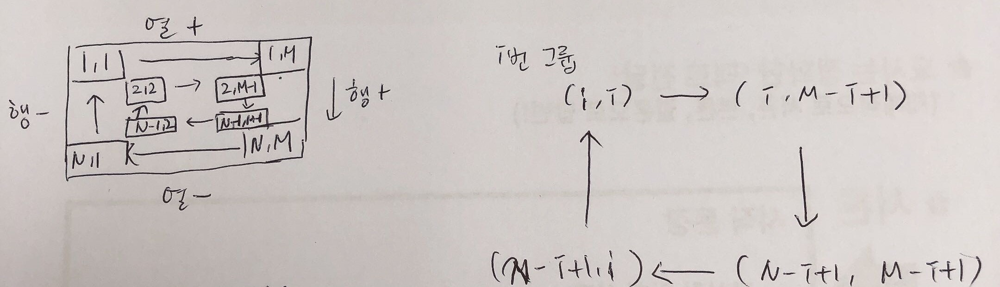

# 계절학기 - 알고리즘 A형

>  7일(하루 4시간)동안 진행되는 계절학기!

# 탐색 - BFS, DFS

## 개념

> 너비 우선 탐색
>
> 기본적인 그래프 탐색(결합 컴포넌트를 찾을 때)
>
> 최단 경로를 찾을 때 DFS 보다 유리(간선의 가중치가 없는 경우)
>
> D[v] = D[u] + 1


> 가중치가 부여되어 있다면 -> 간선 완화를 적용
>
> (u, v) 간선에 대한 완화 과정
>
> D[]: 시작점에서 최단 경로의 가중치 합
>
> if D[v] > D[u]  + weight(u, v):
>
> ​	D[v] = D[u]  + weight(u, v)

```python
import collections
def BFS(v):
    # 큐 생성하고 시작점을 큐에 삽입하고 방문표시
    Q = collections.deque()
    Q.append(s); visit[s] = 1; D[s] = 0;
    # 빈큐가 아닐동안 반복해서
    while Q:
        u = Q.popleft()
        for v in G[u]:
            if not visit[v]:
                visit[v] = 1
                Q.append(v)
                D[v] = D[u] + 1
    
V, E = map(int, input().split()) 
G = [[] for _ in range(V + 1)] # 인접 리스트
visit = [0] * (V + 1) # 정점의 수 만큼

for _ in range(E):
    u, v = map(int, input().split())
    G[u].append(v)
    G[v].append(v) # 인접 리스트
```

## 문제

* 2667.단지번호붙이기
  
  * [문제](https://www.acmicpc.net/problem/2667)
  * [코드](./2667.py) (BFS)
  
  * DFS로 풀었을 때 return value
  
    ```python
    def DFS(x, y):
        ret = 1 # x,y좌표 집 1개
        for dx, dy in (-1, 0), ...:
            nx, ny = x + dx, y + dy
            if 조건...:
                ret += DFS(nx, ny)
        return ret
    ```
  
  * 재귀 함수 트리 이해하기
  
    ```python
    def backtrack(k, n):
        if k == n: return 1
        
        ret = 0
        ret += backtrack(k + 1, n)
        ret += backtrack(k + 1, n)
        
        return ret
    
    backtrack(0, 3)
    ```
  
    ```python
    def backtrack(k, n):
        global cnt
        if k == n: 
            cnt += 1
            return
        
        ret += backtrack(k + 1, n)
        ret += backtrack(k + 1, n)
    
    cnt = 0
    backtrack(0, 3)
    print(cnt)
    ```
  
    * 트리는 싸이클이 없기 때문에 방문 표시할 필요 없다.
  
    * 단말 노드인지 아닌지만 체크하면 된다.
  
    * 그래프 탐색시 BFS로 방문 표시
  
    * 트리 탐색시 단말노드인지 아닌지 체크
  
* 2468.안전영역

  * [문제](https://www.acmicpc.net/problem/2468)

  * [코드](./2468.py)

  * 런타임 에러

    - python3으로 제출하기

      ```python
      import sys
      sys.setrecursionlimit(10000)
      ```
      
    - 시험에선 sys 못쓴다.

    - 시험장에선 recursionlimit 설정해놓았을 것. 걱정 노노!

    - 불안하면 BFS로 돌리기!

  * 틀렸습니다

    * 아무 지역도 물에 잠기지 않을 수도 있다. -> 비가 오지 않는 경우도 고려해야한다.
    * 안전영역의 개수는 최소 1개이다.
    
  * 보완점

    * 최고 비높이 maxH를 구해준 것 처럼 minH를 구해 시간을 줄일 수 있다.

* 2636.치즈
  * [문제](https://www.acmicpc.net/problem/2636)
  * [코드](./2636.py)
  * 런타임 에러
    * python3, recursionlimit 10000

* 2573.빙산
  * [문제](https://www.acmicpc.net/problem/2573)
  * [코드](./2573.py)
* 런타임에러
    * DFS가 아닌 BFS로 풀어보기! 
    * 최대 10,000개의 칸이 있을 수 있기 때문에 재귀 오류
  
* 2589.보물섬
  * [문제](https://www.acmicpc.net/problem/2589)
  * [코드](./2589.py)

* 16234.인구이동
  * [문제](https://www.acmicpc.net/problem/16234)
  * [코드](./16234.py)
  * [런타임에러 DFS 코드](./16234_fail.py)
  * `newVal`로 업데이트 하는 부분 bfs()함수에서 처리할 수 있음
    * 원래 했던 코드 참고
  * 보완점
    * `tmp`라는 리스트 따로 만들지 않고 큐에 원소를 빼지 않고 `front`와 `rear` 이용
    * `front` 증가시키면서 sum값을 계산함
  * 주의할 점
    * 
  * <b>이 방법으로 다시 풀어보기!</b>

# 조합 탐색, 백트래킹

## 개념

* 조합 생성

  ```python
  N, R = 4, 2 # 0 ~ N - 1 중에 R개를 선택
  ```

  

  ```python
  # itertools
  import itertools
  
  arr = itertools.combinations([i for i in range(N)], R)
  print(arr) # <itertools.combinations object at 0x000001C166ED92C8>
  for val in arr:
      print(val)
  (0, 1)
  (0, 2)
  (0, 3)
  (1, 2)
  (1, 3)
  (2, 3)
  ```

  ```python
  # binary counting
  cnt = 0
  for val in range(1 << N):
      for i in range(N):
          if val & (1 << i): cnt += 1
      if cnt == R:
          pass
  ```

  ```python
  # for문 중첩 -> R개를 고른다면 for문 R개 중첩
  for i in range(N - 1):
      for j in range(i + 1, N):
          print(i, j)
  ```

  유연하지 못한 방법이다.

  ```python
  # 재귀
  # k: 고른개수, 호출 depth
  # s: 반복의 시작, 이전 고른 요소의 다음
  sel = []
  def backtrack(k, s):
  	if k == R:
          print(sel)
          return
      
      for i in range(s, N):
          # i번을 고른다. ---> 어딘가에 저장
          sel.append(i)
          backtrack(k + 1, i + 1)
          sel.pop()
          
  backtrack(0, 0)
  ```

  재귀의 이점: 가지치기를 할 수 있다.

  만약 가지치기 할 필요 없으면 itertools 써도 된다.

## 문제

* 14502.연구소
  
  * [문제](https://www.acmicpc.net/problem/14502)

  * [코드](./14502.py)
  
  * 시간 비교
  
    ```python
    # 856ms
    dq = deepcopy(virus)
    
    # 616ms
    dq = deque()
    for x, y in virus:
        dq.append((x, y))
    ```
  
    ```python
    # 1. 756ms
    def bfs(x, y):
        # ...
        if -1 < nx < N and -1 < ny < M and not board[nx][ny] and not visit[nx][ny] \
                        and (nx, ny) not in wall: # 벽
                # ...
    def getWall(k, s): # 벽 3개를 고름
        # ...
        for idx in range(s, len(empty)):
            wall.append(empty[idx])
            getWall(k + 1, idx + 1)
            wall.pop()
        
    wall = [] # 벽 3개
    
    # 2. 424ms
    def bfs(x, y):
        # ...
        if -1 < nx < N and -1 < ny < M and not board[nx][ny] and not visit[nx][ny]: # 벽
                # ...
                
    def getWall(k, s): # 벽 3개를 고름
        # ...
        for idx in range(s, len(empty)):
            x, y = empty[idx]
            board[x][y] = 1
            getWall(k + 1, idx + 1)
            board[x][y] = 0
    ```
  
    1. 벽 리스트를 만들어 리스트에 있는지 없는지 검사
    2. `board` 값을 바꿈. 벽인지 아닌지 검사하는 조건 삭제
  
* 14889.스타트와 링크
  
  * [문제](https://www.acmicpc.net/problem/14889)
  
  * [코드](./14889.py)
    
  * 파이썬 `/` , `//`
  
    ```python
    >>> 4 / 2
    2.0 # float
    ```
  
  * [부분집합 생성 선생님 코드](./14889_teacher.py)
  
    ```python
    #N = 4초기값 0으로 지정
    N = 4
    def backtrack(k, acnt, bcnt):
        if acnt > N // 2 or bcnt > N // 2: return
        if acnt == N // 2 and bcnt == N // 2:
            print(A[:acnt], B[:bcnt])
            pass # 시너지를 구함
    
        # k번 값을 A에 추가할지
        A[acnt] = k
        backtrack(k + 1, acnt + 1, bcnt)
        # B에 추가할지
        B[bcnt] = k
        backtrack(k + 1, acnt, bcnt + 1)
    
    A = [0] * N
    B = [0] * N
    
    backtrack(1, 1, 0)
    ```
  
    * 초기값 0으로 지정
    * 리스트에 넣고 빼는 것 오래 걸리기 때문
    * 이 방법이 부분집합할 때 best인듯
  
* 15686.치킨배달
  * [문제](https://www.acmicpc.net/problem/15686)
  * [코드](./15686.py)

* 17471.게리맨더링
  
  * [문제](https://www.acmicpc.net/problem/17471)
  * [코드](./17471.py)
  * A그룹 or B그룹
  
* 17070.파이프 옮기기1
  
  * [문제](https://www.acmicpc.net/problem/17070)
  * [코드](./17070.py)
  
* 17135.캐슬디펜스
  
  * [문제](https://www.acmicpc.net/problem/17135)
  * [코드](./17135.py)
  * 보완점
    * 나의 방법 : 적의 위치를 리스트에 넣고, 적 위치 업데이트 
    * 더 나은 방법 : 궁수의 위치 업데이트
  
* 14501.퇴사
  
  * [문제](https://www.acmicpc.net/problem/14501)
  * [코드](./14501.py)
  * DP로 풀어봄!
  
* 14888.연산자끼워넣기
  
  * [문제](https://www.acmicpc.net/problem/14888)
  * [코드](./14888.py)
  
  ```python
  # 1. 순열 생성
  # 2. 연산자를 하나씩 선택하면서 모든 경우를 생성
  op = '+-*/'
  cnt = [2, 0, 1, 1]
  N = 4 # 피연산자 N + 1
  order = []
  def backtrack(k):
      if k == N:
  		print(*order)
      else:
          # k번째 위치에 올 연산자를 하나 선택
          for i in range(4):
              if cnt[i]:
                  cnt[i] -= 1
                  order.append(op[i])
                  backtrack(k + 1)
                  cnt[i] += 1
                  order.pop()
                  
  backtrack(0)
  ```
  
  
  
* 15683.감시
  
  * [문제](https://www.acmicpc.net/problem/15683)
  * [코드](./15683.py)
  
* 14503.로봇청소기

  * [문제](https://www.acmicpc.net/problem/14503)
  * [코드](./14503.py)

# 백준 특강

> (19.12.12 - 12.13)
>
> 여기 있는 특강 코드는 비공개!
>
> 예제 꼭 다시 풀어보기!

## 코딩테스트

* 주로 **파싱,  <u>시뮬</u>, <u>브루트포스</u>, <u>BFS</u>, DP** 유형
  * 파싱(Parsing)
  * 시뮬레이션
    * '어떻게 하면 효율적일까'라는 생각으로 접근하지 말기!
    * 문제 그대로 푸는 것이다.
    * 내 생각은 '어떻게 저장/처리'할지에만 반영한다.
  * 브루트 포스
    * 특징 : 방법이 매우 많으며, 최대값(최소값)을 구하는 유형이다.
    * **tip** : 문제를 읽고 방법의 수를 계산해본 후, 시간 복잡도를 구해 알맞은 방법인지 먼저 생각해본다.
    * 시간이 중요하다.
    * 입력크기 N일 때 시간복잡도 계산해보아야한다.
    * 브루트포스의 시간복잡도는 (방법의 수) X (1번 시도하는 시간)

## 브루트포스

* 문제를 풀 때 고려사항
  1. **시간 제한**
  2. 메모리 제한 -> 대부분 경우 의미 X

* 문제 푸는 절차

  1. 경우의 수 계산 -> 직접 계산, 풀 수 있는 문제라면 어떻게 코딩할 것인가 생각해보기

  2. **가능한 모든 방법 만들어본다.**

     (1) 다 해본다.

     (2) for문 사용

     (3) 순열

     (4) 재귀

     (5) 비트마스크

     * 순열, 비트마스크는 재귀로 해결 가능하다.

  3. 답을 구해본다.

* 두가지 유형

  * **순서**

    * N개가 있을 때 순서만 변경하는 경우

    * N!가지 (N) * (N-1) * ... * (1)

    * ex) 사과, 배, 딸기, 바나나를 어떤 순서로 먹을 것인가?

      순서에 따라 값이 달라짐

    * **순열**

  * **선택**

    * N개 중 일부를 선택하는 경우
    * 2^N가지 2 * 2 * ... * 2
    * ex) 사과, 배, 딸기, 바나나 중 어떤 것을 먹을 것인가?
    * **비트마스크**

  * 순열과 비트마스크는 **재귀**로 가능하다.

* EX1) N과M (1) -> 순서

  * 1, 2, 3과 1, 3, 2는 다르다.
  * M개의 자리 N, N-1, N-2... 
  * 예제 코드 중 C배열은 check를 의미하며 중복을 체크하는 배열이다.

  * 시간복잡도 O(N!)

  * 1<= M <= N <= 8. 8! = 40320 많지 않은 숫자이다.

  * 15!은 1조에 가까운 숫자이다.

  * **많고 적음의 기준?**

    * **기준 1억!** (N<=1만일 때, (1만)^2 = 1억)

    * 문제를 풀 때 가장 먼저 읽어야하는 부분은 **입력크기제한(N제한)**이다.
    * 1억보다 작아야 올바른 방법인 것을 알 수 있다.
    * **tip** : 만약 N이 1000, 5000이면 시간복잡도 O(N^2)인 경우가 많다.

* EX2) N과M (2) (오름차순)

  * 순서 -> 10! = 3,628,800
    * check배열 불필요!
    * start
  * 선택으로도 바꾸어 풀 수 있다. 2^10 = 1024
    * 훨씬 더 빠르다!

* EX3) 주사위윷놀이

  * 4^10가지, 거의 100만정도 => 브루트포스!
  * a배열에 수 2개를 저장한다.
  * `a[i][j]` : i번 칸에서 어디로?
    * `a[i][0]`은 그 칸에서 시작할 때
    * `a[i][1]`은 그 칸을 지나갈 때!
    * 시작:[0], 2:[1], 4:[2], 6:[3]...으로 인덱스를 매겼다.
  * 나의 방법은 `dictionary`를 이용하였음
    * 수강생 중 1명만 풀이했던 문제
    * 꼭 다시 풀어보기!

## BFS, DFS

* 목적 : 임의의 한점에서 모든 정점을 한번씩 방문하고자 함.

* BFS => 최단거리를 구하고자 할 때

  * 최단거리를 구할 땐, 원래 다익스트라 써야한다.
  * 하지만 **가중치가 1인 경우, BFS 가능!**
  * BFS는 정점의 정의, 간선의 정의 세우는 것을 중점으로!

* BFS의 조건

  1. 최소 비용 문제(최단시간, 최단거리)
  2. 가중치 1
  3. **정점과 간선의 개수가 적어야한다.** 
     * O(V + E)
     * 기준이 1억이라고 했는데, 계산을 제외했을 때 실제로는 1000만개 정도이다. 

* EX1) [1697. 숨바꼭질](https://www.acmicpc.net/problem/1697)

  * X + 1, X - 1, 2X 각 1초가 걸린다.
  * 이때 1초가 가중치이다.
  * 출발점 1개 X에서 (x + 1), (x - 1), (2X)로 가는 것
  * 빠른시간 안에.
  * => BFS
  * 정점, 간선개수 10만개이면 적은 것이다.
  * BFS의 정점
    * 가장 많이 등장하는 형태 (r, c) 격자판
    * 혹은 체스판
      * dx = [-2, -1, 1, 2, 2, -1, ...]
      * dy = [1, 2, 2, 1, -1, ...]
  * **정점**
    * 만약 A->E로 가는 가장 빠른길이 있을 때,
    * A->B, B->E는 최소거리이다.
    * BFS의 특징으로, 어느 정점으로부터 왔는지 영향을 받으면 안된다.
    * 예를 들어 [숨바꼭질 5](https://www.acmicpc.net/problem/17071)의 경우 다른 방식으로 구현해야 한다.
    * A0 -> B0, A0 -> B1, B0 -> C0, B0 -> C1, B1-> C1, ...

* EX2) [14226. 이모티콘](https://www.acmicpc.net/problem/14226)

  * (S, C) 
    * S: 화면
    * C: 클립보드
  * 세가지 연산
    1. (S, C) -> (S, S) : 화면 -> 클립보드
    2. (S, C) -> (S + C, C) : 클립보드 -> 화면
    3. (S, C) -> (S - 1, C) : 화면에서 1개 삭제

* EX3) [17822. 원판돌리기](https://www.acmicpc.net/problem/17822)

  * 시뮬레이션 + BFS

  * **tip** 효율적으로 풀기

    * [자물쇠](https://www.acmicpc.net/problem/1514), [큐빙](https://www.acmicpc.net/problem/5373)은 오른쪽 1번(시계 방향)으로 돌리는 것은 왼쪽으로 3번(반시계 방향) 돌리는 것과 같다.

    * 스위치 유형 문제 : 문 열고 닫고를 문 0번 열고, 1번 열고로 바꾸어 푼다.

      ```python
      # 원판 [0, 1, 2, 3] 0->3, 3->0
      (x + 3) % 3 == 0
      ```

    * **tip**

      ```c++
      for (i=1;i<=N;i++){
          if (n%i == 0) {
              // 처리
          }
      }
      ```

      이 방법은 별로 좋지 못하다.

      아래와 같이 바꾸었을 때 더 효율적

      ```c++
      for (i=1;i<=N;i+=x){
          // 처리
      }
      ```

      

## 언어사용시 주의사항

> 각 언어마다 시간이 오래걸리는 함수, 연산들이 있다.
>
> 아래는 되도록 쓰지 않기!

* Python

  * `if x in a` 
  * index slicing 연산
  * BFS시 List쓰는 행위(deque를 쓸 것!)

* C++

  * `cin, cout`

    * 백준 c++ 풀이시 main()에

      `ios_base::sync_with_stdio(false);` 추가하기

  * `endl`

## DP

* EX1) [17425. 약수의 합](https://www.acmicpc.net/problem/17425)

  * F(A) = A약수의 합
  * F(24) = 1 + 2 + ... + 12 + 24 => O(N)
  * g(N) = F(1) + F(2) + F(3) + ... + F(24) => O(N^2)
  * N = 10만, N^2 = 100억
  * 효율적으로 푸는 방법
    * 2, 4, 6, 8은 중복이 된다.
    * 따라서 F(2) += 2, F(4) += 2, ...를 하면 된다.
    * 3, 6, 9도 마찬가지
    * F(3) += 2, F(6) += 2, ...

* EX2) [14501. 퇴사](https://www.acmicpc.net/problem/14501)

  * 1~N일 일하고, (N+1)일에 퇴사

  * T일 T[i]일 기간

  * P[i]

  * 브루트 포스

    * 방법의 수 : 2^N (N <= 15), 2^15 = 32768 많지 않음
    * 상담을 하거나, 하지 않거나 선택!
    * go(index) : index날까지 상담했을 때 최대

    ```python
    # 0 ~ (n-1), 퇴사 : n일
    if index == n: return 0
    if index > n: # 조건 위배, 퇴사날짜 넘김
        return -10억;
    ```

    * **tip** 불가능한 큰값 10억을 주는 게 좋음

      10억 + 10억 -> 21억을 넘지 않음

      오버플로우 줄일 수 있음

    * index index(P[index]) + [idx] ... n (go(index + t[index]))

  * DP로 한번 풀어보자.

  * DP의 조건

    * 큰 문제 -> 작은 문제로 푸는데 중복이 발생해야 함.

    * 만약, 반 전체 인원 50명을 20명, 30명으로 나눈다면 중복이 발생한다.

      왼쪽분단, 오른쪽분단으로 나눈다면 중복이 발생하지 않는다.

    * 중복을 제거하는 것이 **Memoization**이다.

      * 메모이제이션은 문제 정답이 언제 구해도 같아야한다.

    ```
    1일부터 11일까지 일할 수 있고, 오늘이 7일일 때,
    1~6일까지 일했을 때
    방법1) 50만
    방법2) 75만
    방법3) 30만
    방법2 선택
    ```

  * **tip** : DP 초기값 0으로 하면 안된다. 느리기때문!

    -1로 하기

  * 브루트포스 vs DP

    * 브루트포스는 앞 선택에 영향을 받는다.
    * DP는 영향을 받지 않는다.

  * DP 풀이

    * max

    * `D[i + T[i]] = D[i] + P[i]`

    * `D[i + 1] = D[i]`

    * `D[i]` : i일까지 벌 수 있는 최대수익

    * i일에 상담을 진행한다면 i + T[i]일

      상담을 진행하지 않는다면 i + 1일

  * 재귀 Top down, 반복 Bottom up(작은 문제 미리 풀어놓음)

* EX3) [11052. 카드 구매하기](https://www.acmicpc.net/problem/11052)

  * 카드 N개 구매

  * 카드팩 구매

  * 1번, 2번, ..., N번 카드팩엔 1장, 2장, ..., N장의 카드가 들어있다. 

  * i번 카드팩 가격 : p[i]

  * D[N] = 카드 N장을 구매하는 최대비용

  * 두 부분으로 나누어 생각할 수 있다.

    1. 마지막에 구매한 카드팩엔 j장의 카드 => `P[j]`
    2. 나머지엔 N-j장의 카드 => `D[N - j]`

    * 일반화 하면 D[i - j], P[j]

  * 시간복잡도 : (문제의수) X (문제1개를 구하는 시간)

    * 문제의 수 : 몇개의 정답 저장해야 하는지?
      * 1장, 2장, ..., N장 -> N
    * 문제1개 시간
      * N
    * O(N^2)

* EX4) [16987. 계란으로 계란치기](https://www.acmicpc.net/problem/16987)

  * 방법 (N - 1)^N, 7^8 = 500만개 (적음)

* EX5) [16926. 배열 돌리기 1](https://www.acmicpc.net/problem/16926)

  * 한 리스트에 넣기
    * (1, 1) (1, 2) (1, 3) (1, 4) (1, 5) (2, 5) (3, 5) ...

  

  * 그룹의 크기 (groups)
    * 4X6일 때 2개
    * 6X4일 때 2개
    * min(N, M) / 2개
  * group 임시 배열
  * a 배열

## 시뮬레이션

* EX1) [17780. 새로운 게임](https://www.acmicpc.net/problem/17780)

  * `A[i][j] ` : 흰 0, 빨 1, 파 2

  * 말 저장해야할 정보

    * 번호
    * 방향
    * 위치(행, 열)

  * 말 저장하는 두가지 방법

    1.  `horse[i][j]` = (i, j)에 있는 말을 아래서부터 저장

    2. 말 k개 1차원 배열에 저장

    * 1 방법이 훨씬 좋다.
    * 2 방법은 말 쌓인 것 처리하기 힘들다.

  * `a[i][j]` = (i, j) 있는 말이 아래부터

  * `where[i]` = i번 말의 위치

  * a바꾸면서 where바꾸기

  * 방향 전환 함수

    * `opposite()`
    * (python에서 dict으로 쉽게 할 수 있을 것 같다.)

  * 총 5개의 이동

    1. -> 흰
    2. -> 빨
    3. -> 파 -> 흰
    4. -> 파 -> 빨
    5. -> 파 -> 파 (이동 x)

    * 1번과 3번, 2번과 4번은 같은 코드이다. 
    * 복붙은 좋지 않다. 수정할 때 실수할 확률 높음.

  * go(x, y, nx, ny): (x, y) 말을 (nx, ny)로 이동하는 함수

